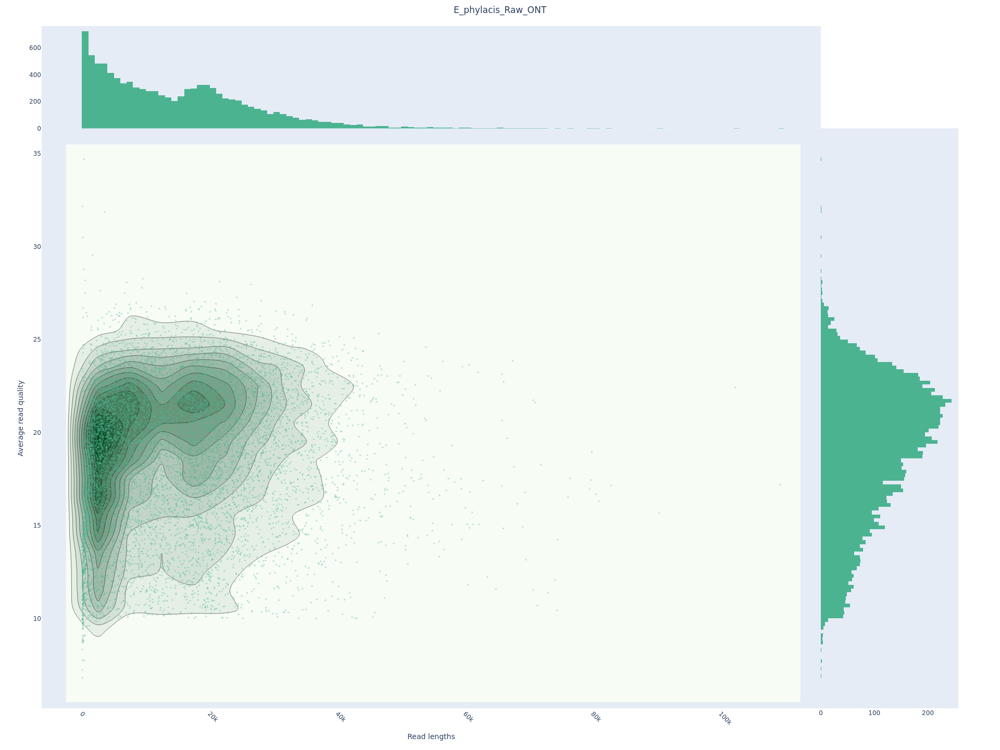
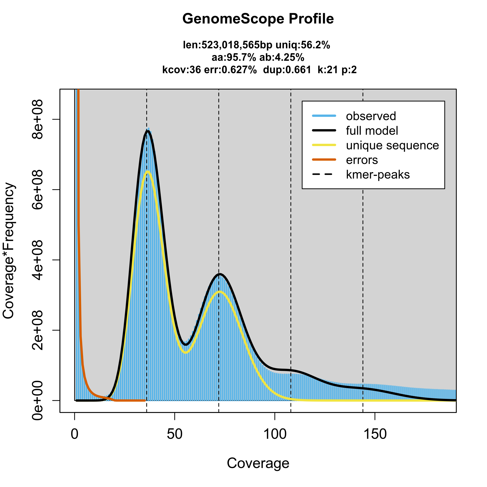
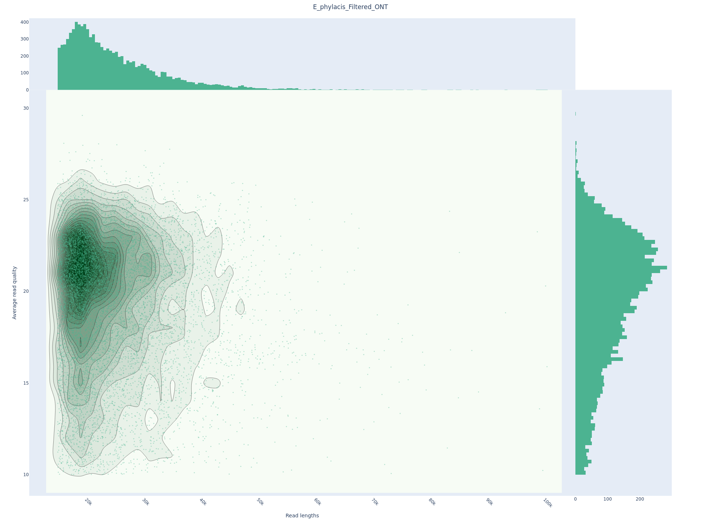
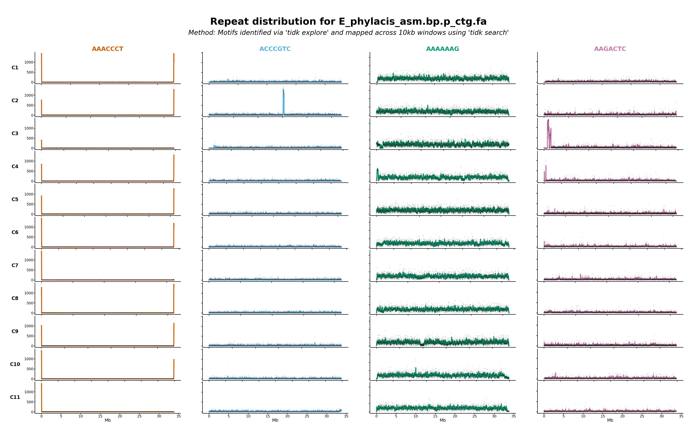
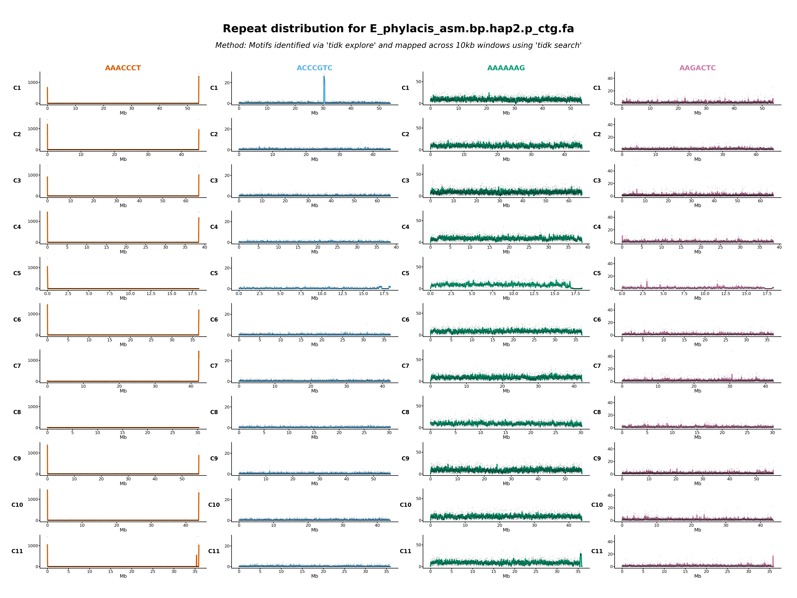

# MM_genome
An assembly of the Meelup Mallee genome.

# Get the environment running

I'll try and do most things in one conda environment. The details of what that looks like are in the `environment.yml` file.

```bash
conda env create environment.yml
```


# Raw Data

The raw data are located here:

```bash
raw_data="/home/raw_data/MM/2025_long_reads/ONT_gDNA192_1071_RL/E_Phylacis/20251117_1227_2C_PBE85256_e040940c/fastq_pass"
```

Let's get a first impression of how much data there is:

```bash
seqkit stats -j 64 -T ${raw_data}/*.fastq.gz > raw_data_seqkit_stats.tsv
grep -v "^file" raw_data_seqkit_stats.tsv | sed 's/,//g' | awk -F'\t' '{r+=$4; b+=$5} END {printf "Reads: %'\''d | Bases: %'\''d | Coverage: %.2fx\n", r, b, b/500000000}'
```

* **Reads**: 3,064,194 
* **Bases**: 44,326,974,907 
* **Coverage**: 88.65x

This shows that we have ~90x coverage (~45 of each haplotype) before QC and filtering, so a good place to start. This is based on an estiamted 500MB genome size.

# QC and read filtering

First let's examine the raw long reads carefully.

## Basic QC

```bash
qc_dir="01_QC"
mkdir ${qc_dir}

# 1. Run NanoPlot
NanoPlot -t 128 \
         --fastq ${raw_data}/*.fastq.gz \
         --downsample 100000 \
         -o ${qc_dir}/01_NanoPlot_Raw \
         --title "E_phylacis_Raw_ONT"

# 2. Long-read K-mer Counting
## set up directories
mkdir -p ${qc_dir}/02_Kmer_distribution
tmp_dir="tmp_processing"
mkdir -p ${tmp_dir}

## list the raw data files
find ${raw_data} -name "*.fastq.gz" > ${tmp_dir}/files.txt

## run KMC
# -k21: Standard k-mer length for GenomeScope 2.0
# -t128: Using all 128 threads for speed
# -m256: 256GB RAM limit
# -ci1: Include k-mers that occur at least once
kmc -k21 -t128 -m256 -ci1 -cs10000 \
    @${tmp_dir}/files.txt \
    ${tmp_dir}/kmc_db \
    ${tmp_dir}/

## create histogram
# keep everything down to 1 occurrence; bunch up the stuff that occurrs >10K times
kmc_tools transform ${tmp_dir}/kmc_db histogram ${qc_dir}/02_Kmer_distribution/long_read_histogram.txt -ci1 -cs1000000

# Run GenomeScope2
# -p : diploid
genomescope2 \
    -i ${qc_dir}/02_Kmer_distribution/long_read_histogram.txt \
    -o ${qc_dir}/02_Kmer_distribution/genomescope_results \
    -k 21 \
    -p 2

rm -rf ${tmp_dir}

```

Nanoplot basics

| Metric | Value |
| :--- | :--- |
| **Total Yield** | 44.3 Gb |
| **Number of Reads** | 3.06 M |
| **Read Length N50** | 22.2 kb |
| **Mean Read Length** | 14.5 kb |
| **Median Read Length** | 12.3 kb |
| **Mean Read Quality** | Q17.2 |
| **Median Read Quality** | Q19.6 (~99%) |
| **> Q10** (90.0% accuracy) | 44.3 Gb |
| **> Q15** (96.8% accuracy) | 38.2 Gb |
| **> Q20** (99.0% accuracy) | 22.2 Gb |



KMC basics output
```
Stats:
   No. of k-mers below min. threshold :            0
   No. of k-mers above max. threshold :            0
   No. of unique k-mers               :   5216090955
   No. of unique counted k-mers       :   5216090955
   Total no. of k-mers                :  44265691027
   Total no. of reads                 :      3064194
   Total no. of super-k-mers          :   6430181221
```

Genomescope:




So we have about 4% heterozygosity, a genome size of ~523MB, and a low error rate of 0.6%. Quite nice!

## Contamaination checking

A quick check of the GC content suggests no serious contamination. 

```bash
zcat ${raw_data}/*.fastq.gz | head -n 400000 | \
seqkit fx2tab -n -g | cut -f 2 | \
awk '{printf "%.0f\n", $1}' | sort | uniq -c | \
awk '{printf "%s%%\t%s\n", $2, $1}' | sort -n
```

```
0%      1
9%      1
10%     1
11%     1
13%     1
15%     1
16%     1
17%     5
18%     5
19%     7
20%     6
21%     10
22%     17
23%     22
24%     32
25%     38
26%     67
27%     136
28%     145
29%     238
30%     298
31%     470
32%     690
33%     1117
34%     1895
35%     3027
36%     5375
37%     8983
38%     13473
39%     15529
40%     15264
41%     11650
42%     7815
43%     4459
44%     2612
45%     1632
46%     980
47%     636
48%     516
49%     387
50%     342
51%     228
52%     219
53%     257
54%     303
55%     442
56%     203
57%     85
58%     64
59%     43
60%     45
61%     22
62%     31
63%     24
64%     25
65%     13
66%     25
67%     17
68%     12
69%     11
70%     12
71%     11
72%     4
73%     6
74%     3
75%     3
76%     2
77%     3
79%     1
100%    1
```

This shows a unimodal distribution around 38-41% GC, so it's best to just assemble the genome first and decontaminate contigs later.


## Read filtering

Let's filter the data with Chopper.

```bash
# 1. Setup Directories
filter_dir="02_filtering"
mkdir -p ${filter_dir}/qc_filtered

# let's not get ourselves in trouble
echo "02_filtering/E_phylacis_filtered.fastq.gz" >> .gitignore


# 2. Run Chopper
# Pipe pigz (decompression) -> chopper (filtering) -> bgzip (compression)
echo "Starting Chopper: Filtering for Length > 15kb and Quality > Q10..."
pigz -dc -p 128 ${raw_data}/*.fastq.gz | \
chopper -q 10 -l 15000 | \
bgzip -@ 128 > ${filter_dir}/E_phylacis_filtered.fastq.gz
echo "Filtering complete. Output saved to: ${filter_dir}/E_phylacis_filtered.fastq.gz"

# 3. Post-Filter QC (NanoPlot)
NanoPlot -t 128 \
         --fastq ${filter_dir}/E_phylacis_filtered.fastq.gz \
         --downsample 100000 \
         -o ${filter_dir}/qc_filtered \
         --title "E_phylacis_Filtered_ONT"
```

Post filtering QC:

| Metric | Pre-Filtering | Post-Filtering |
| :--- | :--- | :--- |
| **Total Yield** | 44.3 Gb | **34.0 Gb** |
| **Number of Reads** | 3.06 M | **1.35 M** |
| **Read Length N50** | 22.2 kb | **25.6 kb** |
| **Mean Read Length** | 14.5 kb | **25.2 kb** |
| **Median Read Length** | 12.3 kb | **22.8 kb** |
| **Mean Read Quality** | Q17.2 | **Q17.8** |
| **Median Read Quality** | Q19.6 (~99%) | **Q20.2** |
| **> Q10** (90.0% accuracy) | 44.3 Gb | **34.0 Gb** |
| **> Q15** (96.8% accuracy) | 38.2 Gb | **29.3 Gb** |
| **> Q20** (99.0% accuracy) | 22.2 Gb | **17.2 Gb** |




This is great. We still have >30x coverage per haplotype, median quality is >Q20, and average read length is well over 20KB. Over half the data is >Q20 reads too. 

# hifiasm assembly

Now I'll assemble the filtered reads with hifiasm. to do this I'll make a Ramdisk to do everything in RAM. I have 2.2TB so this should work OK...


```bash
mkdir -p 03_hifiasm_assembly

# 1. Create a mount point
sudo mkdir -p /mnt/ramdisk

# 2. Mount 1500GB of the 2.2TB RAM as a disk
sudo mount -t tmpfs -o size=1500G tmpfs /mnt/ramdisk
sudo chown $USER /mnt/ramdisk

# 3. Copy your filtered data THERE
cp 02_filtering/E_phylacis_filtered.fastq.gz /mnt/ramdisk/

# 4. Run hifiasm inside the ramdisk
cd /mnt/ramdisk

hifiasm \
    -o E_phylacis_asm \
    -t 160 \
    --ont \
    -l 3 \
    --telo-m AAACCCT \
    --dual-scaf \
    E_phylacis_filtered.fastq.gz \
    2>&1 | tee hifiasm_restart.log

# 5. VERY IMPORTANT: Move results back to /home before rebooting!
rsync -av --progress --exclude='*.fastq.gz' ./ ~/MM_genome/03_hifiasm_assembly/

cd ~/MM_genome

# ignore this stuff for git, mostly
echo "03_hifiasm_assembly/" >> .gitignore

# but keep these guys
git add -f 03_hifiasm_assembly/hifiasm_restart.log
git add -f 03_hifiasm_assembly/*.noseq.gfa
git add -f 03_hifiasm_assembly/*.lowQ.bed
git commit -m "Ignore raw assembly binaries but keep logs and noseq graphs"

```


## Assembly summary

Let's summarise the graphs with gfastats

```bash
mkdir -p 03_hifiasm_assembly/QC
gfastats 03_hifiasm_assembly/E_phylacis_asm.bp.hap1.p_ctg.gfa --discover-paths --segment-report > 03_hifiasm_assembly/QC/stats_hap1_segments.txt
gfastats 03_hifiasm_assembly/E_phylacis_asm.bp.hap1.p_ctg.gfa --discover-paths > 03_hifiasm_assembly/QC/stats_hap1.txt

gfastats 03_hifiasm_assembly/E_phylacis_asm.bp.hap2.p_ctg.gfa --discover-paths --segment-report > 03_hifiasm_assembly/QC/stats_hap2_segments.txt
gfastats 03_hifiasm_assembly/E_phylacis_asm.bp.hap2.p_ctg.gfa --discover-paths > 03_hifiasm_assembly/QC/stats_hap2.txt

gfastats 03_hifiasm_assembly/E_phylacis_asm.bp.p_ctg.gfa --discover-paths --segment-report > 03_hifiasm_assembly/QC/stats_primary_segments.txt
gfastats 03_hifiasm_assembly/E_phylacis_asm.bp.p_ctg.gfa --discover-paths > 03_hifiasm_assembly/QC/stats_primary.txt

git add -f 03_hifiasm_assembly/QC/
```

Hap1:
* Length: 579570136
* N50: 39833816
* Sum of top 11: 479,816,686 (82.7% of total)

Hap2:
* Length: 580987427
* N50: 43786601
* Sum of top 11: 466,703,285 (80.3% of total)

Primary contig assembly:
* Length: 545423967
* N50: 45651274
* Sum of top 11: 512,180,968 (93.9% of total)

Hap1 top 11 scaffolds:
```
Seq     Header  Comment Total segment length    A       C       G       T       GC content %    # soft-masked bases     Is circular: 
1       h1tg000001l             51317275        15581784        10088548        10060793        15586150        39.26   0       N
2       h1tg000002l             34632735        10403692        6918163 6905508 10405372        39.92   0       N
3       h1tg000003l             59377836        18014668        11731310        11638807        17993051        39.36   0       N
4       h1tg000004l             38027376        11524382        7473569 7506629 11522796        39.39   0       N
5       h1tg000005l             39657523        11954888        7853657 7859159 11989819        39.62   0       N
6       h1tg000006l             28751543        8692468 5642168 5679416 8737491 39.38   0       N
7       h1tg000007l             41957522        12681753        8316763 8322106 12636900        39.66   0       N
8       h1tg000008l             61728905        18653045        12184965        12191786        18699109        39.49   0       N
9       h1tg000009l             39833816        12005760        7924497 7892044 12011515        39.71   0       N
10      h1tg000010l             33387284        10075060        6608064 6625293 10078867        39.64   0       N
11      h1tg000011l             51144871        15434505        10210279        10161001        15339086        39.83   0       N
```

Hap2 top 11 scaffolds:

```
Seq     Header  Comment Total segment length    A       C       G       T       GC content %    # soft-masked bases     Is circular: 
1       h2tg000001l             54055996        16246510        10739895        10777096        16292495        39.81   0       N
2       h2tg000002l             45187061        13709758        8862292 8891714 13723297        39.29   0       N
3       h2tg000003l             65679588        19845392        12967282        12971991        19894923        39.49   0       N
4       h2tg000004l             38512735        11580937        7688737 7644481 11598580        39.81   0       N
5       h2tg000005l             18271583        5236722 3476365 3493002 5220136 39.99   0       N
6       h2tg000006l             36524851        11017298        7238859 7254846 11013848        39.68   0       N
7       h2tg000007l             42203136        12767072        8362376 8356582 12717106        39.62   0       N
8       h2tg000008l             30255392        9129461 5979442 5996696 9149793 39.58   0       N
9       h2tg000009l             56292537        17057888        11068887        11069636        17096126        39.33   0       N
10      h2tg000010l             43786601        13237045        8685725 8676979 13186752        39.65   0       N
11      h2tg000011l             35933805        10838134        7021993 7082002 10855327        39.40   0       N
```

Primary contig (bp.p_ctg) top 11 scaffolds
```
Seq     Header  Comment Total segment length    A       C       G       T       GC content %    # soft-masked bases     Is circular: 
1       ptg000001l              45651274        13837378        8968599 8979051 13866246        39.31   0       N
2       ptg000002l              54055996        16246510        10739895        10777096        16292495        39.81   0       N
3       ptg000003l              59271212        17985060        11714462        11612997        17958693        39.36   0       N
4       ptg000004l              38027376        11524382        7473569 7506629 11522796        39.39   0       N
5       ptg000005l              61704420        18645782        12179659        12186397        18692582        39.49   0       N
6       ptg000006l              38521672        11582632        7689359 7647684 11601997        39.81   0       N
7       ptg000007l              42285308        12737509        8368553 8385101 12794145        39.62   0       N
8       ptg000008l              41957522        12681753        8316763 8322106 12636900        39.66   0       N
9       ptg000009l              57093733        17310108        11249947        11235059        17298619        39.38   0       N
10      ptg000010l              39824047        12001580        7920315 7892040 12010112        39.71   0       N
11      ptg000011l              33788408        10173370        6719776 6724548 10170714        39.79   0       N
```

## Telomere checks

Let's check for common repeats, and see where they are.

First we explore for common repeats:

```bash
tidk explore --length 7 --minimum 5 --maximum 12 03_hifiasm_assembly/E_phylacis_asm.bp.p_ctg.fa
tidk explore --length 7 --minimum 5 --maximum 12 03_hifiasm_assembly/E_phylacis_asm.bp.hap1.p_ctg.fa
tidk explore --length 7 --minimum 5 --maximum 12 03_hifiasm_assembly/E_phylacis_asm.bp.hap1.p_ctg.fa
```

All looks good:

```
canonical_repeat_unit   count_repeat_runs_gt_100
AAACCCT 8816
ACCCGTC 2829
[+]     Exploring genome for potential telomeric repeats of length: 7
[+]     Finished searching genome
[+]     Generating output
canonical_repeat_unit   count_repeat_runs_gt_100
AAACCCT 8816
AAAAAAG 1157
AAGACTC 635
[+]     Exploring genome for potential telomeric repeats of length: 7
[+]     Finished searching genome
[+]     Generating output
canonical_repeat_unit   count_repeat_runs_gt_100
AAACCCT 8816
AAAAAAG 1157
AAGACTC 635
```

This is good! Exactly what we expect. The AAACCCT is the telomere. The others are likely centromeres, LINEs, or similar. Let's see where they are on the scaffolds (I'll focus on the first 11 scaffolds of each assembly, becuase that's most of it). 


First we'll use `tidk search` to figure out where they are in each of the three assemblies:

```bash
# Define motifs and assemblies
MOTIFS=("AAACCCT" "ACCCGTC" "AAAAAAG" "AAGACTC")
FILES=("p_ctg" "hap1.p_ctg" "hap2.p_ctg")

mkdir -p 03_hifiasm_assembly/QC/tidk_plots

for f in "${FILES[@]}"; do
  for m in "${MOTIFS[@]}"; do
    echo "Searching for $m in $f..."
    tidk search --string $m \
      --dir 03_hifiasm_assembly/QC/tidk_plots \
      --output "${f}_${m}" \
      --extension tsv \
      "03_hifiasm_assembly/E_phylacis_asm.bp.${f}.fa"
  done
done
```

| Primary Assembly | Haplotype 1 | Haplotype 2 |
| :---: | :---: | :---: |
| [](03_hifiasm_assembly/QC/telomere_results/p_ctg_repeat_fingerprint.png) | [](03_hifiasm_assembly/QC/telomere_results/hap1_repeat_fingerprint.png) | [](03_hifiasm_assembly/QC/telomere_results/hap2_repeat_fingerprint.png) |
| *Click to enlarge* | *Click to enlarge* | *Click to enlarge* |

**Legend:**
* **Red (AAACCCT):** Canonical plant telomere motif.
* **Sky Blue (ACCCGTC):** Putative centromeric satellite.
* **Green (AAAAAAG):** Transposon-associated / Poly-A repeats.
* **Purple (AAGACTC):** Secondary satellite motif.
* Black points represent raw 10kb window counts (alpha 0.5); colored lines indicate smoothed trends.

This is pretty good. Most of the 11 big scaffolds are T2T in the primary and the two haplotype assemblies.

## BUSCO with Compleasm

First I'll make versions of the assemblies with just the 11 longest contigs, since the telomere analysis suggests that this might be quite complete.

```bash
# Define your assemblies
ASSEMBLIES=(
    "E_phylacis_asm.bp.p_ctg.fa"
    "E_phylacis_asm.bp.hap1.p_ctg.fa"
    "E_phylacis_asm.bp.hap2.p_ctg.fa"
)

THREADS=64

for FASTA in "${ASSEMBLIES[@]}"; do
    # Create a base name (e.g., p_ctg, hap1, hap2)
    BASE=$(echo "$FASTA" | sed 's/E_phylacis_asm.bp.//; s/.p_ctg.fa//; s/.fa//')
    
    echo "-------------------------------------------------------"
    echo "Processing: $BASE"
    echo "-------------------------------------------------------"

    # 1. Index the file
    samtools faidx 03_hifiasm_assembly/$FASTA

    # 2. Get the names of the top 11 longest contigs
    cut -f1,2 03_hifiasm_assembly/${FASTA}.fai | \
        sort -k2,2rn | \
        head -n 11 | \
        cut -f1 > ${BASE}_top11_list.txt

    # 3. Extract these contigs
    samtools faidx 03_hifiasm_assembly/$FASTA \
        -r ${BASE}_top11_list.txt > 03_hifiasm_assembly/E_phylacis_${BASE}_top11.fa

    rm ${BASE}_top11_list.txt
done
```


Let's look at the three assemblies completeness with BUSCOs. We'll do general and specific, using embryophyta_odb12 and eudicots_odb12 respectively. We'll repeat it for the full assembly and the 11 biggest contigs.

```bash
# Configuration
OUT_BASE="03_hifiasm_assembly/QC/compleasm_results"
THREADS=128

mkdir -p "$OUT_DIR"

# Download the databases (compleasm handles the URLs automatically)
compleasm download embryophyta
compleasm download eudicotyledons

# --- PRIMARY ASSEMBLY ---
compleasm run -a 03_hifiasm_assembly/E_phylacis_asm.bp.p_ctg.fa -o ${OUT_BASE}/p_ctg_embryo -l embryophyta -t $THREADS
compleasm run -a 03_hifiasm_assembly/E_phylacis_asm.bp.p_ctg.fa -o ${OUT_BASE}/p_ctg_eudicot -l eudicotyledons -t $THREADS

compleasm run -a 03_hifiasm_assembly/E_phylacis_p_ctg_top11.fa -o ${OUT_BASE}/p_ctg_top11_embryo -l embryophyta -t $THREADS
compleasm run -a 03_hifiasm_assembly/E_phylacis_p_ctg_top11.fa -o ${OUT_BASE}/p_ctg_top11_eudicot -l eudicotyledons -t $THREADS

# --- HAPLOTYPE 1 ---
compleasm run -a 03_hifiasm_assembly/E_phylacis_asm.bp.hap1.p_ctg.fa -o ${OUT_BASE}/hap1_embryo -l embryophyta -t $THREADS
compleasm run -a 03_hifiasm_assembly/E_phylacis_asm.bp.hap1.p_ctg.fa -o ${OUT_BASE}/hap1_eudicot -l eudicotyledons -t $THREADS

compleasm run -a 03_hifiasm_assembly/E_phylacis_hap1_top11.fa -o ${OUT_BASE}/hap1_top11_embryo -l embryophyta -t $THREADS
compleasm run -a 03_hifiasm_assembly/E_phylacis_hap1_top11.fa -o ${OUT_BASE}/hap1_top11_eudicot -l eudicotyledons -t $THREADS

# --- HAPLOTYPE 2 ---
compleasm run -a 03_hifiasm_assembly/E_phylacis_asm.bp.hap2.p_ctg.fa -o ${OUT_BASE}/hap2_embryo -l embryophyta -t $THREADS
compleasm run -a 03_hifiasm_assembly/E_phylacis_asm.bp.hap2.p_ctg.fa -o ${OUT_BASE}/hap2_eudicot -l eudicotseudicotyledons -t $THREADS

compleasm run -a 03_hifiasm_assembly/E_phylacis_hap2_top11.fa -o ${OUT_BASE}/hap2_top11_embryo -l embryophyta -t $THREADS
compleasm run -a 03_hifiasm_assembly/E_phylacis_hap2_top11.fa -o ${OUT_BASE}/hap2_top11_eudicot -l eudicotseudicotyledons -t $THREADS

```

Once that's done, we can get the table below using

```bash
python scripts/summarise_compleasm.py
```

