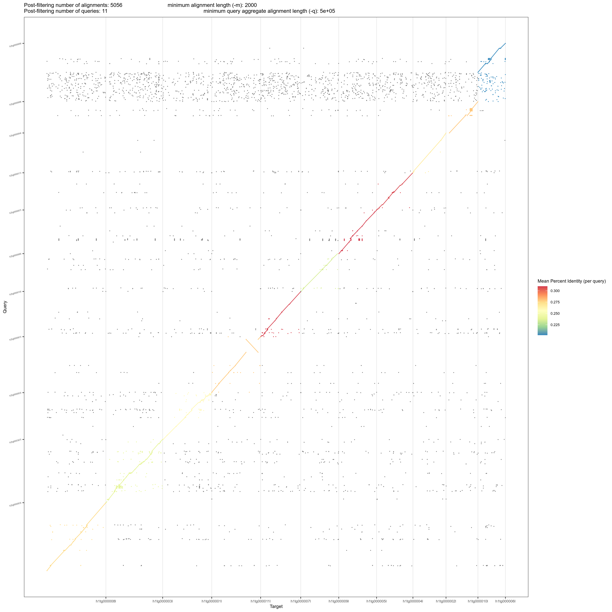
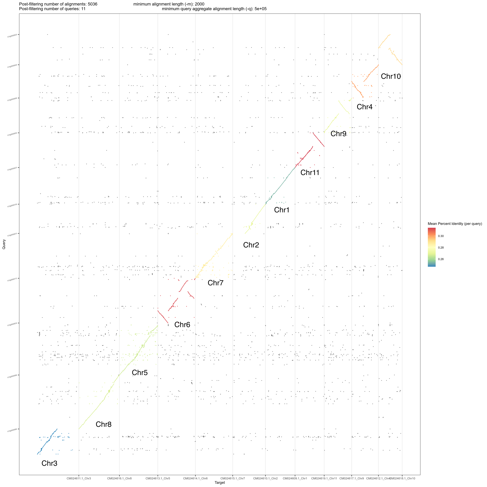
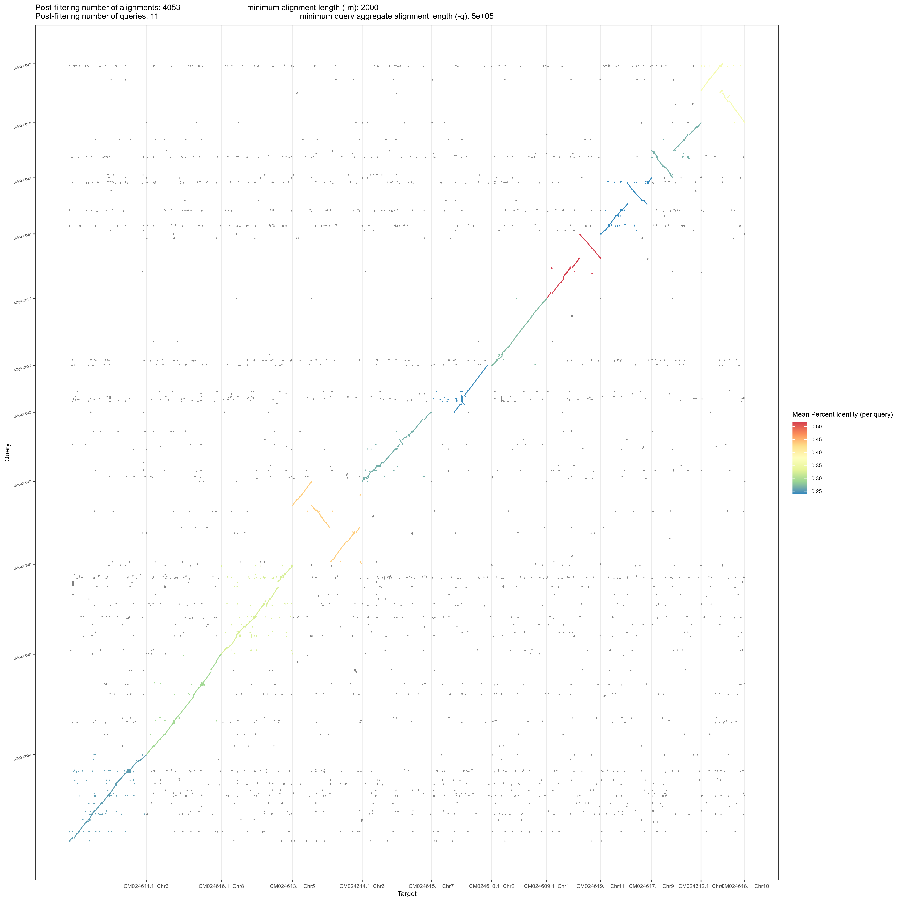
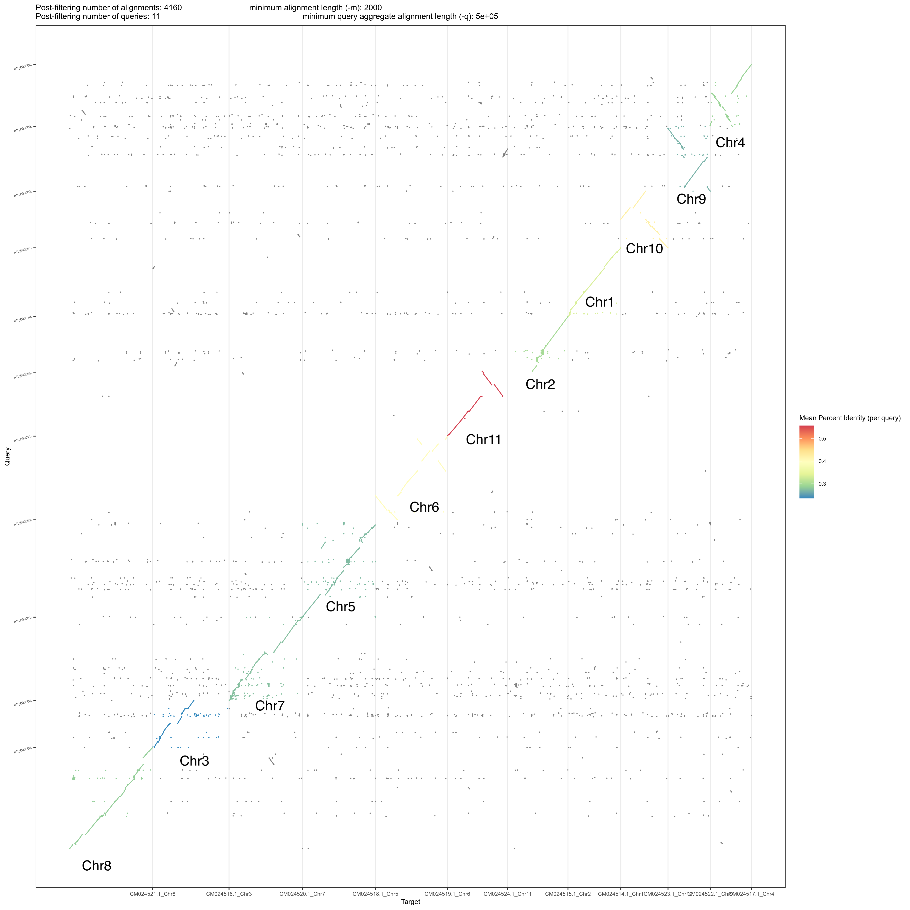
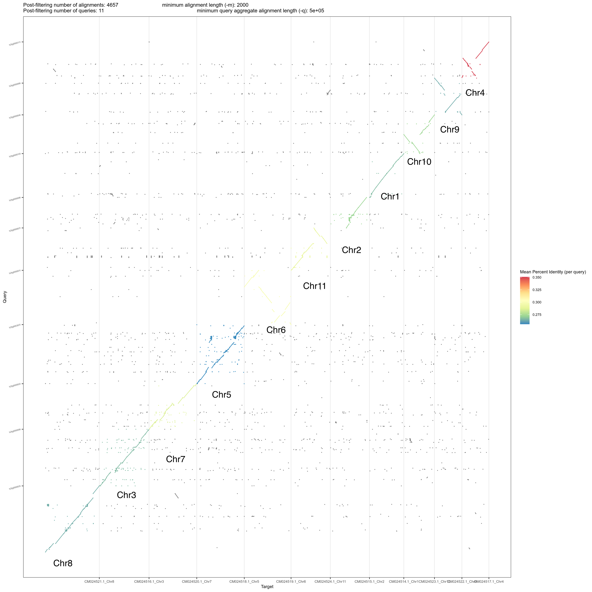
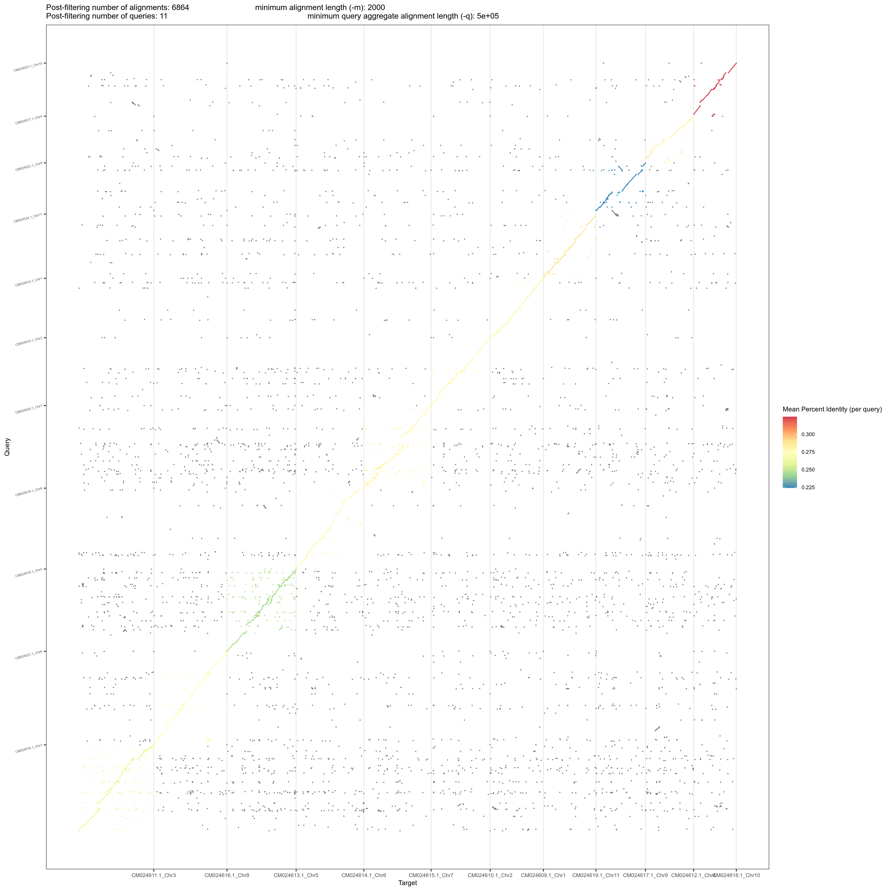

# MM_genome
An assembly of the Meelup Mallee genome.

# Get the environment running

I'll try and do most things in one conda environment. The details of what that looks like are in the `environment.yml` file.

```bash
conda env create environment.yml
```


# Raw Data

The raw data are located here:

```bash
raw_data="/home/raw_data/MM/2025_long_reads/ONT_gDNA192_1071_RL/E_Phylacis/20251117_1227_2C_PBE85256_e040940c/fastq_pass"
```

Let's get a first impression of how much data there is:

```bash
seqkit stats -j 64 -T ${raw_data}/*.fastq.gz > raw_data_seqkit_stats.tsv
grep -v "^file" raw_data_seqkit_stats.tsv | sed 's/,//g' | awk -F'\t' '{r+=$4; b+=$5} END {printf "Reads: %'\''d | Bases: %'\''d | Coverage: %.2fx\n", r, b, b/500000000}'
```

* **Reads**: 3,064,194 
* **Bases**: 44,326,974,907 
* **Coverage**: 88.65x

This shows that we have ~90x coverage (~45 of each haplotype) before QC and filtering, so a good place to start. This is based on an estiamted 500MB genome size.

# 01 QC

First let's examine the raw long reads carefully.

## Basic QC

```bash
qc_dir="01_QC"
mkdir ${qc_dir}

# 1. Run NanoPlot
NanoPlot -t 128 \
         --fastq ${raw_data}/*.fastq.gz \
         --downsample 100000 \
         -o ${qc_dir}/01_NanoPlot_Raw \
         --title "E_phylacis_Raw_ONT"

# 2. Long-read K-mer Counting
## set up directories
mkdir -p ${qc_dir}/02_Kmer_distribution
tmp_dir="tmp_processing"
mkdir -p ${tmp_dir}

## list the raw data files
find ${raw_data} -name "*.fastq.gz" > ${tmp_dir}/files.txt

## run KMC
# -k21: Standard k-mer length for GenomeScope 2.0
# -t128: Using all 128 threads for speed
# -m256: 256GB RAM limit
# -ci1: Include k-mers that occur at least once
kmc -k21 -t128 -m256 -ci1 -cs10000 \
    @${tmp_dir}/files.txt \
    ${tmp_dir}/kmc_db \
    ${tmp_dir}/

## create histogram
# keep everything down to 1 occurrence; bunch up the stuff that occurrs >10K times
kmc_tools transform ${tmp_dir}/kmc_db histogram ${qc_dir}/02_Kmer_distribution/long_read_histogram.txt -ci1 -cs1000000

# Run GenomeScope2
# -p : diploid
genomescope2 \
    -i ${qc_dir}/02_Kmer_distribution/long_read_histogram.txt \
    -o ${qc_dir}/02_Kmer_distribution/genomescope_results \
    -k 21 \
    -p 2

rm -rf ${tmp_dir}

```

Nanoplot basics

| Metric | Value |
| :--- | :--- |
| **Total Yield** | 44.3 Gb |
| **Number of Reads** | 3.06 M |
| **Read Length N50** | 22.2 kb |
| **Mean Read Length** | 14.5 kb |
| **Median Read Length** | 12.3 kb |
| **Mean Read Quality** | Q17.2 |
| **Median Read Quality** | Q19.6 (~99%) |
| **> Q10** (90.0% accuracy) | 44.3 Gb |
| **> Q15** (96.8% accuracy) | 38.2 Gb |
| **> Q20** (99.0% accuracy) | 22.2 Gb |


KMC basics output
```
Stats:
   No. of k-mers below min. threshold :            0
   No. of k-mers above max. threshold :            0
   No. of unique k-mers               :   5216090955
   No. of unique counted k-mers       :   5216090955
   Total no. of k-mers                :  44265691027
   Total no. of reads                 :      3064194
   Total no. of super-k-mers          :   6430181221
```

Genomescope:


So we have about 4% heterozygosity, a genome size of ~523MB, and a low error rate of 0.6%. Quite nice!

## Contamaination checking

A quick check of the GC content suggests no serious contamination. 

```bash
zcat ${raw_data}/*.fastq.gz | head -n 400000 | \
seqkit fx2tab -n -g | cut -f 2 | \
awk '{printf "%.0f\n", $1}' | sort | uniq -c | \
awk '{printf "%s%%\t%s\n", $2, $1}' | sort -n
```

```
0%      1
9%      1
10%     1
11%     1
13%     1
15%     1
16%     1
17%     5
18%     5
19%     7
20%     6
21%     10
22%     17
23%     22
24%     32
25%     38
26%     67
27%     136
28%     145
29%     238
30%     298
31%     470
32%     690
33%     1117
34%     1895
35%     3027
36%     5375
37%     8983
38%     13473
39%     15529
40%     15264
41%     11650
42%     7815
43%     4459
44%     2612
45%     1632
46%     980
47%     636
48%     516
49%     387
50%     342
51%     228
52%     219
53%     257
54%     303
55%     442
56%     203
57%     85
58%     64
59%     43
60%     45
61%     22
62%     31
63%     24
64%     25
65%     13
66%     25
67%     17
68%     12
69%     11
70%     12
71%     11
72%     4
73%     6
74%     3
75%     3
76%     2
77%     3
79%     1
100%    1
```

This shows a unimodal distribution around 38-41% GC, so it's best to just assemble the genome first and decontaminate contigs later.


# 02 Read filtering

Let's filter the data with Chopper.

```bash
# 1. Setup Directories
filter_dir="02_filtering"
mkdir -p ${filter_dir}/qc_filtered

# let's not get ourselves in trouble
echo "02_filtering/E_phylacis_filtered.fastq.gz" >> .gitignore


# 2. Run Chopper
# Pipe pigz (decompression) -> chopper (filtering) -> bgzip (compression)
echo "Starting Chopper: Filtering for Length > 15kb and Quality > Q10..."
pigz -dc -p 128 ${raw_data}/*.fastq.gz | \
chopper -q 10 -l 15000 | \
bgzip -@ 128 > ${filter_dir}/E_phylacis_filtered.fastq.gz
echo "Filtering complete. Output saved to: ${filter_dir}/E_phylacis_filtered.fastq.gz"

# 3. Post-Filter QC (NanoPlot)
NanoPlot -t 128 \
         --fastq ${filter_dir}/E_phylacis_filtered.fastq.gz \
         --downsample 100000 \
         -o ${filter_dir}/qc_filtered \
         --title "E_phylacis_Filtered_ONT"
```

Post filtering QC:

| Metric | Pre-Filtering | Post-Filtering |
| :--- | :--- | :--- |
| **Total Yield** | 44.3 Gb | **34.0 Gb** |
| **Number of Reads** | 3.06 M | **1.35 M** |
| **Read Length N50** | 22.2 kb | **25.6 kb** |
| **Mean Read Length** | 14.5 kb | **25.2 kb** |
| **Median Read Length** | 12.3 kb | **22.8 kb** |
| **Mean Read Quality** | Q17.2 | **Q17.8** |
| **Median Read Quality** | Q19.6 (~99%) | **Q20.2** |
| **> Q10** (90.0% accuracy) | 44.3 Gb | **34.0 Gb** |
| **> Q15** (96.8% accuracy) | 38.2 Gb | **29.3 Gb** |
| **> Q20** (99.0% accuracy) | 22.2 Gb | **17.2 Gb** |


This is great. We still have >30x coverage per haplotype, median quality is >Q20, and average read length is well over 20KB. Over half the data is >Q20 reads too. 

# 03 basic hifiasm assembly

Now I'll assemble the filtered reads with hifiasm. to do this I'll make a Ramdisk to do everything in RAM. I have 2.2TB so this should work OK...


```bash
mkdir -p 03_hifiasm_assembly

# 1. Create a mount point
sudo mkdir -p /mnt/ramdisk

# 2. Mount 1500GB of the 2.2TB RAM as a disk
sudo mount -t tmpfs -o size=1500G tmpfs /mnt/ramdisk
sudo chown $USER /mnt/ramdisk

# 3. Copy your filtered data THERE
cp 02_filtering/E_phylacis_filtered.fastq.gz /mnt/ramdisk/

# 4. Run hifiasm inside the ramdisk
cd /mnt/ramdisk

hifiasm \
    -o E_phylacis_asm \
    -t 160 \
    --ont \
    -l 3 \
    --telo-m AAACCCT \
    --dual-scaf \
    E_phylacis_filtered.fastq.gz \
    2>&1 | tee hifiasm_restart.log

# 5. VERY IMPORTANT: Move results back to /home before rebooting!
rsync -av --progress --exclude='*.fastq.gz' ./ ~/MM_genome/03_hifiasm_assembly/

cd ~/MM_genome

# ignore this stuff for git, mostly
echo "03_hifiasm_assembly/" >> .gitignore

# but keep these guys
git add -f 03_hifiasm_assembly/hifiasm_restart.log
git add -f 03_hifiasm_assembly/*.noseq.gfa
git add -f 03_hifiasm_assembly/*.lowQ.bed
git commit -m "Ignore raw assembly binaries but keep logs and noseq graphs"

```


## Assembly summary

Let's summarise the graphs with gfastats

```bash
mkdir -p 03_hifiasm_assembly/QC
gfastats 03_hifiasm_assembly/E_phylacis_asm.bp.hap1.p_ctg.gfa --discover-paths --segment-report > 03_hifiasm_assembly/QC/stats_hap1_segments.txt
gfastats 03_hifiasm_assembly/E_phylacis_asm.bp.hap1.p_ctg.gfa --discover-paths > 03_hifiasm_assembly/QC/stats_hap1.txt

gfastats 03_hifiasm_assembly/E_phylacis_asm.bp.hap2.p_ctg.gfa --discover-paths --segment-report > 03_hifiasm_assembly/QC/stats_hap2_segments.txt
gfastats 03_hifiasm_assembly/E_phylacis_asm.bp.hap2.p_ctg.gfa --discover-paths > 03_hifiasm_assembly/QC/stats_hap2.txt

gfastats 03_hifiasm_assembly/E_phylacis_asm.bp.p_ctg.gfa --discover-paths --segment-report > 03_hifiasm_assembly/QC/stats_primary_segments.txt
gfastats 03_hifiasm_assembly/E_phylacis_asm.bp.p_ctg.gfa --discover-paths > 03_hifiasm_assembly/QC/stats_primary.txt

git add -f 03_hifiasm_assembly/QC/
```

Hap1:
* Length: 579570136
* N50: 39833816
* Sum of top 11: 479,816,686 (82.7% of total)

Hap2:
* Length: 580987427
* N50: 43786601
* Sum of top 11: 466,703,285 (80.3% of total)

Primary contig assembly:
* Length: 545423967
* N50: 45651274
* Sum of top 11: 512,180,968 (93.9% of total)

Hap1 top 11 scaffolds:
```
Seq     Header  Comment Total segment length    A       C       G       T       GC content %    # soft-masked bases     Is circular: 
1       h1tg000001l             51317275        15581784        10088548        10060793        15586150        39.26   0       N
2       h1tg000002l             34632735        10403692        6918163 6905508 10405372        39.92   0       N
3       h1tg000003l             59377836        18014668        11731310        11638807        17993051        39.36   0       N
4       h1tg000004l             38027376        11524382        7473569 7506629 11522796        39.39   0       N
5       h1tg000005l             39657523        11954888        7853657 7859159 11989819        39.62   0       N
6       h1tg000006l             28751543        8692468 5642168 5679416 8737491 39.38   0       N
7       h1tg000007l             41957522        12681753        8316763 8322106 12636900        39.66   0       N
8       h1tg000008l             61728905        18653045        12184965        12191786        18699109        39.49   0       N
9       h1tg000009l             39833816        12005760        7924497 7892044 12011515        39.71   0       N
10      h1tg000010l             33387284        10075060        6608064 6625293 10078867        39.64   0       N
11      h1tg000011l             51144871        15434505        10210279        10161001        15339086        39.83   0       N
```

Hap2 top 11 scaffolds:

```
Seq     Header  Comment Total segment length    A       C       G       T       GC content %    # soft-masked bases     Is circular: 
1       h2tg000001l             54055996        16246510        10739895        10777096        16292495        39.81   0       N
2       h2tg000002l             45187061        13709758        8862292 8891714 13723297        39.29   0       N
3       h2tg000003l             65679588        19845392        12967282        12971991        19894923        39.49   0       N
4       h2tg000004l             38512735        11580937        7688737 7644481 11598580        39.81   0       N
5       h2tg000005l             18271583        5236722 3476365 3493002 5220136 39.99   0       N
6       h2tg000006l             36524851        11017298        7238859 7254846 11013848        39.68   0       N
7       h2tg000007l             42203136        12767072        8362376 8356582 12717106        39.62   0       N
8       h2tg000008l             30255392        9129461 5979442 5996696 9149793 39.58   0       N
9       h2tg000009l             56292537        17057888        11068887        11069636        17096126        39.33   0       N
10      h2tg000010l             43786601        13237045        8685725 8676979 13186752        39.65   0       N
11      h2tg000011l             35933805        10838134        7021993 7082002 10855327        39.40   0       N
```

Primary contig (bp.p_ctg) top 11 scaffolds
```
Seq     Header  Comment Total segment length    A       C       G       T       GC content %    # soft-masked bases     Is circular: 
1       ptg000001l              45651274        13837378        8968599 8979051 13866246        39.31   0       N
2       ptg000002l              54055996        16246510        10739895        10777096        16292495        39.81   0       N
3       ptg000003l              59271212        17985060        11714462        11612997        17958693        39.36   0       N
4       ptg000004l              38027376        11524382        7473569 7506629 11522796        39.39   0       N
5       ptg000005l              61704420        18645782        12179659        12186397        18692582        39.49   0       N
6       ptg000006l              38521672        11582632        7689359 7647684 11601997        39.81   0       N
7       ptg000007l              42285308        12737509        8368553 8385101 12794145        39.62   0       N
8       ptg000008l              41957522        12681753        8316763 8322106 12636900        39.66   0       N
9       ptg000009l              57093733        17310108        11249947        11235059        17298619        39.38   0       N
10      ptg000010l              39824047        12001580        7920315 7892040 12010112        39.71   0       N
11      ptg000011l              33788408        10173370        6719776 6724548 10170714        39.79   0       N
```

## Telomere checks

Let's check for common repeats, and see where they are.

First we explore for common repeats:

```bash
tidk explore --length 7 --minimum 5 --maximum 12 03_hifiasm_assembly/E_phylacis_asm.bp.p_ctg.fa
tidk explore --length 7 --minimum 5 --maximum 12 03_hifiasm_assembly/E_phylacis_asm.bp.hap1.p_ctg.fa
tidk explore --length 7 --minimum 5 --maximum 12 03_hifiasm_assembly/E_phylacis_asm.bp.hap1.p_ctg.fa
```

All looks good:

```
canonical_repeat_unit   count_repeat_runs_gt_100
AAACCCT 8816
ACCCGTC 2829
[+]     Exploring genome for potential telomeric repeats of length: 7
[+]     Finished searching genome
[+]     Generating output
canonical_repeat_unit   count_repeat_runs_gt_100
AAACCCT 8816
AAAAAAG 1157
AAGACTC 635
[+]     Exploring genome for potential telomeric repeats of length: 7
[+]     Finished searching genome
[+]     Generating output
canonical_repeat_unit   count_repeat_runs_gt_100
AAACCCT 8816
AAAAAAG 1157
AAGACTC 635
```

This is good! Exactly what we expect. The AAACCCT is the telomere. The others are likely centromeres, LINEs, or similar. Let's see where they are on the scaffolds (I'll focus on the first 11 scaffolds of each assembly, becuase that's most of it). 


First we'll use `tidk search` to figure out where they are in each of the three assemblies:

```bash
# Define motifs and assemblies
MOTIFS=("AAACCCT" "ACCCGTC" "AAAAAAG" "AAGACTC")
FILES=("p_ctg" "hap1.p_ctg" "hap2.p_ctg")

mkdir -p 03_hifiasm_assembly/QC/tidk_plots

for f in "${FILES[@]}"; do
  for m in "${MOTIFS[@]}"; do
    echo "Searching for $m in $f..."
    tidk search --string $m \
      --dir 03_hifiasm_assembly/QC/tidk_plots \
      --output "${f}_${m}" \
      --extension tsv \
      "03_hifiasm_assembly/E_phylacis_asm.bp.${f}.fa"
  done
done
```

| Primary Assembly | Haplotype 1 | Haplotype 2 |
| :---: | :---: | :---: |
| [](03_hifiasm_assembly/QC/telomere_results/p_ctg_repeat_fingerprint.png) | [](03_hifiasm_assembly/QC/telomere_results/hap1_repeat_fingerprint.png) | [](03_hifiasm_assembly/QC/telomere_results/hap2_repeat_fingerprint.png) |
| *Click to enlarge* | *Click to enlarge* | *Click to enlarge* |

**Legend:**
* **Red (AAACCCT):** Canonical plant telomere motif.
* **Sky Blue (ACCCGTC):** Putative centromeric satellite.
* **Green (AAAAAAG):** Transposon-associated / Poly-A repeats.
* **Purple (AAGACTC):** Secondary satellite motif.
* Black points represent raw 10kb window counts (alpha 0.5); colored lines indicate smoothed trends.

This is pretty good. Most of the 11 big scaffolds are T2T in the primary and the two haplotype assemblies.

## BUSCO with Compleasm

First I'll make versions of the assemblies with just the 11 longest contigs, since the telomere analysis suggests that this might be quite complete.

```bash
# Define your assemblies
ASSEMBLIES=(
    "E_phylacis_asm.bp.p_ctg.fa"
    "E_phylacis_asm.bp.hap1.p_ctg.fa"
    "E_phylacis_asm.bp.hap2.p_ctg.fa"
)

THREADS=64

for FASTA in "${ASSEMBLIES[@]}"; do
    # Create a base name (e.g., p_ctg, hap1, hap2)
    BASE=$(echo "$FASTA" | sed 's/E_phylacis_asm.bp.//; s/.p_ctg.fa//; s/.fa//')
    
    echo "-------------------------------------------------------"
    echo "Processing: $BASE"
    echo "-------------------------------------------------------"

    # 1. Index the file
    samtools faidx 03_hifiasm_assembly/$FASTA

    # 2. Get the names of the top 11 longest contigs
    cut -f1,2 03_hifiasm_assembly/${FASTA}.fai | \
        sort -k2,2rn | \
        head -n 11 | \
        cut -f1 > ${BASE}_top11_list.txt

    # 3. Extract these contigs
    samtools faidx 03_hifiasm_assembly/$FASTA \
        -r ${BASE}_top11_list.txt > 03_hifiasm_assembly/E_phylacis_${BASE}_top11.fa

    rm ${BASE}_top11_list.txt
done
```


Let's look at the three assemblies completeness with BUSCOs. We'll do general and specific, using embryophyta_odb12 and eudicots_odb12 respectively. We'll repeat it for the full assembly and the 11 biggest contigs.

```bash
# Configuration
OUT_BASE="03_hifiasm_assembly/QC/compleasm_results"
THREADS=128

mkdir -p "$OUT_DIR"

# Download the databases (compleasm handles the URLs automatically)
compleasm download embryophyta
compleasm download eudicotyledons

# --- PRIMARY ASSEMBLY ---
compleasm run -a 03_hifiasm_assembly/E_phylacis_asm.bp.p_ctg.fa -o ${OUT_BASE}/p_ctg_embryo -l embryophyta -t $THREADS
compleasm run -a 03_hifiasm_assembly/E_phylacis_asm.bp.p_ctg.fa -o ${OUT_BASE}/p_ctg_eudicot -l eudicotyledons -t $THREADS

compleasm run -a 03_hifiasm_assembly/E_phylacis_p_ctg_top11.fa -o ${OUT_BASE}/p_ctg_top11_embryo -l embryophyta -t $THREADS
compleasm run -a 03_hifiasm_assembly/E_phylacis_p_ctg_top11.fa -o ${OUT_BASE}/p_ctg_top11_eudicot -l eudicotyledons -t $THREADS

# --- HAPLOTYPE 1 ---
compleasm run -a 03_hifiasm_assembly/E_phylacis_asm.bp.hap1.p_ctg.fa -o ${OUT_BASE}/hap1_embryo -l embryophyta -t $THREADS
compleasm run -a 03_hifiasm_assembly/E_phylacis_asm.bp.hap1.p_ctg.fa -o ${OUT_BASE}/hap1_eudicot -l eudicotyledons -t $THREADS

compleasm run -a 03_hifiasm_assembly/E_phylacis_hap1_top11.fa -o ${OUT_BASE}/hap1_top11_embryo -l embryophyta -t $THREADS
compleasm run -a 03_hifiasm_assembly/E_phylacis_hap1_top11.fa -o ${OUT_BASE}/hap1_top11_eudicot -l eudicotyledons -t $THREADS

# --- HAPLOTYPE 2 ---
compleasm run -a 03_hifiasm_assembly/E_phylacis_asm.bp.hap2.p_ctg.fa -o ${OUT_BASE}/hap2_embryo -l embryophyta -t $THREADS
compleasm run -a 03_hifiasm_assembly/E_phylacis_asm.bp.hap2.p_ctg.fa -o ${OUT_BASE}/hap2_eudicot -l eudicotyledons -t $THREADS

compleasm run -a 03_hifiasm_assembly/E_phylacis_hap2_top11.fa -o ${OUT_BASE}/hap2_top11_embryo -l embryophyta -t $THREADS
compleasm run -a 03_hifiasm_assembly/E_phylacis_hap2_top11.fa -o ${OUT_BASE}/hap2_top11_eudicot -l eudicotyledons -t $THREADS

```

Once that's done, we can get the table below using

```bash
python scripts/summarise_compleasm.py
```

| Dataset with embryophyta |      S (%, (N)) |      D (%, (N)) |      F (%, (N)) |      M (%, (N)) |    Total |
| ---------------------- | ---------------: | ---------------: | ---------------: | ---------------: | --------: |
| p_ctg_embryo           |   96.50% (1955) |      3.11% (63) |       0.39% (8) |       0.00% (0) |     2026 |
| p_ctg_top11_embryo     |   94.32% (1911) |      2.62% (53) |      0.59% (12) |      2.47% (50) |     2026 |
| hap1_embryo            |   91.31% (1850) |     7.90% (160) |       0.39% (8) |       0.39% (8) |     2026 |
| hap1_top11_embryo      |   91.51% (1854) |      2.42% (49) |      0.79% (16) |     5.28% (107) |     2026 |
| hap2_embryo            |   93.14% (1887) |     6.52% (132) |       0.35% (7) |       0.00% (0) |     2026 |
| hap2_top11_embryo      |   93.48% (1894) |      1.97% (40) |      0.59% (12) |      3.95% (80) |     2026 |


| Dataset with eudicots  |      S (%, (N)) |      D (%, (N)) |      F (%, (N)) |      M (%, (N)) |    Total |
| ---------------------- | ---------------: | ---------------: | ---------------: | ---------------: | --------: |
| p_ctg_eudicot          |   96.79% (2715) |      2.89% (81) |       0.29% (8) |       0.04% (1) |     2805 |
| p_ctg_top11_eudicot    |   95.04% (2666) |      2.14% (60) |      0.53% (15) |      2.28% (64) |     2805 |
| hap1_eudicot           |   91.76% (2574) |     7.31% (205) |      0.39% (11) |      0.53% (15) |     2805 |
| hap1_top11_eudicot     |   91.94% (2579) |      2.00% (56) |      0.75% (21) |     5.31% (149) |     2805 |
| hap2_eudicot           |   92.66% (2599) |     7.06% (198) |       0.25% (7) |       0.04% (1) |     2805 |
| hap2_top11_eudicot     |   93.69% (2628) |      2.03% (57) |      0.57% (16) |     3.71% (104) |     2805 |

A few observations. The primary is exceptionally complete, and even has 97.5% of BUSCOs (either set) when you just take the top 11 contigs. The smaller contigs contain quite a few duplicates.

The two haplotype assemblies are also very complete, and dropping the small contigs massively drops the duplication rate, at the cost of putting the missing % up to ~4-5%. 

In terms of the top11 assemblies which have just the 11 'chromosome' contigs, completeness is still ~95% or higher. The duplication rate is ~2%, and there's ~1% fragmented.

This is good, showing we can stick with these assemblies from here. 

## Comparing hap1 and hap2

First let's figure out which contigs are which in the haplotypes. We'll align it and dot-plot it.

```bash
mkdir 03_hifiasm_assembly/compare_h1h2

# Align Hap1 to Hap2
minimap2 -x asm5 -t 128 -N 1000 --secondary=no \
    03_hifiasm_assembly/E_phylacis_hap1_top11.fa \
    03_hifiasm_assembly/E_phylacis_hap2_top11.fa \
    > 03_hifiasm_assembly/compare_h1h2/hap1_vs_hap2.paf

Rscript scripts/pafCoordsDotPlotly.R   -i 03_hifiasm_assembly/compare_h1h2/hap1_vs_hap2.paf   -o hap1_vs_hap2_dotplot2 -s -t -m 2000 -q 500000

mv hap1_vs_hap2_dotplot2.* 03_hifiasm_assembly/compare_h1h2/.
```

The dotplot shows good contiguity between them, but the % identity is low (gaps and repeats??)


We can look at coverage vs. identity using the `dv` column of the PAF, which is similar to P distance.


```bash
awk 'BEGIN {
    print "| H2 ID | H1 ID | Total Matches | H2 Coverage | Identity (1-dv) |";
    print "| :--- | :--- | :--- | :--- | :--- |";
}
{
    # Extract dv tag
    dv=0; for(i=13;i<=NF;i++) if($i ~ /^dv:f:/) dv=substr($i,6);
    
    # Key is Query + Target pair
    key=$1"|"$6;
    matches[key]+=$10;
    # Store target length (Col 7) to calculate coverage later
    t_lengths[key]=$7;
    # Store the dv for the pair
    dvs[key]=dv; 
}
END {
    for (k in matches) {
        split(k, names, "|");
        coverage = (matches[k] / t_lengths[k]) * 100;
        identity = (1 - dvs[k]) * 100;
        
        # Filter for significant matches only (optional, e.g., > 1% coverage)
        # to avoid printing the repetitive noise again
        if (coverage > 1) {
            printf "| %s | %s | %d | %.2f%% | %.2f%% |\n", \
            names[1], names[2], matches[k], coverage, identity;
        }
    }
}' 03_hifiasm_assembly/compare_h1h2/hap1_vs_hap2.paf | sort -t'|' -k2,2 -k4,4nr | awk -F'|' '!seen[$2]++'
```

| H2 ID | H1 ID | Total Matches | H2 Coverage | Identity (1-dv) |
| :--- | :--- | :--- | :--- | :--- |
| h2tg000001l | h1tg000011l | 18993427 | 37.14% | 97.35% |
| h2tg000002l | h1tg000001l | 13955987 | 27.20% | 94.97% |
| h2tg000003l | h1tg000008l | 20029949 | 32.45% | 96.42% |
| h2tg000004l | h1tg000002l | 13101698 | 37.83% | 89.83% |
| h2tg000006l | h1tg000009l | 12991176 | 32.61% | 92.96% |
| h2tg000007l | h1tg000005l | 14464822 | 36.47% | 96.42% |
| h2tg000008l | h1tg000010l | 10033092 | 30.05% | 93.99% |
| h2tg000009l | h1tg000006l | 8494638 | 29.54% | 97.89% |
| h2tg000010l | h1tg000007l | 14004298 | 33.38% | 92.96% |
| h2tg000011l | h1tg000004l | 11697283 | 30.76% | 94.38% |
| h2tg000307l | h1tg000003l | 15749157 | 26.52% | 94.97% |

This table gives the correspondence between the chromosomes in h1 and h2. It shows that the coverage is low (as shown in the dotplot) due to indels and structural variants. But where the sequences align, they are very similar (89-98% identity). Chr 4l from h2 and 2l from h1 is interesting - they match by the lowest amount of 89%, but the dotplot for these looks the cleanest! So they are highly sytenic, but with high sequence divergence. 


# 04 Comparison with decipiens and virginea

Next we want to compare the new genomes to those of the putative parental species (not individuals, we don't have the individual parents). These are E. decipiens and E. virginea.

First we get the genomes:

```bash
# Create the root folder
mkdir -p parental_spp_genomes
cd parental_spp_genomes

# Download E. decipiens (GCA_014182575.1)
datasets download genome accession GCA_014182575.1 --filename e_decipiens.zip
unzip e_decipiens.zip -d e_decipiens_dir
mv e_decipiens_dir/ncbi_dataset/data/GCA_014182575.1/*.fna E_decipiens.fa

# Download E. virginea (GCA_014182375.1)
datasets download genome accession GCA_014182375.1 --filename e_virginea.zip
unzip e_virginea.zip -d e_virginea_dir
mv e_virginea_dir/ncbi_dataset/data/GCA_014182375.1/*.fna E_virginea.fa

# Cleanup
rm -rf *_dir *.zip
cd ..
```
## Via genome alignment

Now we align them all to the two parents. I'll cut out secondary alignments for now.

```bash
# Create output directory for alignments
mkdir -p 04_parental_assignment

# Alignment of Hap1 vs both parents
minimap2 -x asm5 -N 1000 --secondary=no -t 128 parental_spp_genomes/E_decipiens.fa 03_hifiasm_assembly/E_phylacis_hap1_top11.fa > 04_parental_assignment/hap1_vs_decipiens.paf
minimap2 -x asm5 -N 1000 --secondary=no -t 128 parental_spp_genomes/E_virginea.fa 03_hifiasm_assembly/E_phylacis_hap1_top11.fa > 04_parental_assignment/hap1_vs_virginea.paf

# Alignment of Hap2 vs both parents
minimap2 -x asm5 -N 1000 --secondary=no -t 128 parental_spp_genomes/E_decipiens.fa 03_hifiasm_assembly/E_phylacis_hap2_top11.fa > 04_parental_assignment/hap2_vs_decipiens.paf
minimap2 -x asm5 -N 1000 --secondary=no -t 128 parental_spp_genomes/E_virginea.fa 03_hifiasm_assembly/E_phylacis_hap2_top11.fa > 04_parental_assignment/hap2_vs_virginea.paf
```

A rough look at these alignments is to get the identity to decipiens and virginea across the whole chromosomes of hap1 and hap2, using the approach we did above for the hap1 v hap2 paf. 

```bash
awk 'BEGIN {
    print "| S1 ID | S2 ID | Total Matches | S1 Coverage | Identity |";
    print "| :--- | :--- | :--- | :--- | :--- |";
}
{
    # Extract dv tag
    dv=0; for(i=13;i<=NF;i++) if($i ~ /^dv:f:/) dv=substr($i,6);
    
    # Key is Query + Target pair
    key=$1"|"$6;
    matches[key]+=$10;
    # Store target length (Col 7) to calculate coverage later
    t_lengths[key]=$7;
    # Store the dv for the pair
    dvs[key]=dv; 
}
END {
    for (k in matches) {
        split(k, names, "|");
        coverage = (matches[k] / t_lengths[k]) * 100;
        identity = (1 - dvs[k]) * 100;
        
        # Filter for significant matches only (optional, e.g., > 1% coverage)
        # to avoid printing the repetitive noise again
        if (coverage > 1) {
            printf "| %s | %s | %d | %.2f%% | %.2f%% |\n", \
            names[1], names[2], matches[k], coverage, identity;
        }
    }
}' 03_hifiasm_assembly/compare_h1h2/hap1_vs_hap2.paf | sort -t'|' -k2,2 -k4,4nr | awk -F'|' '!seen[$2]++'
```

In the following tables - I ran the above twice for each of h1 and h2 (vs the two parents). I then organised the rows according to the decipiens chromosome, so row 1 corresponds to homologous chromosomes in both tables, etc. I bolded the parent with the highest identity for each row.

### Haplotype 1 Assignment
| S1 ID | decip ID | virgin ID | decip Matches | virgin Matches | decip Coverage | virgin Coverage | decip Identity | virgin Identity |
| :---  | :---     | :---      | :---          | :---           | :---           | :---            | :---           | :---            |
| h1tg000001l | CM024615.1 |  CM024520.1 | 24507427 |  14259343 | **40.71%** | 24.90% | **97.35%** |  92.96% |
| h1tg000002l | CM024618.1 |  CM024523.1 | 12497885 |  21930450 | 32.71% | **59.56%** | **97.35%** |  91.27% |
| h1tg000003l | CM024613.1 |  CM024518.1 | 15221461 |  26814450 | 24.60% | **47.00%** | 93.86% |  **97.35%** |
| h1tg000004l | CM024612.1 |  CM024517.1 | 21161217 |  10238986 | **49.09%** | 31.61% | 88.95% |  **93.39%** |
| h1tg000005l | CM024619.1 |  CM024524.1 | 14717449 |  25884302 | 31.37% | **54.94%** | 97.35% |  **97.89%** |
| h1tg000006l | CM024611.1 |  CM024516.1 | 14070625 |  7971233 |  **21.01%** | 13.35% | **97.35%** |  94.97% |
| h1tg000007l | CM024609.1 |  CM024514.1 | 14192176 |  25459023 | 29.80% | **61.75%** | **97.35%** |  96.42% |
| h1tg000008l | CM024616.1 |  CM024521.1 | 19421761 |  32622160 | 29.67% | **50.27%** | **97.35%** |  **97.35%** |
| h1tg000009l | CM024617.1 |  CM024522.1 | 22115718 |  11535835 | **49.93%** | 35.01% | 95.64% |  **97.35%** |
| h1tg000010l | CM024610.1 |  CM024515.1 | 11611686 |  18607522 | 22.00% | **39.55%** | **97.35%** |  96.42% |
| h1tg000011l | CM024614.1 |  CM024519.1 | 18324338 |  33323862 | 30.25% | **59.35%** | **96.42%** |  95.64% |

### Haplotype 2 Assignment
| S1 ID | decip ID | virgin ID | decip Matches | virgin Matches | decip Coverage | virgin Coverage | decip Identity | virgin Identity |
| :---  | :---     | :---      | :---          | :---           | :---           | :---            | :---           | :---            |
| h2tg000002l | CM024615.1 |  CM024520.1 | 13540418 | 23333631 | 22.49% | **40.74%** | **97.35%** |   92.96% |
| h2tg000004l | CM024618.1 |  CM024523.1 | 21985119 | 12297418 | **57.54%** | 33.40% | **97.35%** |   **97.35%** |
| h2tg000307l | CM024613.1 |  CM024518.1 | 25985950 | 14930779 | **42.00%** | 26.17% | 93.48% |   **97.35%** |
| h2tg000011l | CM024612.1 |  CM024517.1 | 12352436 | 19166451 | 28.65% | **59.17%** | **97.35%** |   **97.35%** |
| h2tg000007l | CM024619.1 |  CM024524.1 | 26865746 | 13888371 | **57.26%** | 29.48% | 94.82% |   **95.64%** |
| h2tg000009l | CM024611.1 |  CM024516.1 | 16223298 | 26266346 | 24.23% | **44.00%** | **95.64%** |   91.57% |
| h2tg000010l | CM024609.1 |  CM024514.1 | 24752428 | 13217580 | **51.97%** | 32.06% | 88.59% |   **94.38%** |
| h2tg000003l | CM024616.1 |  CM024521.1 | 34587010 | 19185595 | **52.84%** | 29.57% | **97.89%** |   **97.89%** |
| h2tg000006l | CM024617.1 |  CM024522.1 | 12763271 | 20615297 | 28.82% | **62.57%** | 84.85% |   **93.39%** |
| h2tg000008l | CM024610.1 |  CM024515.1 | 16518915 | 9262525 | **31.30%** | 19.69% | 95.64% |   **96.42%** |
| h2tg000001l | CM024614.1 |  CM024519.1 | 32535393 | 18373938 | **53.72%** | 32.72% | **97.35%** |   94.38% |


Based on these results, the identity looks a bit confusing, and maybe has a bug. Generously, one would say that it doesn't help distinguish much between the two parents. But the coverage tells a different story. We get perfect assignment between the two parents - h1 prefers one parent, h2 always prefers the other. You can read these off. In the following table I rearranged them into order based on the E decipiens genome from NCBI.


| Chr# | decipiens-original | virginea-original | decipiens-parent | virginea-parent |
| :--- | :---             | :---     	     | :---      		| :---            |
| Chr1 | CM024609.1 |  CM024514.1 | h2tg000010l | h1tg000007l |
| Chr2 | CM024610.1 |  CM024515.1 | h2tg000008l | h1tg000010l |
| Chr3 | CM024611.1 |  CM024516.1 | h1tg000006l | h2tg000009l |
| Chr4 | CM024612.1 |  CM024517.1 | h1tg000004l | h2tg000011l |
| Chr5 | CM024613.1 |  CM024518.1 | h2tg000307l | h1tg000003l |
| Chr6 | CM024614.1 |  CM024519.1 | h2tg000001l | h1tg000011l |
| Chr7 | CM024615.1 |  CM024520.1 | h1tg000001l | h2tg000002l |
| Chr8 | CM024616.1 |  CM024521.1 | h2tg000003l | h1tg000008l |
| Chr9 | CM024617.1 |  CM024522.1 | h1tg000009l | h2tg000006l |
| Chr10 | CM024618.1 |  CM024523.1 | h2tg000004l | h1tg000002l |
| Chr11 | CM024619.1 |  CM024524.1 | h2tg000007l | h1tg000005l |


## Dotplots vs. putative parents

Let's further examine the putative assignments above with dotplots.

First we'll get the 11 main chromosomes from the two parental genomes. This script also names the chromosomes in the parental genomes with the chromosome numbers, e.g. `CM024609.1_Chr1`

```bash
# ---------------------------------------------------------
# 1. Process E. decipiens
# ---------------------------------------------------------
# IDs: CM024609.1 (Chr 1) through CM024619.1 (Chr 11)
for i in {0..10}; do
    # Calculate the ID (09, 10, 11...) and the Chr number (1, 2, 3...)
    ACC=$(printf "CM0246%02d.1" $((9 + i)))
    CHR="Chr$((1 + i))"
    
    # Extract and rename on the fly
    samtools faidx parental_spp_genomes/E_decipiens.fa $ACC | \
    sed "s/>$ACC/>${ACC}_${CHR}/" >> parental_spp_genomes/E_decipiens_top11.fa
done

# ---------------------------------------------------------
# 2. Process E. virginea
# ---------------------------------------------------------
# IDs: CM024514.1 (Chr 1) through CM024524.1 (Chr 11)
for i in {0..10}; do
    ACC=$(printf "CM0245%02d.1" $((14 + i)))
    CHR="Chr$((1 + i))"
    
    samtools faidx parental_spp_genomes/E_virginea.fa $ACC | \
    sed "s/>$ACC/>${ACC}_${CHR}/" >> parental_spp_genomes/E_virginea_top11.fa
done
```

Now we can make the dot plots:

```bash
#!/bin/bash

# --- File and Directory Names ---
H1="03_hifiasm_assembly/E_phylacis_hap1_top11.fa"
H2="03_hifiasm_assembly/E_phylacis_hap2_top11.fa"
DEC="parental_spp_genomes/E_decipiens_top11_named.fa"
VIR="parental_spp_genomes/E_virginea_top11_named.fa"
OUT_DIR="04_parental_assignment/all_vs_all_dotplots"

mkdir -p $OUT_DIR

# Define the pairs to compare: "Reference,Query,OutputName"
PAIRS=(
    "$H1,$H2,h1_vs_h2"
    "$DEC,$H1,h1_vs_dec"
    "$VIR,$H1,h1_vs_vir"
    "$DEC,$H2,h2_vs_dec"
    "$VIR,$H2,h2_vs_vir"
    "$DEC,$VIR,dec_vs_vir"
)

          
echo "Done! All 6 comparisons are in $OUT_DIR"
```


## All-vs-All Haplotype & Parental Comparison

This table provides a comprehensive overview of the synteny and divergence between the assembled haplotypes (H1, H2) and the two parental reference genomes (*E. decipiens* and *E. virginea*). 

| | **Haplotype 1 (H1)** | **Haplotype 2 (H2)** | **E. decipiens (Ref)** | **E. virginea (Ref)** |
| :--- | :---: | :---: | :---: | :---: |
| **H1** | — | — | — | — |
| **H2** | [](04_parental_assignment/all_vs_all_dotplots/h1_vs_h2_plot.png) | — | — | — |
| **Decipiens** | [](04_parental_assignment/all_vs_all_dotplots/h1_vs_dec_plot.png) | [](04_parental_assignment/all_vs_all_dotplots/h2_vs_dec_plot.png) | — | — |
| **Virginea** | [](04_parental_assignment/all_vs_all_dotplots/h1_vs_vir_plot.png) | [](04_parental_assignment/all_vs_all_dotplots/h2_vs_vir_plot.png) | [](04_parental_assignment/all_vs_all_dotplots/dec_vs_vir_plot.png) | — |

---
*Note: Click on any thumbnail to view the full-resolution interactive/static dotplot.*

Visual analysis of the dotplots suggest the following.

First, it looks to me like there could be a bit of phase switching. E.g. chr3 for h1 maps well to the start of virginea, but to the middle of decipiens. Merqury should help to sort out if this is real.

Second, we can try to allocate chromosomes to parents. However, doing this reveals that there's often not a clear distinction, and even if there is, one would often assign both H1 and H2 to the same parents on visual inspection (e.g. Chr 5 looks to be best aligned to decipiens for both H1 and H2). This could just be because the particular accumulation of structural variants (which are common) in the particular samples we have access to for virginea and decipiens. 

Everyone here is clearly closely related, and there are clearly a lot of structural variants between all comparisons. 

Another notable difference is that mapping E. decipiens vs. E. virginea looks a lot more contiguous than H1 vs H2, or either haplotypes vs decipiens OR virginea. This could well be because the two parental genomes were scaffolded against E. grandis, while H1 and H2 were not. This is important, because this is likely to reduce apparent variation between decipiens and virginea, as both will be affected by reference bias. Of course, my assembly may be full of errors as well!

All of this suggests that Merqury might be a useful approach to paint chromosomes. 

## Merqury

First let's download the short reads for the two parent species. They are here: 

* decipiens: https://trace.ncbi.nlm.nih.gov/Traces/?run=SRR25119757
* virginea: https://trace.ncbi.nlm.nih.gov/Traces/?run=SRR25119786

```bash
cd parental_spp_genomes

# decipiens
wget https://sra-downloadb.be-md.ncbi.nlm.nih.gov/sos9/sra-pub-zq-922/SRR025/25119/SRR25119757/SRR25119757.lite.1
fasterq-dump SRR25119757.lite.1 --split-files --threads 16 --progress && pigz -p 16 *.fastq
mv SRR25119757.lite.1_1.fastq.gz E_decipiens_R1.fastq.gz
mv SRR25119757.lite.1_2.fastq.gz E_decipiens_R2.fastq.gz

# virginea
wget https://sra-downloadb.be-md.ncbi.nlm.nih.gov/sos9/sra-pub-zq-922/SRR025/25119/SRR25119786/SRR25119786.lite.1
fasterq-dump SRR25119786.lite.1 --split-files --threads 16 --progress && pigz -p 16 *.fastq
mv SRR25119786.lite.1_1.fastq.gz E_virginea_R1.fastq.gz
mv SRR25119786.lite.1_2.fastq.gz E_virginea_R2.fastq.gz
```

Now we'll build the kmer databases. note that these are not actual parents, but parental species, so I won't bother using the kmers to check the assembly itself. I'm only intersted in mapping parental species kmers to the assembly to look for switching.

```bash
export k=31
cd parental_spp_genomes/

# E virginea
meryl k=$k count threads=128 memory=1200G \
    output E_virginea.meryl \
    E_virginea_R1.fastq.gz E_virginea_R2.fastq.gz

# E decipiens
meryl k=$k count threads=128 memory=1200G \
    output E_decipiens.meryl \
    E_decipiens_R1.fastq.gz E_decipiens_R2.fastq.gz

meryl statistics E_virginea.meryl
meryl statistics E_decipiens.meryl

```

```
decipiens
Found 1 command tree.
Number of 31-mers that are:
  unique             1290874493  (exactly one instance of the kmer is in the input)
  distinct           2030909683  (non-redundant kmer sequences in the input)
  present           18810934773  (...)
  missing   4611686016396478221  (non-redundant kmer sequences not in the input)

             number of   cumulative   cumulative     presence
              distinct     fraction     fraction   in dataset
frequency        kmers     distinct        total       (1e-6)
--------- ------------ ------------ ------------ ------------
        1   1290874493       0.6356       0.0686     0.000053
        2     89038578       0.6795       0.0781     0.000106
        3     34417617       0.6964       0.0836     0.000159
        4     24398445       0.7084       0.0888     0.000213
        5     21071260       0.7188       0.0944     0.000266
        6     20750383       0.7290       0.1010     0.000319
        7     21256492       0.7395       0.1089     0.000372
        8     21951538       0.7503       0.1182     0.000425
        9     22547668       0.7614       0.1290     0.000478
       10     22978776       0.7727       0.1412     0.000532

virginea
Found 1 command tree.
Number of 31-mers that are:
  unique             1225112802  (exactly one instance of the kmer is in the input)
  distinct           1897334044  (non-redundant kmer sequences in the input)
  present           17081200798  (...)
  missing   4611686016530053860  (non-redundant kmer sequences not in the input)

             number of   cumulative   cumulative     presence
              distinct     fraction     fraction   in dataset
frequency        kmers     distinct        total       (1e-6)
--------- ------------ ------------ ------------ ------------
        1   1225112802       0.6457       0.0717     0.000059
        2     94219756       0.6954       0.0828     0.000117
        3     32918583       0.7127       0.0885     0.000176
        4     21986254       0.7243       0.0937     0.000234
        5     18523886       0.7341       0.0991     0.000293
        6     18102892       0.7436       0.1055     0.000351
        7     18383380       0.7533       0.1130     0.000410
        8     18817127       0.7632       0.1218     0.000468
        9     19189702       0.7733       0.1319     0.000527
       10     19389542       0.7835       0.1433     0.000585
```

The trough in both of these distributions is at 6. So we'll get unique 31mers by filtering out everything that appears <6 times.

```bash
meryl threads=128 greater-than 5 \
    output E_virginea.filtered.meryl \
    E_virginea.meryl

meryl threads=128 greater-than 5 \
    output E_decipiens.filtered.meryl \
    E_decipiens.meryl
```

Now we can create species-spefic 31mers via subtraction

```bash
meryl threads=128 subtract \
    output E_virginea.only.meryl \
    E_virginea.filtered.meryl E_decipiens.filtered.meryl

meryl threads=128 subtract \
    output E_decipiens.only.meryl \
    E_decipiens.filtered.meryl E_virginea.filtered.meryl

meryl statistics E_virginea.only.meryl | head -n 20
meryl statistics E_decipiens.only.meryl | head -n 20
```

Both of these have a similar distribution:

```
decipiens
Found 1 command tree.
Number of 31-mers that are:
  unique                4979883  (exactly one instance of the kmer is in the input)
  distinct            486744832  (non-redundant kmer sequences in the input)
  present           10560074052  (...)
  missing   4611686017940643072  (non-redundant kmer sequences not in the input)

             number of   cumulative   cumulative     presence
              distinct     fraction     fraction   in dataset
frequency        kmers     distinct        total       (1e-6)
--------- ------------ ------------ ------------ ------------
        1      4979883       0.0102       0.0005     0.000095
        2      4832476       0.0202       0.0014     0.000189
        3      4666418       0.0297       0.0027     0.000284
        4      4474050       0.0389       0.0044     0.000379
        5      4263121       0.0477       0.0064     0.000473
        6     22101931       0.0931       0.0190     0.000568
        7     22034781       0.1384       0.0336     0.000663
        8     22173871       0.1839       0.0504     0.000758
        9     22250304       0.2296       0.0694     0.000852
       10     22199813       0.2753       0.0904     0.000947

virginea
Found 1 command tree.
Number of 31-mers that are:
  unique                4954189  (exactly one instance of the kmer is in the input)
  distinct            414255629  (non-redundant kmer sequences in the input)
  present            8912622148  (...)
  missing   4611686018013132275  (non-redundant kmer sequences not in the input)

             number of   cumulative   cumulative     presence
              distinct     fraction     fraction   in dataset
frequency        kmers     distinct        total       (1e-6)
--------- ------------ ------------ ------------ ------------
        1      4954189       0.0120       0.0006     0.000112
        2      4770616       0.0235       0.0016     0.000224
        3      4571300       0.0345       0.0032     0.000337
        4      4346218       0.0450       0.0051     0.000449
        5      4116279       0.0549       0.0074     0.000561
        6     19090626       0.1010       0.0203     0.000673
        7     18795727       0.1464       0.0350     0.000785
        8     18693943       0.1915       0.0518     0.000898
        9     18568529       0.2363       0.0706     0.001010
       10     18318337       0.2806       0.0911     0.001122

```

Now we filter out the rare unique kmers again, and use merqury to map these to the two haplotypes.

```bash

meryl threads=128 greater-than 5 \
    output E_virginea.final_probes.meryl \
    E_virginea.only.meryl

meryl threads=128 greater-than 5 \
    output E_decipiens.final_probes.meryl \
    E_decipiens.only.meryl
```

Now we run Merqury. I generate a dummy child db (I don't have short reads for the child, and regardless it's not actually a child...)

```bash
# 1. Create a placeholder 'read-db' by merging the two probe sets
meryl threads=128 union-sum \
    output species_union.meryl \
    E_virginea.final_probes.meryl E_decipiens.final_probes.meryl

# copy the files with a .fasta extension, because merqury seems to reall want that
cp ../03_hifiasm_assembly/E_phylacis_hap1_top11.fa E_phylacis_hap1_top11.fasta
cp ../03_hifiasm_assembly/E_phylacis_hap2_top11.fa E_phylacis_hap2_top11.fasta

merqury.sh \
    species_union.meryl \
    E_virginea.final_probes.meryl \
    E_decipiens.final_probes.meryl \
    E_phylacis_hap1_top11.fasta \
    E_phylacis_hap2_top11.fasta \
    E_phylacis_species_map
```


Frustratingly, this fails at the last steps, likely because using parental species not individuals leads to a lot of noise and ~infinite switching, so no blocks long enough to call a real block by merqury's approach. Instead, let's map the kmers directly and plot them out. 

Of note, the blob plot and the histogram (same data) show a consistent 2-3x preference for one parent spp over the other:

| Assembly | Contig | E_virginea Probes | E_decipiens Probes | Size (bp) | Dominant Parent | Dominant Ratio |
| :--- | :--- | :--- | :--- | :--- | :--- | :--- |
| E_phylacis_hap1_top11 | h1tg000008l | 29,574,230 | 11,485,726 | 61,728,875 | Virginea | 2.57x |
| E_phylacis_hap1_top11 | h1tg000003l | 24,166,149 | 12,032,714 | 59,377,806 | Virginea | 2.01x |
| E_phylacis_hap1_top11 | h1tg000001l | 7,233,487 | 25,796,697 | 51,317,245 | Decipiens | 3.57x |
| E_phylacis_hap1_top11 | h1tg000011l | 26,173,487 | 9,579,941 | 51,144,841 | Virginea | 2.73x |
| E_phylacis_hap1_top11 | h1tg000007l | 21,214,760 | 7,752,565 | 41,957,492 | Virginea | 2.74x |
| E_phylacis_hap1_top11 | h1tg000009l | 5,729,451 | 20,405,351 | 39,833,786 | Decipiens | 3.56x |
| E_phylacis_hap1_top11 | h1tg000005l | 20,178,769 | 7,482,591 | 39,657,493 | Virginea | 2.70x |
| E_phylacis_hap1_top11 | h1tg000004l | 5,222,786 | 19,422,560 | 38,027,346 | Decipiens | 3.72x |
| E_phylacis_hap1_top11 | h1tg000002l | 17,617,635 | 6,408,337 | 34,632,705 | Virginea | 2.75x |
| E_phylacis_hap1_top11 | h1tg000010l | 15,674,330 | 6,474,976 | 33,387,254 | Virginea | 2.42x |
| E_phylacis_hap1_top11 | h1tg000006l | 4,178,238 | 13,450,401 | 28,751,513 | Decipiens | 3.22x |
| E_phylacis_hap2_top11 | h2tg000003l | 10,174,689 | 33,286,426 | 65,679,558 | Decipiens | 3.27x |
| E_phylacis_hap2_top11 | h2tg000307l | 8,408,538 | 28,955,231 | 59,218,057 | Decipiens | 3.44x |
| E_phylacis_hap2_top11 | h2tg000009l | 23,820,241 | 11,758,129 | 56,292,507 | Virginea | 2.03x |
| E_phylacis_hap2_top11 | h2tg000001l | 7,696,497 | 29,401,315 | 54,055,966 | Decipiens | 3.82x |
| E_phylacis_hap2_top11 | h2tg000002l | 18,573,496 | 10,028,448 | 45,187,031 | Virginea | 1.85x |
| E_phylacis_hap2_top11 | h2tg000010l | 6,147,171 | 23,104,469 | 43,786,441 | Decipiens | 3.76x |
| E_phylacis_hap2_top11 | h2tg000007l | 5,967,530 | 23,348,547 | 42,203,106 | Decipiens | 3.91x |
| E_phylacis_hap2_top11 | h2tg000004l | 5,520,519 | 19,783,505 | 38,512,705 | Decipiens | 3.58x |
| E_phylacis_hap2_top11 | h2tg000006l | 17,538,735 | 7,250,381 | 36,524,821 | Virginea | 2.42x |
| E_phylacis_hap2_top11 | h2tg000011l | 17,323,908 | 6,663,693 | 35,797,366 | Virginea | 2.60x |
| E_phylacis_hap2_top11 | h2tg000008l | 5,139,230 | 14,287,990 | 30,255,362 | Decipiens | 2.78x |

[link to blob plot]

There are two explanations for this:

1. Frequent phase switching - seems unlikely because the ratio is so consistent, and there's always a clear dominant parent
2. Background noise - these are three individuals that are very different from one another, so it's feasible that the final probes (e.g. those uniquely in E. virginea that are also in the Meelup mallee) have a fair degree of noise, insofar as some proportion of them are also likely to hit E. decipiens chromosomes.

One way to distinguish these is to map the two final probe sets directly to the chromosomes, and look at the distribution. If 1 is correct, then we expect clear blocks that prefer one parent over the other (even with noise). If 2 is correct, then we expect a consistent signal along a chromosome where one parent is preferred compared to the other in a sliding window. The evidence from merqury failing suggests the window could be quite small, since it looks like there weren't runs of >100 unique kmers for any of the parents. So we could look at windows of ~1000 and if 2 is correct it should be a stable signal of ~2-3x preference for the dominant parent. 

### Mapping kmers to chromosomes

Let's map the kmers to the chromosomes with meryl, and do a sliding window to visualise it. I'll aim for two visualisations

1. a visualisation of the physical chromosome, with the proportion of the EACH parent in a sliding window plotted, just in different colours. We'll write the script so that we can play around with the sliding window size. In this plot we expect to see consistent preference for one parent over the other on each chromosome if there's no phase switching.

2. The same data, but just plotting the distribution of the proportion for each parent in each window across the chromosome. In this plot, a single unimodal distribution for each parent is what we expect if there's no phase switching.

Let's map the kmers with meryl:

```bash
# For Hap1
# Virginea k-mers on Hap1
meryl-lookup -bed \
  -sequence E_phylacis_hap1_top11.fasta \
  -mers E_virginea.final_probes.meryl \
  -output hap1_virginea.bed

# Decipiens k-mers on Hap1
meryl-lookup -bed \
  -sequence E_phylacis_hap1_top11.fasta \
  -mers E_decipiens.final_probes.meryl \
  -output hap1_decipiens.bed

# For Hap2
# Virginea k-mers on Hap2
meryl-lookup -bed \
  -sequence E_phylacis_hap2_top11.fasta \
  -mers E_virginea.final_probes.meryl \
  -output hap2_virginea.bed

# Decipiens k-mers on Hap2
meryl-lookup -bed \
  -sequence E_phylacis_hap2_top11.fasta \
  -mers E_decipiens.final_probes.meryl \
  -output hap2_decipiens.bed

```

Define boundaries:

```bash
# Create chromosome index files
samtools faidx E_phylacis_hap1_top11.fasta
samtools faidx E_phylacis_hap2_top11.fasta

# Extract contig names and lengths
cut -f 1,2 E_phylacis_hap1_top11.fasta.fai > hap1.genome
cut -f 1,2 E_phylacis_hap2_top11.fasta.fai > hap2.genome
```

make windows, I'll do 10K, and 100K to start with.

```bash
# Windows for Hap1
bedtools makewindows -g hap1.genome -w 10000 > hap1_10k.bed
bedtools makewindows -g hap1.genome -w 100000 > hap1_100k.bed

# Windows for Hap2
bedtools makewindows -g hap2.genome -w 10000 > hap2_10k.bed
bedtools makewindows -g hap2.genome -w 100000 > hap2_100k.bed
```

Now I'll get kmer coverage:

```bash
# Hap1 #
# 100k Windows
bedtools coverage -a hap1_100k.bed -b hap1_virginea.bed > h1_v_100k.txt
bedtools coverage -a hap1_100k.bed -b hap1_decipiens.bed > h1_d_100k.txt

# 10k Windows
bedtools coverage -a hap1_10k.bed -b hap1_virginea.bed > h1_v_10k.txt
bedtools coverage -a hap1_10k.bed -b hap1_decipiens.bed > h1_d_10k.txt

# Hap2 #
# 100k Windows
bedtools coverage -a hap2_100k.bed -b hap2_virginea.bed > h2_v_100k.txt
bedtools coverage -a hap2_100k.bed -b hap2_decipiens.bed > h2_d_100k.txt

# 10k Windows
bedtools coverage -a hap2_10k.bed -b hap2_virginea.bed > h2_v_10k.txt
bedtools coverage -a hap2_10k.bed -b hap2_decipiens.bed > h2_d_10k.txt
```

Now we plot those out along the genomes with an R script:

```bash
Rscript ../scripts/parental_kmer_plots.R . parental_kmer_plots
```

Next, it's time to tidy everything up. All the big files I will leave (rather messily) in the `parental_spp_genomes` folder, because that's git ignored already. The smaller stuff I want to keep tabs on I'll organise better.

