# An assembly of the Meelup Mallee genome.

# Get the environment running

I'll try and do most things in one conda environment. The details of what that looks like are in the `environment.yml` file.

```bash
conda env create environment.yml
```


# Raw Data

The raw data are located here:

```bash
raw_data="/home/raw_data/MM/2025_long_reads/ONT_gDNA192_1071_RL/E_Phylacis/20251117_1227_2C_PBE85256_e040940c/fastq_pass"
```

Let's get a first impression of how much data there is:

```bash
seqkit stats -j 64 -T ${raw_data}/*.fastq.gz > raw_data_seqkit_stats.tsv
grep -v "^file" raw_data_seqkit_stats.tsv | sed 's/,//g' | awk -F'\t' '{r+=$4; b+=$5} END {printf "Reads: %'\''d | Bases: %'\''d | Coverage: %.2fx\n", r, b, b/500000000}'
```

* **Reads**: 3,064,194 
* **Bases**: 44,326,974,907 
* **Coverage**: 88.65x

This shows that we have ~90x coverage (~45 of each haplotype) before QC and filtering, so a good place to start. This is based on an estiamted 500MB genome size.

# 01 QC

First let's examine the raw long reads carefully.

## Basic QC

```bash
qc_dir="01_QC"
mkdir ${qc_dir}

# 1. Run NanoPlot
NanoPlot -t 128 \
         --fastq ${raw_data}/*.fastq.gz \
         --downsample 100000 \
         -o ${qc_dir}/01_NanoPlot_Raw \
         --title "E_phylacis_Raw_ONT"

# 2. Long-read K-mer Counting
## set up directories
mkdir -p ${qc_dir}/02_Kmer_distribution
tmp_dir="tmp_processing"
mkdir -p ${tmp_dir}

## list the raw data files
find ${raw_data} -name "*.fastq.gz" > ${tmp_dir}/files.txt

## run KMC
# -k21: Standard k-mer length for GenomeScope 2.0
# -t128: Using all 128 threads for speed
# -m256: 256GB RAM limit
# -ci1: Include k-mers that occur at least once
kmc -k21 -t128 -m256 -ci1 -cs10000 \
    @${tmp_dir}/files.txt \
    ${tmp_dir}/kmc_db \
    ${tmp_dir}/

## create histogram
# keep everything down to 1 occurrence; bunch up the stuff that occurrs >10K times
kmc_tools transform ${tmp_dir}/kmc_db histogram ${qc_dir}/02_Kmer_distribution/long_read_histogram.txt -ci1 -cs1000000

# Run GenomeScope2
# -p : diploid
genomescope2 \
    -i ${qc_dir}/02_Kmer_distribution/long_read_histogram.txt \
    -o ${qc_dir}/02_Kmer_distribution/genomescope_results \
    -k 21 \
    -p 2

rm -rf ${tmp_dir}

```

Nanoplot basics

| Metric | Value |
| :--- | :--- |
| **Total Yield** | 44.3 Gb |
| **Number of Reads** | 3.06 M |
| **Read Length N50** | 22.2 kb |
| **Mean Read Length** | 14.5 kb |
| **Median Read Length** | 12.3 kb |
| **Mean Read Quality** | Q17.2 |
| **Median Read Quality** | Q19.6 (~99%) |
| **> Q10** (90.0% accuracy) | 44.3 Gb |
| **> Q15** (96.8% accuracy) | 38.2 Gb |
| **> Q20** (99.0% accuracy) | 22.2 Gb |

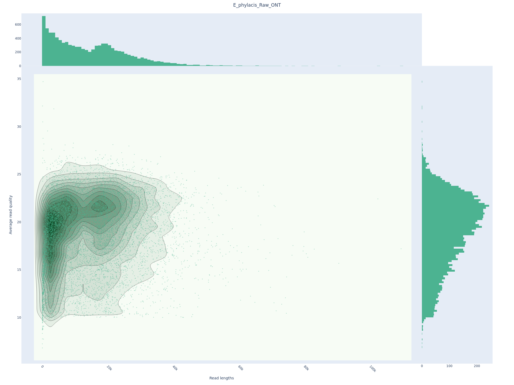

KMC basics output
```
Stats:
   No. of k-mers below min. threshold :            0
   No. of k-mers above max. threshold :            0
   No. of unique k-mers               :   5216090955
   No. of unique counted k-mers       :   5216090955
   Total no. of k-mers                :  44265691027
   Total no. of reads                 :      3064194
   Total no. of super-k-mers          :   6430181221
```

Genomescope:

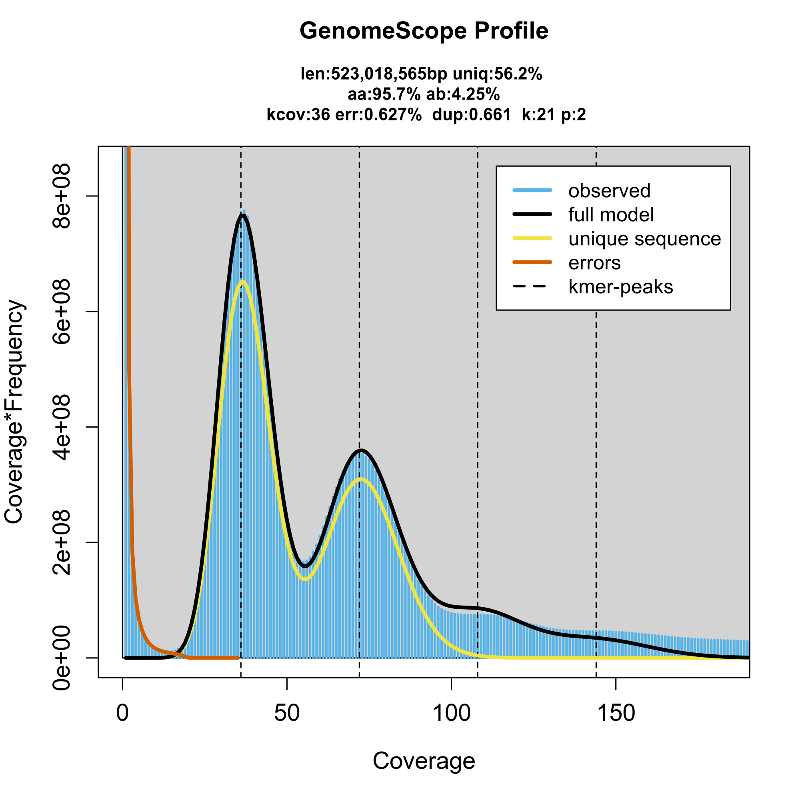


So we have about 4% heterozygosity, a genome size of ~523MB, and a low error rate of 0.6%. Quite nice!

## Contamaination checking

A quick check of the GC content suggests no serious contamination. 

```bash
zcat ${raw_data}/*.fastq.gz | head -n 400000 | \
seqkit fx2tab -n -g | cut -f 2 | \
awk '{printf "%.0f\n", $1}' | sort | uniq -c | \
awk '{printf "%s%%\t%s\n", $2, $1}' | sort -n
```

```
0%      1
9%      1
10%     1
11%     1
13%     1
15%     1
16%     1
17%     5
18%     5
19%     7
20%     6
21%     10
22%     17
23%     22
24%     32
25%     38
26%     67
27%     136
28%     145
29%     238
30%     298
31%     470
32%     690
33%     1117
34%     1895
35%     3027
36%     5375
37%     8983
38%     13473
39%     15529
40%     15264
41%     11650
42%     7815
43%     4459
44%     2612
45%     1632
46%     980
47%     636
48%     516
49%     387
50%     342
51%     228
52%     219
53%     257
54%     303
55%     442
56%     203
57%     85
58%     64
59%     43
60%     45
61%     22
62%     31
63%     24
64%     25
65%     13
66%     25
67%     17
68%     12
69%     11
70%     12
71%     11
72%     4
73%     6
74%     3
75%     3
76%     2
77%     3
79%     1
100%    1
```

This shows a unimodal distribution around 38-41% GC, so it's best to just assemble the genome first and decontaminate contigs later.


# 02 Read filtering

Let's filter the data with Chopper.

```bash
# 1. Setup Directories
filter_dir="02_filtering"
mkdir -p ${filter_dir}/qc_filtered

# let's not get ourselves in trouble
echo "02_filtering/E_phylacis_filtered.fastq.gz" >> .gitignore


# 2. Run Chopper
# Pipe pigz (decompression) -> chopper (filtering) -> bgzip (compression)
echo "Starting Chopper: Filtering for Length > 15kb and Quality > Q10..."
pigz -dc -p 128 ${raw_data}/*.fastq.gz | \
chopper -q 10 -l 15000 | \
bgzip -@ 128 > ${filter_dir}/E_phylacis_filtered.fastq.gz
echo "Filtering complete. Output saved to: ${filter_dir}/E_phylacis_filtered.fastq.gz"

# 3. Post-Filter QC (NanoPlot)
NanoPlot -t 128 \
         --fastq ${filter_dir}/E_phylacis_filtered.fastq.gz \
         --downsample 100000 \
         -o ${filter_dir}/qc_filtered \
         --title "E_phylacis_Filtered_ONT"
```

Post filtering QC:

| Metric | Pre-Filtering | Post-Filtering |
| :--- | :--- | :--- |
| **Total Yield** | 44.3 Gb | **34.0 Gb** |
| **Number of Reads** | 3.06 M | **1.35 M** |
| **Read Length N50** | 22.2 kb | **25.6 kb** |
| **Mean Read Length** | 14.5 kb | **25.2 kb** |
| **Median Read Length** | 12.3 kb | **22.8 kb** |
| **Mean Read Quality** | Q17.2 | **Q17.8** |
| **Median Read Quality** | Q19.6 (~99%) | **Q20.2** |
| **> Q10** (90.0% accuracy) | 44.3 Gb | **34.0 Gb** |
| **> Q15** (96.8% accuracy) | 38.2 Gb | **29.3 Gb** |
| **> Q20** (99.0% accuracy) | 22.2 Gb | **17.2 Gb** |

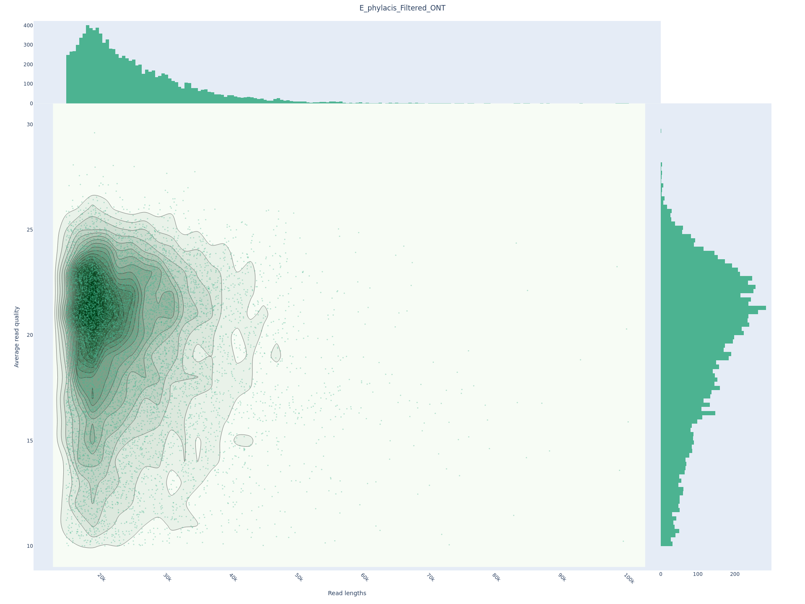


This is great. We still have >30x coverage per haplotype, median quality is >Q20, and average read length is well over 20KB. Over half the data is >Q20 reads too. 

# 03 basic hifiasm assembly

Now I'll assemble the filtered reads with hifiasm. to do this I'll make a Ramdisk to do everything in RAM. I have 2.2TB so this should work OK...


```bash
mkdir -p 03_hifiasm_assembly

# 1. Create a mount point
sudo mkdir -p /mnt/ramdisk

# 2. Mount 1500GB of the 2.2TB RAM as a disk
sudo mount -t tmpfs -o size=1500G tmpfs /mnt/ramdisk
sudo chown $USER /mnt/ramdisk

# 3. Copy your filtered data THERE
cp 02_filtering/E_phylacis_filtered.fastq.gz /mnt/ramdisk/

# 4. Run hifiasm inside the ramdisk
cd /mnt/ramdisk

hifiasm \
    -o E_phylacis_asm \
    -t 160 \
    --ont \
    -l 3 \
    --telo-m AAACCCT \
    --dual-scaf \
    E_phylacis_filtered.fastq.gz \
    2>&1 | tee hifiasm_restart.log

# 5. VERY IMPORTANT: Move results back to /home before rebooting!
rsync -av --progress --exclude='*.fastq.gz' ./ ~/MM_genome/03_hifiasm_assembly/

cd ~/MM_genome

# ignore this stuff for git, mostly
echo "03_hifiasm_assembly/" >> .gitignore

# but keep these guys
git add -f 03_hifiasm_assembly/hifiasm_restart.log
git add -f 03_hifiasm_assembly/*.noseq.gfa
git add -f 03_hifiasm_assembly/*.lowQ.bed
git commit -m "Ignore raw assembly binaries but keep logs and noseq graphs"

```


## Assembly summary

Let's summarise the graphs with gfastats

```bash
mkdir -p 03_hifiasm_assembly/QC
gfastats 03_hifiasm_assembly/E_phylacis_asm.bp.hap1.p_ctg.gfa --discover-paths --segment-report > 03_hifiasm_assembly/QC/stats_hap1_segments.txt
gfastats 03_hifiasm_assembly/E_phylacis_asm.bp.hap1.p_ctg.gfa --discover-paths > 03_hifiasm_assembly/QC/stats_hap1.txt

gfastats 03_hifiasm_assembly/E_phylacis_asm.bp.hap2.p_ctg.gfa --discover-paths --segment-report > 03_hifiasm_assembly/QC/stats_hap2_segments.txt
gfastats 03_hifiasm_assembly/E_phylacis_asm.bp.hap2.p_ctg.gfa --discover-paths > 03_hifiasm_assembly/QC/stats_hap2.txt

gfastats 03_hifiasm_assembly/E_phylacis_asm.bp.p_ctg.gfa --discover-paths --segment-report > 03_hifiasm_assembly/QC/stats_primary_segments.txt
gfastats 03_hifiasm_assembly/E_phylacis_asm.bp.p_ctg.gfa --discover-paths > 03_hifiasm_assembly/QC/stats_primary.txt

git add -f 03_hifiasm_assembly/QC/
```

Hap1:
* Length: 579570136
* N50: 39833816
* Sum of top 11: 479,816,686 (82.7% of total)

Hap2:
* Length: 580987427
* N50: 43786601
* Sum of top 11: 466,703,285 (80.3% of total)

Primary contig assembly:
* Length: 545423967
* N50: 45651274
* Sum of top 11: 512,180,968 (93.9% of total)

Hap1 top 11 scaffolds:
```
Seq     Header  Comment Total segment length    A       C       G       T       GC content %    # soft-masked bases     Is circular: 
1       h1tg000001l             51317275        15581784        10088548        10060793        15586150        39.26   0       N
2       h1tg000002l             34632735        10403692        6918163 6905508 10405372        39.92   0       N
3       h1tg000003l             59377836        18014668        11731310        11638807        17993051        39.36   0       N
4       h1tg000004l             38027376        11524382        7473569 7506629 11522796        39.39   0       N
5       h1tg000005l             39657523        11954888        7853657 7859159 11989819        39.62   0       N
6       h1tg000006l             28751543        8692468 5642168 5679416 8737491 39.38   0       N
7       h1tg000007l             41957522        12681753        8316763 8322106 12636900        39.66   0       N
8       h1tg000008l             61728905        18653045        12184965        12191786        18699109        39.49   0       N
9       h1tg000009l             39833816        12005760        7924497 7892044 12011515        39.71   0       N
10      h1tg000010l             33387284        10075060        6608064 6625293 10078867        39.64   0       N
11      h1tg000011l             51144871        15434505        10210279        10161001        15339086        39.83   0       N
```

Hap2 top 11 scaffolds:

```
Seq     Header  Comment Total segment length    A       C       G       T       GC content %    # soft-masked bases     Is circular: 
1       h2tg000001l             54055996        16246510        10739895        10777096        16292495        39.81   0       N
2       h2tg000002l             45187061        13709758        8862292 8891714 13723297        39.29   0       N
3       h2tg000003l             65679588        19845392        12967282        12971991        19894923        39.49   0       N
4       h2tg000004l             38512735        11580937        7688737 7644481 11598580        39.81   0       N
5       h2tg000005l             18271583        5236722 3476365 3493002 5220136 39.99   0       N
6       h2tg000006l             36524851        11017298        7238859 7254846 11013848        39.68   0       N
7       h2tg000007l             42203136        12767072        8362376 8356582 12717106        39.62   0       N
8       h2tg000008l             30255392        9129461 5979442 5996696 9149793 39.58   0       N
9       h2tg000009l             56292537        17057888        11068887        11069636        17096126        39.33   0       N
10      h2tg000010l             43786601        13237045        8685725 8676979 13186752        39.65   0       N
11      h2tg000011l             35933805        10838134        7021993 7082002 10855327        39.40   0       N
```

Primary contig (bp.p_ctg) top 11 scaffolds
```
Seq     Header  Comment Total segment length    A       C       G       T       GC content %    # soft-masked bases     Is circular: 
1       ptg000001l              45651274        13837378        8968599 8979051 13866246        39.31   0       N
2       ptg000002l              54055996        16246510        10739895        10777096        16292495        39.81   0       N
3       ptg000003l              59271212        17985060        11714462        11612997        17958693        39.36   0       N
4       ptg000004l              38027376        11524382        7473569 7506629 11522796        39.39   0       N
5       ptg000005l              61704420        18645782        12179659        12186397        18692582        39.49   0       N
6       ptg000006l              38521672        11582632        7689359 7647684 11601997        39.81   0       N
7       ptg000007l              42285308        12737509        8368553 8385101 12794145        39.62   0       N
8       ptg000008l              41957522        12681753        8316763 8322106 12636900        39.66   0       N
9       ptg000009l              57093733        17310108        11249947        11235059        17298619        39.38   0       N
10      ptg000010l              39824047        12001580        7920315 7892040 12010112        39.71   0       N
11      ptg000011l              33788408        10173370        6719776 6724548 10170714        39.79   0       N
```

## Telomere checks

Let's check for common repeats, and see where they are.

First we explore for common repeats:

```bash
tidk explore --length 7 --minimum 5 --maximum 12 03_hifiasm_assembly/E_phylacis_asm.bp.p_ctg.fa
tidk explore --length 7 --minimum 5 --maximum 12 03_hifiasm_assembly/E_phylacis_asm.bp.hap1.p_ctg.fa
tidk explore --length 7 --minimum 5 --maximum 12 03_hifiasm_assembly/E_phylacis_asm.bp.hap1.p_ctg.fa
```

All looks good:

```
canonical_repeat_unit   count_repeat_runs_gt_100
AAACCCT 8816
ACCCGTC 2829
[+]     Exploring genome for potential telomeric repeats of length: 7
[+]     Finished searching genome
[+]     Generating output
canonical_repeat_unit   count_repeat_runs_gt_100
AAACCCT 8816
AAAAAAG 1157
AAGACTC 635
[+]     Exploring genome for potential telomeric repeats of length: 7
[+]     Finished searching genome
[+]     Generating output
canonical_repeat_unit   count_repeat_runs_gt_100
AAACCCT 8816
AAAAAAG 1157
AAGACTC 635
```

This is good! Exactly what we expect. The AAACCCT is the telomere. The others are likely centromeres, LINEs, or similar. Let's see where they are on the scaffolds (I'll focus on the first 11 scaffolds of each assembly, becuase that's most of it). 


First we'll use `tidk search` to figure out where they are in each of the three assemblies:

```bash
# Define motifs and assemblies
MOTIFS=("AAACCCT" "ACCCGTC" "AAAAAAG" "AAGACTC")
FILES=("p_ctg" "hap1.p_ctg" "hap2.p_ctg")

mkdir -p 03_hifiasm_assembly/QC/tidk_plots

for f in "${FILES[@]}"; do
  for m in "${MOTIFS[@]}"; do
    echo "Searching for $m in $f..."
    tidk search --string $m \
      --dir 03_hifiasm_assembly/QC/tidk_plots \
      --output "${f}_${m}" \
      --extension tsv \
      "03_hifiasm_assembly/E_phylacis_asm.bp.${f}.fa"
  done
done
```

| Primary Assembly | Haplotype 1 | Haplotype 2 |
| :---: | :---: | :---: |
| [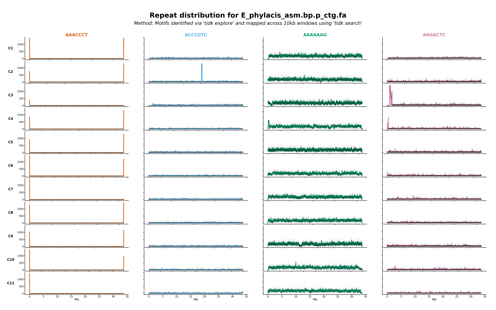](03_hifiasm_assembly/QC/telomere_results/p_ctg_repeat_fingerprint.png) | [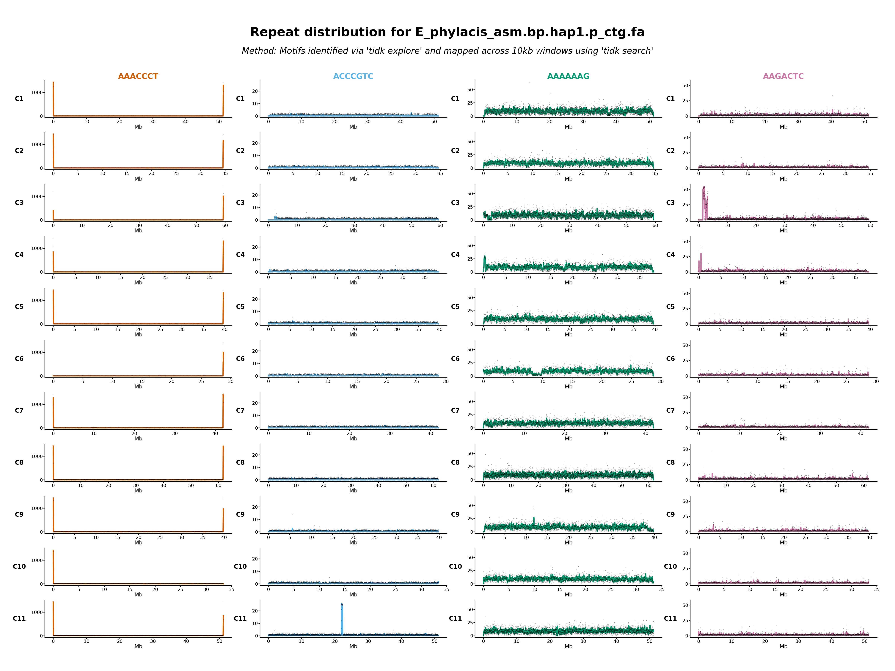](03_hifiasm_assembly/QC/telomere_results/hap1_repeat_fingerprint.png) | [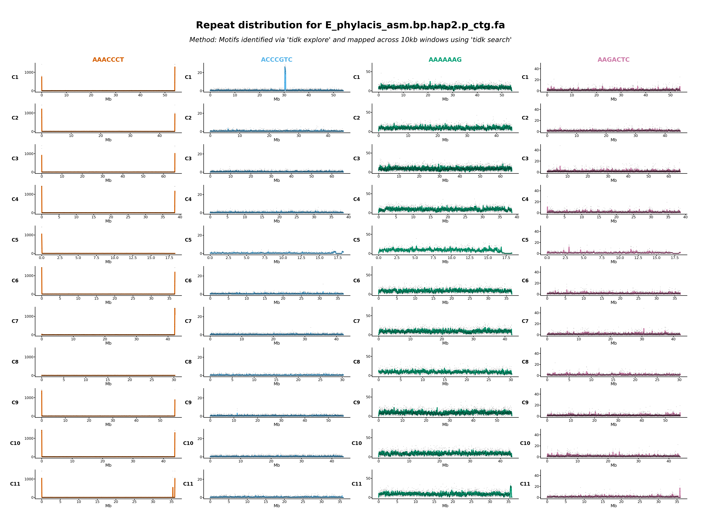](03_hifiasm_assembly/QC/telomere_results/hap2_repeat_fingerprint.png) |
| *Click to enlarge* | *Click to enlarge* | *Click to enlarge* |

**Legend:**
* **Red (AAACCCT):** Canonical plant telomere motif.
* **Sky Blue (ACCCGTC):** Putative centromeric satellite.
* **Green (AAAAAAG):** Transposon-associated / Poly-A repeats.
* **Purple (AAGACTC):** Secondary satellite motif.
* Black points represent raw 10kb window counts (alpha 0.5); colored lines indicate smoothed trends.

This is pretty good. Most of the 11 big scaffolds are T2T in the primary and the two haplotype assemblies.

## BUSCO with Compleasm

First I'll make versions of the assemblies with just the 11 longest contigs, since the telomere analysis suggests that this might be quite complete.

```bash
# Define your assemblies
ASSEMBLIES=(
    "E_phylacis_asm.bp.p_ctg.fa"
    "E_phylacis_asm.bp.hap1.p_ctg.fa"
    "E_phylacis_asm.bp.hap2.p_ctg.fa"
)

THREADS=64

for FASTA in "${ASSEMBLIES[@]}"; do
    # Create a base name (e.g., p_ctg, hap1, hap2)
    BASE=$(echo "$FASTA" | sed 's/E_phylacis_asm.bp.//; s/.p_ctg.fa//; s/.fa//')
    
    echo "-------------------------------------------------------"
    echo "Processing: $BASE"
    echo "-------------------------------------------------------"

    # 1. Index the file
    samtools faidx 03_hifiasm_assembly/$FASTA

    # 2. Get the names of the top 11 longest contigs
    cut -f1,2 03_hifiasm_assembly/${FASTA}.fai | \
        sort -k2,2rn | \
        head -n 11 | \
        cut -f1 > ${BASE}_top11_list.txt

    # 3. Extract these contigs
    samtools faidx 03_hifiasm_assembly/$FASTA \
        -r ${BASE}_top11_list.txt > 03_hifiasm_assembly/E_phylacis_${BASE}_top11.fa

    rm ${BASE}_top11_list.txt
done
```


Let's look at the three assemblies completeness with BUSCOs. We'll do general and specific, using embryophyta_odb12 and eudicots_odb12 respectively. We'll repeat it for the full assembly and the 11 biggest contigs.

```bash
# Configuration
OUT_BASE="03_hifiasm_assembly/QC/compleasm_results"
THREADS=128

mkdir -p "$OUT_DIR"

# Download the databases (compleasm handles the URLs automatically)
compleasm download embryophyta
compleasm download eudicotyledons

# --- PRIMARY ASSEMBLY ---
compleasm run -a 03_hifiasm_assembly/E_phylacis_asm.bp.p_ctg.fa -o ${OUT_BASE}/p_ctg_embryo -l embryophyta -t $THREADS
compleasm run -a 03_hifiasm_assembly/E_phylacis_asm.bp.p_ctg.fa -o ${OUT_BASE}/p_ctg_eudicot -l eudicotyledons -t $THREADS

compleasm run -a 03_hifiasm_assembly/E_phylacis_p_ctg_top11.fa -o ${OUT_BASE}/p_ctg_top11_embryo -l embryophyta -t $THREADS
compleasm run -a 03_hifiasm_assembly/E_phylacis_p_ctg_top11.fa -o ${OUT_BASE}/p_ctg_top11_eudicot -l eudicotyledons -t $THREADS

# --- HAPLOTYPE 1 ---
compleasm run -a 03_hifiasm_assembly/E_phylacis_asm.bp.hap1.p_ctg.fa -o ${OUT_BASE}/hap1_embryo -l embryophyta -t $THREADS
compleasm run -a 03_hifiasm_assembly/E_phylacis_asm.bp.hap1.p_ctg.fa -o ${OUT_BASE}/hap1_eudicot -l eudicotyledons -t $THREADS

compleasm run -a 03_hifiasm_assembly/E_phylacis_hap1_top11.fa -o ${OUT_BASE}/hap1_top11_embryo -l embryophyta -t $THREADS
compleasm run -a 03_hifiasm_assembly/E_phylacis_hap1_top11.fa -o ${OUT_BASE}/hap1_top11_eudicot -l eudicotyledons -t $THREADS

# --- HAPLOTYPE 2 ---
compleasm run -a 03_hifiasm_assembly/E_phylacis_asm.bp.hap2.p_ctg.fa -o ${OUT_BASE}/hap2_embryo -l embryophyta -t $THREADS
compleasm run -a 03_hifiasm_assembly/E_phylacis_asm.bp.hap2.p_ctg.fa -o ${OUT_BASE}/hap2_eudicot -l eudicotyledons -t $THREADS

compleasm run -a 03_hifiasm_assembly/E_phylacis_hap2_top11.fa -o ${OUT_BASE}/hap2_top11_embryo -l embryophyta -t $THREADS
compleasm run -a 03_hifiasm_assembly/E_phylacis_hap2_top11.fa -o ${OUT_BASE}/hap2_top11_eudicot -l eudicotyledons -t $THREADS

```

Once that's done, we can get the table below using

```bash
python scripts/summarise_compleasm.py
```

| Dataset with embryophyta |      S (%, (N)) |      D (%, (N)) |      F (%, (N)) |      M (%, (N)) |    Total |
| ---------------------- | ---------------: | ---------------: | ---------------: | ---------------: | --------: |
| p_ctg_embryo           |   96.50% (1955) |      3.11% (63) |       0.39% (8) |       0.00% (0) |     2026 |
| p_ctg_top11_embryo     |   94.32% (1911) |      2.62% (53) |      0.59% (12) |      2.47% (50) |     2026 |
| hap1_embryo            |   91.31% (1850) |     7.90% (160) |       0.39% (8) |       0.39% (8) |     2026 |
| hap1_top11_embryo      |   91.51% (1854) |      2.42% (49) |      0.79% (16) |     5.28% (107) |     2026 |
| hap2_embryo            |   93.14% (1887) |     6.52% (132) |       0.35% (7) |       0.00% (0) |     2026 |
| hap2_top11_embryo      |   93.48% (1894) |      1.97% (40) |      0.59% (12) |      3.95% (80) |     2026 |


| Dataset with eudicots  |      S (%, (N)) |      D (%, (N)) |      F (%, (N)) |      M (%, (N)) |    Total |
| ---------------------- | ---------------: | ---------------: | ---------------: | ---------------: | --------: |
| p_ctg_eudicot          |   96.79% (2715) |      2.89% (81) |       0.29% (8) |       0.04% (1) |     2805 |
| p_ctg_top11_eudicot    |   95.04% (2666) |      2.14% (60) |      0.53% (15) |      2.28% (64) |     2805 |
| hap1_eudicot           |   91.76% (2574) |     7.31% (205) |      0.39% (11) |      0.53% (15) |     2805 |
| hap1_top11_eudicot     |   91.94% (2579) |      2.00% (56) |      0.75% (21) |     5.31% (149) |     2805 |
| hap2_eudicot           |   92.66% (2599) |     7.06% (198) |       0.25% (7) |       0.04% (1) |     2805 |
| hap2_top11_eudicot     |   93.69% (2628) |      2.03% (57) |      0.57% (16) |     3.71% (104) |     2805 |

A few observations. The primary is exceptionally complete, and even has 97.5% of BUSCOs (either set) when you just take the top 11 contigs. The smaller contigs contain quite a few duplicates.

The two haplotype assemblies are also very complete, and dropping the small contigs massively drops the duplication rate, at the cost of putting the missing % up to ~4-5%. 

In terms of the top11 assemblies which have just the 11 'chromosome' contigs, completeness is still ~95% or higher. The duplication rate is ~2%, and there's ~1% fragmented.

This is good, showing we can stick with these assemblies from here. 

## Comparing hap1 and hap2

First let's figure out which contigs are which in the haplotypes. We'll align it and dot-plot it.

```bash
mkdir 03_hifiasm_assembly/compare_h1h2

# Align Hap1 to Hap2
minimap2 -x asm5 -t 128 -N 1000 --secondary=no \
    03_hifiasm_assembly/E_phylacis_hap1_top11.fa \
    03_hifiasm_assembly/E_phylacis_hap2_top11.fa \
    > 03_hifiasm_assembly/compare_h1h2/hap1_vs_hap2.paf

Rscript scripts/pafCoordsDotPlotly.R   -i 03_hifiasm_assembly/compare_h1h2/hap1_vs_hap2.paf   -o hap1_vs_hap2_dotplot2 -s -t -m 2000 -q 500000

mv hap1_vs_hap2_dotplot2.* 03_hifiasm_assembly/compare_h1h2/.
```

The dotplot shows good contiguity between them, but the % identity is low (gaps and repeats??)
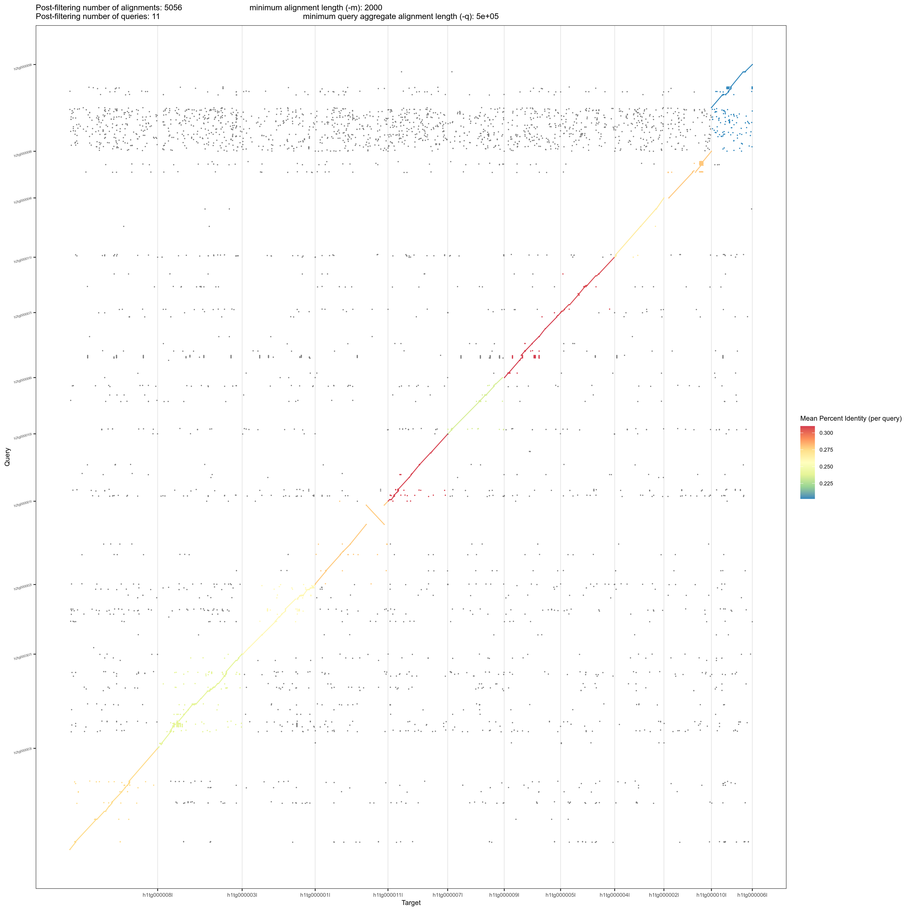

We can look at coverage vs. identity using the `dv` column of the PAF, which is similar to P distance.


```bash
awk 'BEGIN {
    print "| H2 ID | H1 ID | Total Matches | H2 Coverage | Identity (1-dv) |";
    print "| :--- | :--- | :--- | :--- | :--- |";
}
{
    # Extract dv tag
    dv=0; for(i=13;i<=NF;i++) if($i ~ /^dv:f:/) dv=substr($i,6);
    
    # Key is Query + Target pair
    key=$1"|"$6;
    matches[key]+=$10;
    # Store target length (Col 7) to calculate coverage later
    t_lengths[key]=$7;
    # Store the dv for the pair
    dvs[key]=dv; 
}
END {
    for (k in matches) {
        split(k, names, "|");
        coverage = (matches[k] / t_lengths[k]) * 100;
        identity = (1 - dvs[k]) * 100;
        
        # Filter for significant matches only (optional, e.g., > 1% coverage)
        # to avoid printing the repetitive noise again
        if (coverage > 1) {
            printf "| %s | %s | %d | %.2f%% | %.2f%% |\n", \
            names[1], names[2], matches[k], coverage, identity;
        }
    }
}' 03_hifiasm_assembly/compare_h1h2/hap1_vs_hap2.paf | sort -t'|' -k2,2 -k4,4nr | awk -F'|' '!seen[$2]++'
```

| H2 ID | H1 ID | Total Matches | H2 Coverage | Identity (1-dv) |
| :--- | :--- | :--- | :--- | :--- |
| h2tg000001l | h1tg000011l | 18993427 | 37.14% | 97.35% |
| h2tg000002l | h1tg000001l | 13955987 | 27.20% | 94.97% |
| h2tg000003l | h1tg000008l | 20029949 | 32.45% | 96.42% |
| h2tg000004l | h1tg000002l | 13101698 | 37.83% | 89.83% |
| h2tg000006l | h1tg000009l | 12991176 | 32.61% | 92.96% |
| h2tg000007l | h1tg000005l | 14464822 | 36.47% | 96.42% |
| h2tg000008l | h1tg000010l | 10033092 | 30.05% | 93.99% |
| h2tg000009l | h1tg000006l | 8494638 | 29.54% | 97.89% |
| h2tg000010l | h1tg000007l | 14004298 | 33.38% | 92.96% |
| h2tg000011l | h1tg000004l | 11697283 | 30.76% | 94.38% |
| h2tg000307l | h1tg000003l | 15749157 | 26.52% | 94.97% |

This table gives the correspondence between the chromosomes in h1 and h2. It shows that the coverage is low (as shown in the dotplot) due to indels and structural variants. But where the sequences align, they are very similar (89-98% identity). Chr 4l from h2 and 2l from h1 is interesting - they match by the lowest amount of 89%, but the dotplot for these looks the cleanest! So they are highly sytenic, but with high sequence divergence. 


# 04 Comparison with decipiens and virginea

Next we want to compare the new genomes to those of the putative parental species (not individuals, we don't have the individual parents). These are E. decipiens and E. virginea.

First we get the genomes:

```bash
# Create the root folder
mkdir -p parental_spp_genomes
cd parental_spp_genomes

# Download E. decipiens (GCA_014182575.1)
datasets download genome accession GCA_014182575.1 --filename e_decipiens.zip
unzip e_decipiens.zip -d e_decipiens_dir
mv e_decipiens_dir/ncbi_dataset/data/GCA_014182575.1/*.fna E_decipiens.fa

# Download E. virginea (GCA_014182375.1)
datasets download genome accession GCA_014182375.1 --filename e_virginea.zip
unzip e_virginea.zip -d e_virginea_dir
mv e_virginea_dir/ncbi_dataset/data/GCA_014182375.1/*.fna E_virginea.fa

# Cleanup
rm -rf *_dir *.zip
cd ..
```
## Via genome alignment

Now we align them all to the two parents. I'll cut out secondary alignments for now.

```bash
# Create output directory for alignments
mkdir -p 04_parental_assignment

# Alignment of Hap1 vs both parents
minimap2 -x asm5 -N 1000 --secondary=no -t 128 parental_spp_genomes/E_decipiens.fa 03_hifiasm_assembly/E_phylacis_hap1_top11.fa > 04_parental_assignment/hap1_vs_decipiens.paf
minimap2 -x asm5 -N 1000 --secondary=no -t 128 parental_spp_genomes/E_virginea.fa 03_hifiasm_assembly/E_phylacis_hap1_top11.fa > 04_parental_assignment/hap1_vs_virginea.paf

# Alignment of Hap2 vs both parents
minimap2 -x asm5 -N 1000 --secondary=no -t 128 parental_spp_genomes/E_decipiens.fa 03_hifiasm_assembly/E_phylacis_hap2_top11.fa > 04_parental_assignment/hap2_vs_decipiens.paf
minimap2 -x asm5 -N 1000 --secondary=no -t 128 parental_spp_genomes/E_virginea.fa 03_hifiasm_assembly/E_phylacis_hap2_top11.fa > 04_parental_assignment/hap2_vs_virginea.paf
```

A rough look at these alignments is to get the identity to decipiens and virginea across the whole chromosomes of hap1 and hap2, using the approach we did above for the hap1 v hap2 paf. 

```bash
awk 'BEGIN {
    print "| S1 ID | S2 ID | Total Matches | S1 Coverage | Identity |";
    print "| :--- | :--- | :--- | :--- | :--- |";
}
{
    # Extract dv tag
    dv=0; for(i=13;i<=NF;i++) if($i ~ /^dv:f:/) dv=substr($i,6);
    
    # Key is Query + Target pair
    key=$1"|"$6;
    matches[key]+=$10;
    # Store target length (Col 7) to calculate coverage later
    t_lengths[key]=$7;
    # Store the dv for the pair
    dvs[key]=dv; 
}
END {
    for (k in matches) {
        split(k, names, "|");
        coverage = (matches[k] / t_lengths[k]) * 100;
        identity = (1 - dvs[k]) * 100;
        
        # Filter for significant matches only (optional, e.g., > 1% coverage)
        # to avoid printing the repetitive noise again
        if (coverage > 1) {
            printf "| %s | %s | %d | %.2f%% | %.2f%% |\n", \
            names[1], names[2], matches[k], coverage, identity;
        }
    }
}' 03_hifiasm_assembly/compare_h1h2/hap1_vs_hap2.paf | sort -t'|' -k2,2 -k4,4nr | awk -F'|' '!seen[$2]++'
```

In the following tables - I ran the above twice for each of h1 and h2 (vs the two parents). I then organised the rows according to the decipiens chromosome, so row 1 corresponds to homologous chromosomes in both tables, etc. I bolded the parent with the highest identity for each row.

### Haplotype 1 Assignment
| S1 ID | decip ID | virgin ID | decip Matches | virgin Matches | decip Coverage | virgin Coverage | decip Identity | virgin Identity |
| :---  | :---     | :---      | :---          | :---           | :---           | :---            | :---           | :---            |
| h1tg000001l | CM024615.1 |  CM024520.1 | 24507427 |  14259343 | **40.71%** | 24.90% | **97.35%** |  92.96% |
| h1tg000002l | CM024618.1 |  CM024523.1 | 12497885 |  21930450 | 32.71% | **59.56%** | **97.35%** |  91.27% |
| h1tg000003l | CM024613.1 |  CM024518.1 | 15221461 |  26814450 | 24.60% | **47.00%** | 93.86% |  **97.35%** |
| h1tg000004l | CM024612.1 |  CM024517.1 | 21161217 |  10238986 | **49.09%** | 31.61% | 88.95% |  **93.39%** |
| h1tg000005l | CM024619.1 |  CM024524.1 | 14717449 |  25884302 | 31.37% | **54.94%** | 97.35% |  **97.89%** |
| h1tg000006l | CM024611.1 |  CM024516.1 | 14070625 |  7971233 |  **21.01%** | 13.35% | **97.35%** |  94.97% |
| h1tg000007l | CM024609.1 |  CM024514.1 | 14192176 |  25459023 | 29.80% | **61.75%** | **97.35%** |  96.42% |
| h1tg000008l | CM024616.1 |  CM024521.1 | 19421761 |  32622160 | 29.67% | **50.27%** | **97.35%** |  **97.35%** |
| h1tg000009l | CM024617.1 |  CM024522.1 | 22115718 |  11535835 | **49.93%** | 35.01% | 95.64% |  **97.35%** |
| h1tg000010l | CM024610.1 |  CM024515.1 | 11611686 |  18607522 | 22.00% | **39.55%** | **97.35%** |  96.42% |
| h1tg000011l | CM024614.1 |  CM024519.1 | 18324338 |  33323862 | 30.25% | **59.35%** | **96.42%** |  95.64% |

### Haplotype 2 Assignment
| S1 ID | decip ID | virgin ID | decip Matches | virgin Matches | decip Coverage | virgin Coverage | decip Identity | virgin Identity |
| :---  | :---     | :---      | :---          | :---           | :---           | :---            | :---           | :---            |
| h2tg000002l | CM024615.1 |  CM024520.1 | 13540418 | 23333631 | 22.49% | **40.74%** | **97.35%** |   92.96% |
| h2tg000004l | CM024618.1 |  CM024523.1 | 21985119 | 12297418 | **57.54%** | 33.40% | **97.35%** |   **97.35%** |
| h2tg000307l | CM024613.1 |  CM024518.1 | 25985950 | 14930779 | **42.00%** | 26.17% | 93.48% |   **97.35%** |
| h2tg000011l | CM024612.1 |  CM024517.1 | 12352436 | 19166451 | 28.65% | **59.17%** | **97.35%** |   **97.35%** |
| h2tg000007l | CM024619.1 |  CM024524.1 | 26865746 | 13888371 | **57.26%** | 29.48% | 94.82% |   **95.64%** |
| h2tg000009l | CM024611.1 |  CM024516.1 | 16223298 | 26266346 | 24.23% | **44.00%** | **95.64%** |   91.57% |
| h2tg000010l | CM024609.1 |  CM024514.1 | 24752428 | 13217580 | **51.97%** | 32.06% | 88.59% |   **94.38%** |
| h2tg000003l | CM024616.1 |  CM024521.1 | 34587010 | 19185595 | **52.84%** | 29.57% | **97.89%** |   **97.89%** |
| h2tg000006l | CM024617.1 |  CM024522.1 | 12763271 | 20615297 | 28.82% | **62.57%** | 84.85% |   **93.39%** |
| h2tg000008l | CM024610.1 |  CM024515.1 | 16518915 | 9262525 | **31.30%** | 19.69% | 95.64% |   **96.42%** |
| h2tg000001l | CM024614.1 |  CM024519.1 | 32535393 | 18373938 | **53.72%** | 32.72% | **97.35%** |   94.38% |


Based on these results, the identity looks a bit confusing, and maybe has a bug. Generously, one would say that it doesn't help distinguish much between the two parents. But the coverage tells a different story. We get perfect assignment between the two parents - h1 prefers one parent, h2 always prefers the other. You can read these off. In the following table I rearranged them into order based on the E decipiens genome from NCBI.


| Chr# | decipiens-original | virginea-original | decipiens-parent | virginea-parent |
| :--- | :---             | :---     	     | :---      		| :---            |
| Chr1 | CM024609.1 |  CM024514.1 | h2tg000010l | h1tg000007l |
| Chr2 | CM024610.1 |  CM024515.1 | h2tg000008l | h1tg000010l |
| Chr3 | CM024611.1 |  CM024516.1 | h1tg000006l | h2tg000009l |
| Chr4 | CM024612.1 |  CM024517.1 | h1tg000004l | h2tg000011l |
| Chr5 | CM024613.1 |  CM024518.1 | h2tg000307l | h1tg000003l |
| Chr6 | CM024614.1 |  CM024519.1 | h2tg000001l | h1tg000011l |
| Chr7 | CM024615.1 |  CM024520.1 | h1tg000001l | h2tg000002l |
| Chr8 | CM024616.1 |  CM024521.1 | h2tg000003l | h1tg000008l |
| Chr9 | CM024617.1 |  CM024522.1 | h1tg000009l | h2tg000006l |
| Chr10 | CM024618.1 |  CM024523.1 | h2tg000004l | h1tg000002l |
| Chr11 | CM024619.1 |  CM024524.1 | h2tg000007l | h1tg000005l |


## Dotplots vs. putative parents

Let's further examine the putative assignments above with dotplots.

First we'll get the 11 main chromosomes from the two parental genomes. This script also names the chromosomes in the parental genomes with the chromosome numbers, e.g. `CM024609.1_Chr1`

```bash
# ---------------------------------------------------------
# 1. Process E. decipiens
# ---------------------------------------------------------
# IDs: CM024609.1 (Chr 1) through CM024619.1 (Chr 11)
for i in {0..10}; do
    # Calculate the ID (09, 10, 11...) and the Chr number (1, 2, 3...)
    ACC=$(printf "CM0246%02d.1" $((9 + i)))
    CHR="Chr$((1 + i))"
    
    # Extract and rename on the fly
    samtools faidx parental_spp_genomes/E_decipiens.fa $ACC | \
    sed "s/>$ACC/>${ACC}_${CHR}/" >> parental_spp_genomes/E_decipiens_top11.fa
done

# ---------------------------------------------------------
# 2. Process E. virginea
# ---------------------------------------------------------
# IDs: CM024514.1 (Chr 1) through CM024524.1 (Chr 11)
for i in {0..10}; do
    ACC=$(printf "CM0245%02d.1" $((14 + i)))
    CHR="Chr$((1 + i))"
    
    samtools faidx parental_spp_genomes/E_virginea.fa $ACC | \
    sed "s/>$ACC/>${ACC}_${CHR}/" >> parental_spp_genomes/E_virginea_top11.fa
done
```

Now we can make the dot plots:

```bash
#!/bin/bash

# --- File and Directory Names ---
H1="03_hifiasm_assembly/E_phylacis_hap1_top11.fa"
H2="03_hifiasm_assembly/E_phylacis_hap2_top11.fa"
DEC="parental_spp_genomes/E_decipiens_top11_named.fa"
VIR="parental_spp_genomes/E_virginea_top11_named.fa"
OUT_DIR="04_parental_assignment/all_vs_all_dotplots"

mkdir -p $OUT_DIR

# Define the pairs to compare: "Reference,Query,OutputName"
PAIRS=(
    "$H1,$H2,h1_vs_h2"
    "$DEC,$H1,h1_vs_dec"
    "$VIR,$H1,h1_vs_vir"
    "$DEC,$H2,h2_vs_dec"
    "$VIR,$H2,h2_vs_vir"
    "$DEC,$VIR,dec_vs_vir"
)

          
echo "Done! All 6 comparisons are in $OUT_DIR"
```


## All-vs-All Haplotype & Parental Comparison

This table provides a comprehensive overview of the synteny and divergence between the assembled haplotypes (H1, H2) and the two parental reference genomes (*E. decipiens* and *E. virginea*). 

| | **Haplotype 1 (H1)** | **Haplotype 2 (H2)** | **E. decipiens (Ref)** | **E. virginea (Ref)** |
| :--- | :---: | :---: | :---: | :---: |
| **H1** | — | — | — | — |
| **H2** | [](04_parental_assignment/all_vs_all_dotplots/h1_vs_h2_plot.png) | — | — | — |
| **Decipiens** | [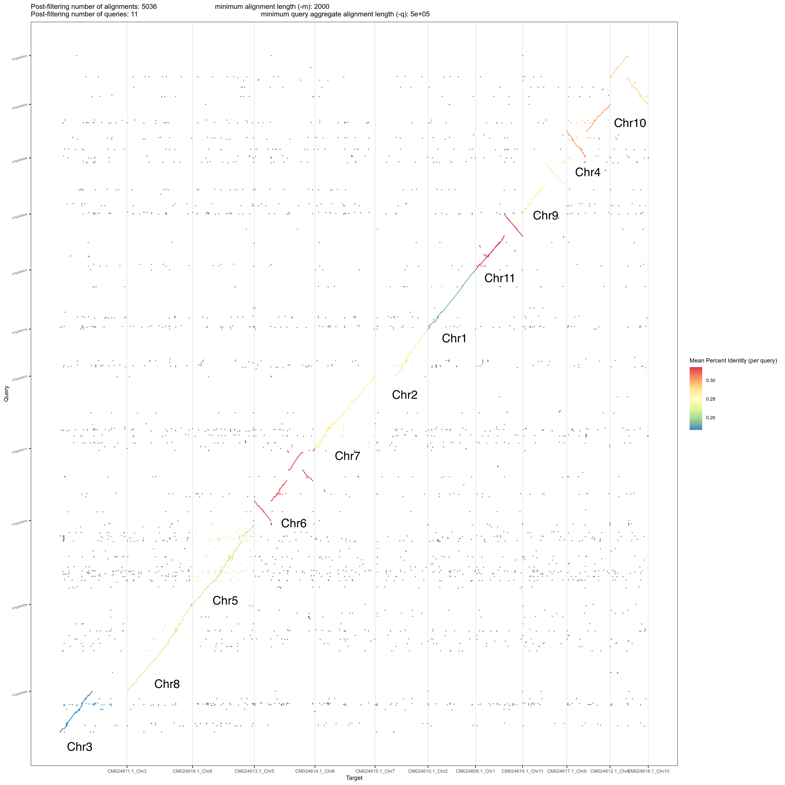](04_parental_assignment/all_vs_all_dotplots/h1_vs_dec_plot.png) | [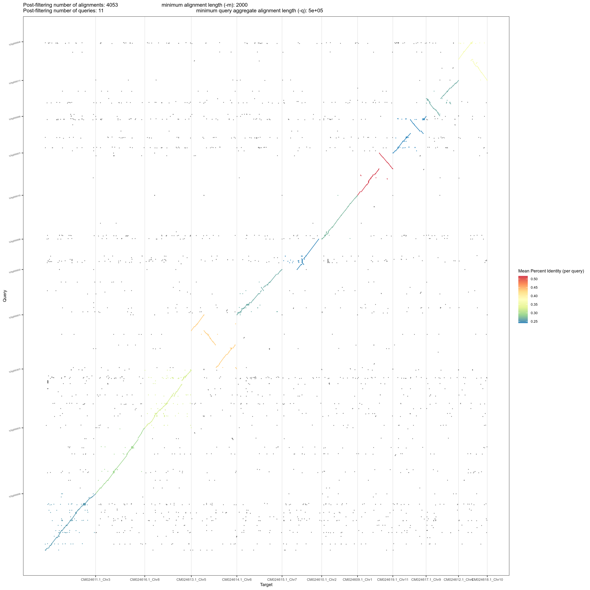](04_parental_assignment/all_vs_all_dotplots/h2_vs_dec_plot.png) | — | — |
| **Virginea** | [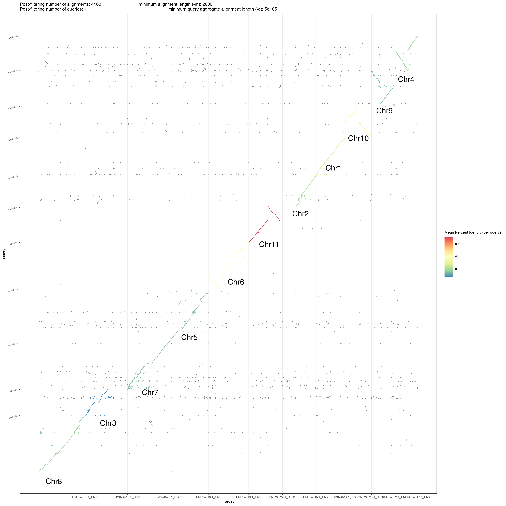](04_parental_assignment/all_vs_all_dotplots/h1_vs_vir_plot.png) | [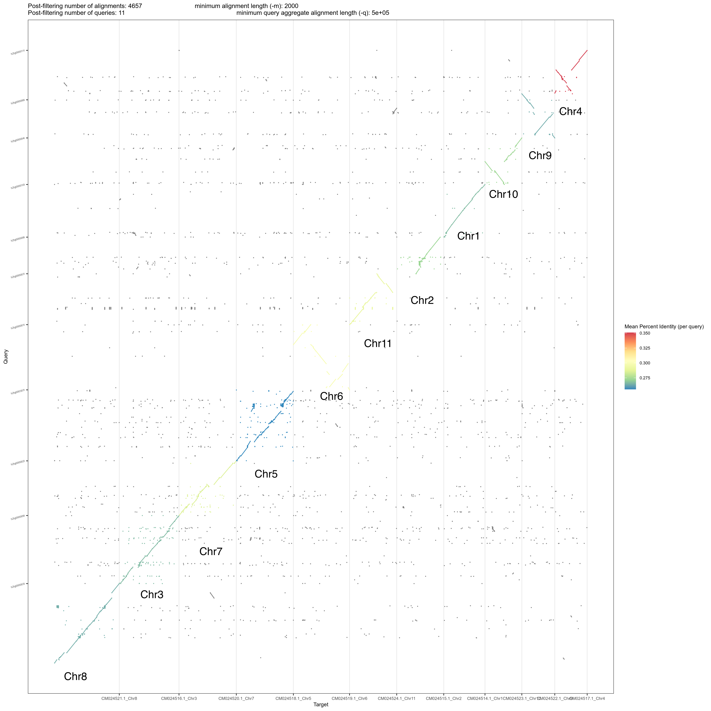](04_parental_assignment/all_vs_all_dotplots/h2_vs_vir_plot.png) | [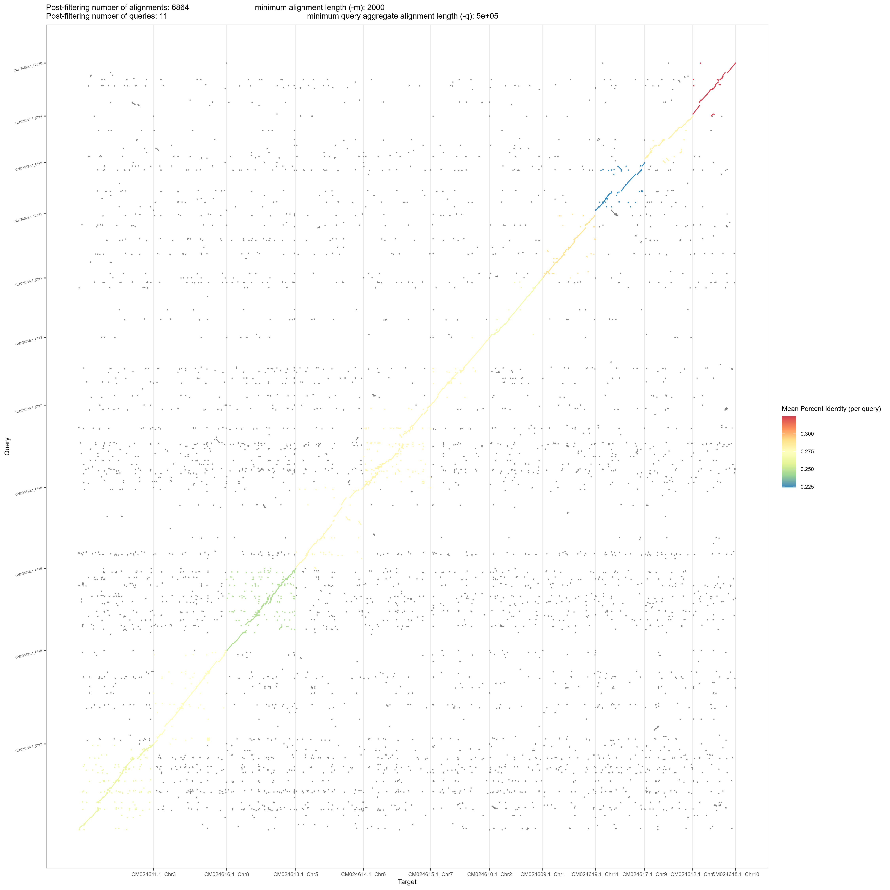](04_parental_assignment/all_vs_all_dotplots/dec_vs_vir_plot.png) | — |

---
*Note: Click on any thumbnail to view the full-resolution interactive/static dotplot.*

Visual analysis of the dotplots suggest the following.

First, it looks to me like there could be a bit of phase switching. E.g. chr3 for h1 maps well to the start of virginea, but to the middle of decipiens. Merqury should help to sort out if this is real.

Second, we can try to allocate chromosomes to parents. However, doing this reveals that there's often not a clear distinction, and even if there is, one would often assign both H1 and H2 to the same parents on visual inspection (e.g. Chr 5 looks to be best aligned to decipiens for both H1 and H2). This could just be because the particular accumulation of structural variants (which are common) in the particular samples we have access to for virginea and decipiens. 

Everyone here is clearly closely related, and there are clearly a lot of structural variants between all comparisons. 

Another notable difference is that mapping E. decipiens vs. E. virginea looks a lot more contiguous than H1 vs H2, or either haplotypes vs decipiens OR virginea. This could well be because the two parental genomes were scaffolded against E. grandis, while H1 and H2 were not. This is important, because this is likely to reduce apparent variation between decipiens and virginea, as both will be affected by reference bias. Of course, my assembly may be full of errors as well!

All of this suggests that Merqury might be a useful approach to paint chromosomes. 

## Merqury

First let's download the short reads for the two parent species. They are here: 

* decipiens: https://trace.ncbi.nlm.nih.gov/Traces/?run=SRR25119757
* virginea: https://trace.ncbi.nlm.nih.gov/Traces/?run=SRR25119786

```bash
cd parental_spp_genomes

# decipiens
wget https://sra-downloadb.be-md.ncbi.nlm.nih.gov/sos9/sra-pub-zq-922/SRR025/25119/SRR25119757/SRR25119757.lite.1
fasterq-dump SRR25119757.lite.1 --split-files --threads 16 --progress && pigz -p 16 *.fastq
mv SRR25119757.lite.1_1.fastq.gz E_decipiens_R1.fastq.gz
mv SRR25119757.lite.1_2.fastq.gz E_decipiens_R2.fastq.gz

# virginea
wget https://sra-downloadb.be-md.ncbi.nlm.nih.gov/sos9/sra-pub-zq-922/SRR025/25119/SRR25119786/SRR25119786.lite.1
fasterq-dump SRR25119786.lite.1 --split-files --threads 16 --progress && pigz -p 16 *.fastq
mv SRR25119786.lite.1_1.fastq.gz E_virginea_R1.fastq.gz
mv SRR25119786.lite.1_2.fastq.gz E_virginea_R2.fastq.gz
```

Now we'll build the kmer databases. note that these are not actual parents, but parental species, so I won't bother using the kmers to check the assembly itself. I'm only intersted in mapping parental species kmers to the assembly to look for switching.

```bash
export k=31
cd parental_spp_genomes/

# E virginea
meryl k=$k count threads=128 memory=1200G \
    output E_virginea.meryl \
    E_virginea_R1.fastq.gz E_virginea_R2.fastq.gz

# E decipiens
meryl k=$k count threads=128 memory=1200G \
    output E_decipiens.meryl \
    E_decipiens_R1.fastq.gz E_decipiens_R2.fastq.gz

meryl statistics E_virginea.meryl
meryl statistics E_decipiens.meryl

```

```
decipiens
Found 1 command tree.
Number of 31-mers that are:
  unique             1290874493  (exactly one instance of the kmer is in the input)
  distinct           2030909683  (non-redundant kmer sequences in the input)
  present           18810934773  (...)
  missing   4611686016396478221  (non-redundant kmer sequences not in the input)

             number of   cumulative   cumulative     presence
              distinct     fraction     fraction   in dataset
frequency        kmers     distinct        total       (1e-6)
--------- ------------ ------------ ------------ ------------
        1   1290874493       0.6356       0.0686     0.000053
        2     89038578       0.6795       0.0781     0.000106
        3     34417617       0.6964       0.0836     0.000159
        4     24398445       0.7084       0.0888     0.000213
        5     21071260       0.7188       0.0944     0.000266
        6     20750383       0.7290       0.1010     0.000319
        7     21256492       0.7395       0.1089     0.000372
        8     21951538       0.7503       0.1182     0.000425
        9     22547668       0.7614       0.1290     0.000478
       10     22978776       0.7727       0.1412     0.000532

virginea
Found 1 command tree.
Number of 31-mers that are:
  unique             1225112802  (exactly one instance of the kmer is in the input)
  distinct           1897334044  (non-redundant kmer sequences in the input)
  present           17081200798  (...)
  missing   4611686016530053860  (non-redundant kmer sequences not in the input)

             number of   cumulative   cumulative     presence
              distinct     fraction     fraction   in dataset
frequency        kmers     distinct        total       (1e-6)
--------- ------------ ------------ ------------ ------------
        1   1225112802       0.6457       0.0717     0.000059
        2     94219756       0.6954       0.0828     0.000117
        3     32918583       0.7127       0.0885     0.000176
        4     21986254       0.7243       0.0937     0.000234
        5     18523886       0.7341       0.0991     0.000293
        6     18102892       0.7436       0.1055     0.000351
        7     18383380       0.7533       0.1130     0.000410
        8     18817127       0.7632       0.1218     0.000468
        9     19189702       0.7733       0.1319     0.000527
       10     19389542       0.7835       0.1433     0.000585
```

The trough in both of these distributions is at 6. So we'll get unique 31mers by filtering out everything that appears <6 times.

```bash
meryl threads=128 greater-than 5 \
    output E_virginea.filtered.meryl \
    E_virginea.meryl

meryl threads=128 greater-than 5 \
    output E_decipiens.filtered.meryl \
    E_decipiens.meryl
```

Now we can create species-spefic 31mers via subtraction

```bash
meryl threads=128 subtract \
    output E_virginea.only.meryl \
    E_virginea.filtered.meryl E_decipiens.filtered.meryl

meryl threads=128 subtract \
    output E_decipiens.only.meryl \
    E_decipiens.filtered.meryl E_virginea.filtered.meryl

meryl statistics E_virginea.only.meryl | head -n 20
meryl statistics E_decipiens.only.meryl | head -n 20
```

Both of these have a similar distribution:

```
decipiens
Found 1 command tree.
Number of 31-mers that are:
  unique                4979883  (exactly one instance of the kmer is in the input)
  distinct            486744832  (non-redundant kmer sequences in the input)
  present           10560074052  (...)
  missing   4611686017940643072  (non-redundant kmer sequences not in the input)

             number of   cumulative   cumulative     presence
              distinct     fraction     fraction   in dataset
frequency        kmers     distinct        total       (1e-6)
--------- ------------ ------------ ------------ ------------
        1      4979883       0.0102       0.0005     0.000095
        2      4832476       0.0202       0.0014     0.000189
        3      4666418       0.0297       0.0027     0.000284
        4      4474050       0.0389       0.0044     0.000379
        5      4263121       0.0477       0.0064     0.000473
        6     22101931       0.0931       0.0190     0.000568
        7     22034781       0.1384       0.0336     0.000663
        8     22173871       0.1839       0.0504     0.000758
        9     22250304       0.2296       0.0694     0.000852
       10     22199813       0.2753       0.0904     0.000947

virginea
Found 1 command tree.
Number of 31-mers that are:
  unique                4954189  (exactly one instance of the kmer is in the input)
  distinct            414255629  (non-redundant kmer sequences in the input)
  present            8912622148  (...)
  missing   4611686018013132275  (non-redundant kmer sequences not in the input)

             number of   cumulative   cumulative     presence
              distinct     fraction     fraction   in dataset
frequency        kmers     distinct        total       (1e-6)
--------- ------------ ------------ ------------ ------------
        1      4954189       0.0120       0.0006     0.000112
        2      4770616       0.0235       0.0016     0.000224
        3      4571300       0.0345       0.0032     0.000337
        4      4346218       0.0450       0.0051     0.000449
        5      4116279       0.0549       0.0074     0.000561
        6     19090626       0.1010       0.0203     0.000673
        7     18795727       0.1464       0.0350     0.000785
        8     18693943       0.1915       0.0518     0.000898
        9     18568529       0.2363       0.0706     0.001010
       10     18318337       0.2806       0.0911     0.001122

```

Now we filter out the rare unique kmers again, and use merqury to map these to the two haplotypes.

```bash

meryl threads=128 greater-than 5 \
    output E_virginea.final_probes.meryl \
    E_virginea.only.meryl

meryl threads=128 greater-than 5 \
    output E_decipiens.final_probes.meryl \
    E_decipiens.only.meryl
```

Now we run Merqury. I generate a dummy child db (I don't have short reads for the child, and regardless it's not actually a child...)

```bash
# 1. Create a placeholder 'read-db' by merging the two probe sets
meryl threads=128 union-sum \
    output species_union.meryl \
    E_virginea.final_probes.meryl E_decipiens.final_probes.meryl

# copy the files with a .fasta extension, because merqury seems to reall want that
cp ../03_hifiasm_assembly/E_phylacis_hap1_top11.fa E_phylacis_hap1_top11.fasta
cp ../03_hifiasm_assembly/E_phylacis_hap2_top11.fa E_phylacis_hap2_top11.fasta

merqury.sh \
    species_union.meryl \
    E_virginea.final_probes.meryl \
    E_decipiens.final_probes.meryl \
    E_phylacis_hap1_top11.fasta \
    E_phylacis_hap2_top11.fasta \
    E_phylacis_species_map
```


Frustratingly, this fails at the last steps, likely because using parental species not individuals leads to a lot of noise and ~infinite switching, so no blocks long enough to call a real block by merqury's approach. Instead, let's map the kmers directly and plot them out. 

Of note, the blob plot and the histogram (same data) show a consistent 2-3x preference for one parent spp over the other:

| Assembly | Contig | E_virginea Probes | E_decipiens Probes | Size (bp) | Dominant Parent | Dominant Ratio |
| :--- | :--- | :--- | :--- | :--- | :--- | :--- |
| E_phylacis_hap1_top11 | h1tg000008l | 29,574,230 | 11,485,726 | 61,728,875 | Virginea | 2.57x |
| E_phylacis_hap1_top11 | h1tg000003l | 24,166,149 | 12,032,714 | 59,377,806 | Virginea | 2.01x |
| E_phylacis_hap1_top11 | h1tg000001l | 7,233,487 | 25,796,697 | 51,317,245 | Decipiens | 3.57x |
| E_phylacis_hap1_top11 | h1tg000011l | 26,173,487 | 9,579,941 | 51,144,841 | Virginea | 2.73x |
| E_phylacis_hap1_top11 | h1tg000007l | 21,214,760 | 7,752,565 | 41,957,492 | Virginea | 2.74x |
| E_phylacis_hap1_top11 | h1tg000009l | 5,729,451 | 20,405,351 | 39,833,786 | Decipiens | 3.56x |
| E_phylacis_hap1_top11 | h1tg000005l | 20,178,769 | 7,482,591 | 39,657,493 | Virginea | 2.70x |
| E_phylacis_hap1_top11 | h1tg000004l | 5,222,786 | 19,422,560 | 38,027,346 | Decipiens | 3.72x |
| E_phylacis_hap1_top11 | h1tg000002l | 17,617,635 | 6,408,337 | 34,632,705 | Virginea | 2.75x |
| E_phylacis_hap1_top11 | h1tg000010l | 15,674,330 | 6,474,976 | 33,387,254 | Virginea | 2.42x |
| E_phylacis_hap1_top11 | h1tg000006l | 4,178,238 | 13,450,401 | 28,751,513 | Decipiens | 3.22x |
| E_phylacis_hap2_top11 | h2tg000003l | 10,174,689 | 33,286,426 | 65,679,558 | Decipiens | 3.27x |
| E_phylacis_hap2_top11 | h2tg000307l | 8,408,538 | 28,955,231 | 59,218,057 | Decipiens | 3.44x |
| E_phylacis_hap2_top11 | h2tg000009l | 23,820,241 | 11,758,129 | 56,292,507 | Virginea | 2.03x |
| E_phylacis_hap2_top11 | h2tg000001l | 7,696,497 | 29,401,315 | 54,055,966 | Decipiens | 3.82x |
| E_phylacis_hap2_top11 | h2tg000002l | 18,573,496 | 10,028,448 | 45,187,031 | Virginea | 1.85x |
| E_phylacis_hap2_top11 | h2tg000010l | 6,147,171 | 23,104,469 | 43,786,441 | Decipiens | 3.76x |
| E_phylacis_hap2_top11 | h2tg000007l | 5,967,530 | 23,348,547 | 42,203,106 | Decipiens | 3.91x |
| E_phylacis_hap2_top11 | h2tg000004l | 5,520,519 | 19,783,505 | 38,512,705 | Decipiens | 3.58x |
| E_phylacis_hap2_top11 | h2tg000006l | 17,538,735 | 7,250,381 | 36,524,821 | Virginea | 2.42x |
| E_phylacis_hap2_top11 | h2tg000011l | 17,323,908 | 6,663,693 | 35,797,366 | Virginea | 2.60x |
| E_phylacis_hap2_top11 | h2tg000008l | 5,139,230 | 14,287,990 | 30,255,362 | Decipiens | 2.78x |

[link to blob plot]

There are two explanations for this:

1. Frequent phase switching - seems unlikely because the ratio is so consistent, and there's always a clear dominant parent
2. Background noise - these are three individuals that are very different from one another, so it's feasible that the final probes (e.g. those uniquely in E. virginea that are also in the Meelup mallee) have a fair degree of noise, insofar as some proportion of them are also likely to hit E. decipiens chromosomes.

One way to distinguish these is to map the two final probe sets directly to the chromosomes, and look at the distribution. If 1 is correct, then we expect clear blocks that prefer one parent over the other (even with noise). If 2 is correct, then we expect a consistent signal along a chromosome where one parent is preferred compared to the other in a sliding window. The evidence from merqury failing suggests the window could be quite small, since it looks like there weren't runs of >100 unique kmers for any of the parents. So we could look at windows of ~1000 and if 2 is correct it should be a stable signal of ~2-3x preference for the dominant parent. 

### Mapping kmers to chromosomes

Let's map the kmers to the chromosomes with meryl, and do a sliding window to visualise it. I'll aim for two visualisations

First let's map the kmers with meryl:

```bash
# For Hap1
# Virginea k-mers on Hap1
meryl-lookup -bed \
  -sequence E_phylacis_hap1_top11.fasta \
  -mers E_virginea.final_probes.meryl \
  -output hap1_virginea.bed

# Decipiens k-mers on Hap1
meryl-lookup -bed \
  -sequence E_phylacis_hap1_top11.fasta \
  -mers E_decipiens.final_probes.meryl \
  -output hap1_decipiens.bed

# For Hap2
# Virginea k-mers on Hap2
meryl-lookup -bed \
  -sequence E_phylacis_hap2_top11.fasta \
  -mers E_virginea.final_probes.meryl \
  -output hap2_virginea.bed

# Decipiens k-mers on Hap2
meryl-lookup -bed \
  -sequence E_phylacis_hap2_top11.fasta \
  -mers E_decipiens.final_probes.meryl \
  -output hap2_decipiens.bed

```

Define boundaries:

```bash
# Create chromosome index files
samtools faidx E_phylacis_hap1_top11.fasta
samtools faidx E_phylacis_hap2_top11.fasta

# Extract contig names and lengths
cut -f 1,2 E_phylacis_hap1_top11.fasta.fai > hap1.genome
cut -f 1,2 E_phylacis_hap2_top11.fasta.fai > hap2.genome
```

make windows, I'll do 10K, and 100K to start with.

```bash
# Windows for Hap1
bedtools makewindows -g hap1.genome -w 10000 > hap1_10k.bed
bedtools makewindows -g hap1.genome -w 100000 > hap1_100k.bed

# Windows for Hap2
bedtools makewindows -g hap2.genome -w 10000 > hap2_10k.bed
bedtools makewindows -g hap2.genome -w 100000 > hap2_100k.bed
```

Now I'll get kmer coverage:

```bash
# Hap1 #
# 100k Windows
bedtools coverage -a hap1_100k.bed -b hap1_virginea.bed > h1_v_100k.txt
bedtools coverage -a hap1_100k.bed -b hap1_decipiens.bed > h1_d_100k.txt

# 10k Windows
bedtools coverage -a hap1_10k.bed -b hap1_virginea.bed > h1_v_10k.txt
bedtools coverage -a hap1_10k.bed -b hap1_decipiens.bed > h1_d_10k.txt

# Hap2 #
# 100k Windows
bedtools coverage -a hap2_100k.bed -b hap2_virginea.bed > h2_v_100k.txt
bedtools coverage -a hap2_100k.bed -b hap2_decipiens.bed > h2_d_100k.txt

# 10k Windows
bedtools coverage -a hap2_10k.bed -b hap2_virginea.bed > h2_v_10k.txt
bedtools coverage -a hap2_10k.bed -b hap2_decipiens.bed > h2_d_10k.txt
```

Now we plot those out along the genomes with an R script:

```bash
Rscript ../scripts/parental_kmer_plots.R . parental_kmer_plots
```

The plots below validate the assembly phasing and investigate parental inheritance patterns by mapping species-specific k-mer probes (derived from *E. virginea* and *E. decipiens* SRA data) across both haplotypes. 

The plots below compare raw k-mer density (counts per window) and the relative proportion of parental signal. Note that reciprocal crossovers in the proportion plots would indicate potential phase switches, while asymmetric "flickers" suggest complex ancestry or introgression. The former are very rare, suggesting that the phasing is good.

| Raw K-mer Density | Parental Proportions (Mirror Plots) |
| :---: | :---: |
| **100K Windows** | **100K Windows** |
| 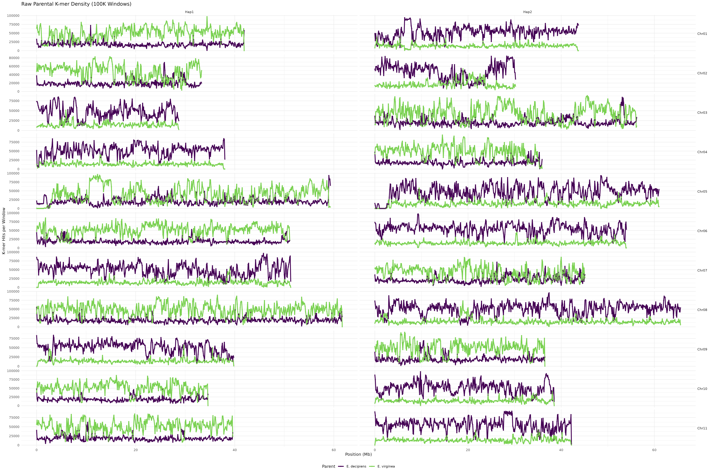 | 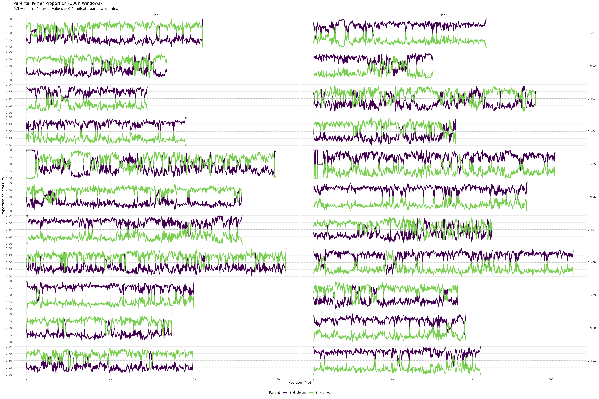 |
| **10K Windows** | **10K Windows** |
| 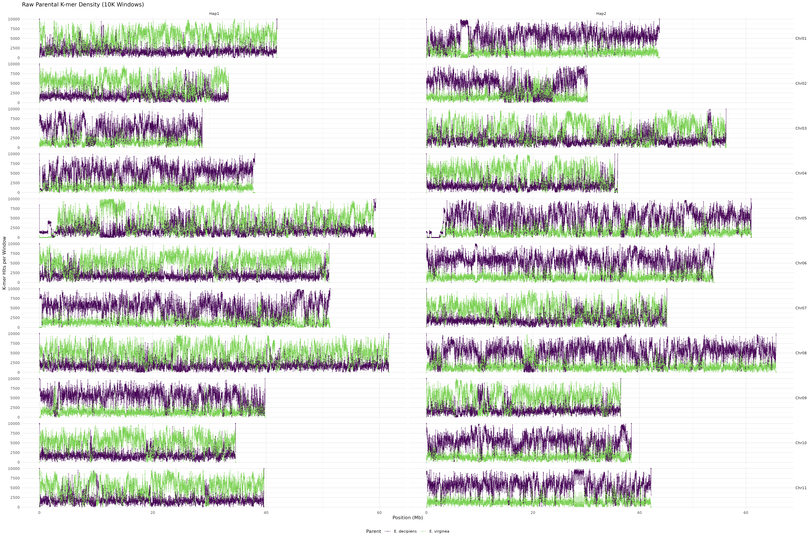 | 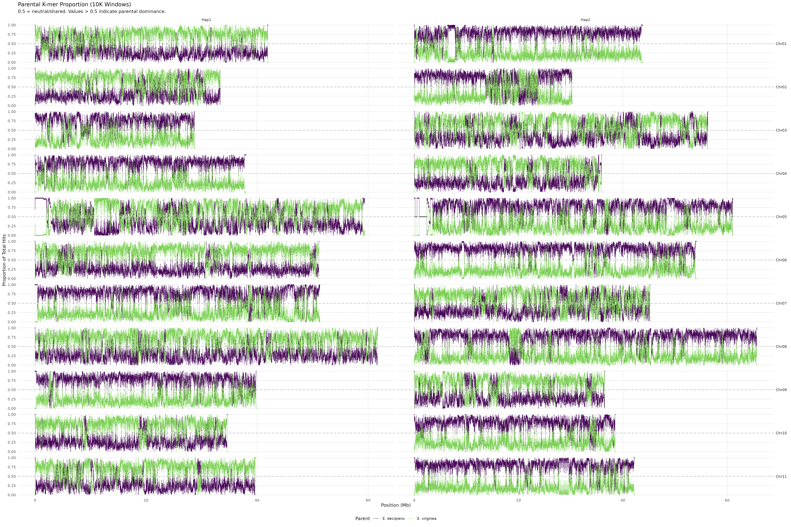 |


Next, it's time to tidy everything up. 

```bash
cd ../04_parental_assignment
mkdir species_map
mv ../parental_spp_genomes/E_phylacis_* species_map/
mv ../parental_spp_genomes/completeness.stats species_map/
mv ../parental_spp_genomes/h* species_map/
mv ../parental_spp_genomes/parental_kmer_plots .
```

I added the species map file to the gitignore


## Parental assignment of the 11 major chromosomes

To summarise all of the above, we can now clearly assign the haplotypes into two parental groups.

This table summarizes the evidence used to assign the `h1` and `h2` contigs to their parental identities. Ratios in brackets indicate the strength of the signal (Dominant Parent / Secondary Parent).

What's amazing (and comforting) is that genome-alignment and unique parental species kmers agree perfectly. 

| Chr# | decipiens-original | virginea-original | h1 ID | h2 ID | h1 decip cov | h1 virg cov | h2 decip cov | h2 virg cov | h1 decip probes | h1 virg probes | h2 decip probes | h2 virg probes | h1 coverage parent | h1 probe parent | h2 coverage parent | h2 probe parent |
| :--- | :--- | :--- | :--- | :--- | :--- | :--- | :--- | :--- | :--- | :--- | :--- | :--- | :--- | :--- | :--- | :--- |
| **Chr1** | CM024609.1 | CM024514.1 | h1tg000007l | h2tg000010l | 29.8% | 61.8% | 52.0% | 32.1% | 7.7M | 21.2M | 23.1M | 6.1M | virginea (2.07x) | virginea (2.74x) | decipiens (1.62x) | decipiens (3.76x) |
| **Chr2** | CM024610.1 | CM024515.1 | h1tg000010l | h2tg000008l | 22.0% | 39.6% | 31.3% | 19.7% | 6.5M | 15.7M | 14.3M | 5.1M | virginea (1.80x) | virginea (2.42x) | decipiens (1.59x) | decipiens (2.78x) |
| **Chr3** | CM024611.1 | CM024516.1 | h1tg000006l | h2tg000009l | 21.0% | 13.4% | 24.2% | 44.0% | 13.5M | 4.2M | 11.8M | 23.8M | decipiens (1.57x) | decipiens (3.22x) | virginea (1.82x) | virginea (2.03x) |
| **Chr4** | CM024612.1 | CM024517.1 | h1tg000004l | h2tg000011l | 49.1% | 31.6% | 28.7% | 59.2% | 19.4M | 5.2M | 6.7M | 17.3M | decipiens (1.55x) | decipiens (3.72x) | virginea (2.07x) | virginea (2.60x) |
| **Chr5** | CM024613.1 | CM024518.1 | h1tg000003l | h2tg000307l | 24.6% | 47.0% | 42.0% | 26.2% | 12.0M | 24.2M | 29.0M | 8.4M | virginea (1.91x) | virginea (2.01x) | decipiens (1.60x) | decipiens (3.44x) |
| **Chr6** | CM024614.1 | CM024519.1 | h1tg000011l | h2tg000001l | 30.3% | 59.4% | 53.7% | 32.7% | 9.6M | 26.2M | 29.4M | 7.7M | virginea (1.96x) | virginea (2.73x) | decipiens (1.64x) | decipiens (3.82x) |
| **Chr7** | CM024615.1 | CM024520.1 | h1tg000001l | h2tg000002l | 40.7% | 24.9% | 22.5% | 40.7% | 25.8M | 7.2M | 10.0M | 18.6M | decipiens (1.63x) | decipiens (3.57x) | virginea (1.81x) | virginea (1.85x) |
| **Chr8** | CM024616.1 | CM024521.1 | h1tg000008l | h2tg000003l | 29.7% | 50.3% | 52.8% | 29.6% | 11.5M | 29.6M | 33.3M | 10.2M | virginea (1.69x) | virginea (2.57x) | decipiens (1.79x) | decipiens (3.27x) |
| **Chr9** | CM024617.1 | CM024522.1 | h1tg000009l | h2tg000006l | 49.9% | 35.0% | 28.8% | 62.6% | 20.4M | 5.7M | 7.3M | 17.5M | decipiens (1.43x) | decipiens (3.56x) | virginea (2.17x) | virginea (2.42x) |
| **Chr10** | CM024618.1 | CM024523.1 | h1tg000002l | h2tg000004l | 32.7% | 59.6% | 57.5% | 33.4% | 6.4M | 17.6M | 19.8M | 5.5M | virginea (1.82x) | virginea (2.75x) | decipiens (1.72x) | decipiens (3.58x) |
| **Chr11** | CM024619.1 | CM024524.1 | h1tg000005l | h2tg000007l | 31.4% | 54.9% | 57.3% | 29.5% | 7.5M | 20.2M | 23.3M | 6.0M | virginea (1.75x) | virginea (2.70x) | decipiens (1.94x) | decipiens (3.91x) |

Let's rearrange the 11 chromosomes of the two haplotypes accordingly:

```bash
# Define paths
ASSEMBLY_DIR="03_hifiasm_assembly"
HAP1="$ASSEMBLY_DIR/E_phylacis_hap1_top11.fa"
HAP2="$ASSEMBLY_DIR/E_phylacis_hap2_top11.fa"

# Define output files
VIRG_OUT="$ASSEMBLY_DIR/E_phylacis_virginea_parent_top11.fa"
DECIP_OUT="$ASSEMBLY_DIR/E_phylacis_decipiens_parent_top11.fa"

# Helper function to extract and rename
# Usage: rename_chr <input_file> <contig_id> <chr_number>
rename_chr() {
    seqkit grep -p "$2" "$1" | \
    seqkit replace -p "(.+)" -r "\$1 Eucalyptus phylacis chromosome $3"
}

echo "Sorting and renaming chromosomes..."

# --- 1. Assemble Virginea Parent (E. virginea) ---
# Chromosomes: 1(h1), 2(h1), 3(h2), 4(h2), 5(h1), 6(h1), 7(h2), 8(h1), 9(h2), 10(h1), 11(h1)
{
    rename_chr "$HAP1" "h1tg000007l" "1"
    rename_chr "$HAP1" "h1tg000010l" "2"
    rename_chr "$HAP2" "h2tg000009l" "3"
    rename_chr "$HAP2" "h2tg000011l" "4"
    rename_chr "$HAP1" "h1tg000003l" "5"
    rename_chr "$HAP1" "h1tg000011l" "6"
    rename_chr "$HAP2" "h2tg000002l" "7"
    rename_chr "$HAP1" "h1tg000008l" "8"
    rename_chr "$HAP2" "h2tg000006l" "9"
    rename_chr "$HAP1" "h1tg000002l" "10"
    rename_chr "$HAP1" "h1tg000005l" "11"
} > "$VIRG_OUT"

# --- 2. Assemble Decipiens Parent (E. decipiens) ---
# Chromosomes: 1(h2), 2(h2), 3(h1), 4(h1), 5(h2), 6(h2), 7(h1), 8(h2), 9(h1), 10(h2), 11(h2)
{
    rename_chr "$HAP2" "h2tg000010l" "1"
    rename_chr "$HAP2" "h2tg000008l" "2"
    rename_chr "$HAP1" "h1tg000006l" "3"
    rename_chr "$HAP1" "h1tg000004l" "4"
    rename_chr "$HAP2" "h2tg000307l" "5"
    rename_chr "$HAP2" "h2tg000001l" "6"
    rename_chr "$HAP1" "h1tg000001l" "7"
    rename_chr "$HAP2" "h2tg000003l" "8"
    rename_chr "$HAP1" "h1tg000009l" "9"
    rename_chr "$HAP2" "h2tg000004l" "10"
    rename_chr "$HAP2" "h2tg000007l" "11"
} > "$DECIP_OUT"

echo "Done."
echo "------------------------------------------"
echo "VIRGINEA FILE: $VIRG_OUT"
grep ">" "$VIRG_OUT"
echo "------------------------------------------"
echo "DECIPIENS FILE: $DECIP_OUT"
grep ">" "$DECIP_OUT"

mv 03_hifiasm_assembly/E_phylacis_virginea_parent_top11.fa 04_parental_assignment/
mv 03_hifiasm_assembly/E_phylacis_decipiens_parent_top11.fa 04_parental_assignment/
```

## Who's the mother?

Now let's use the cp genome to figure out who the mother is, then add that chromosome to the assembly.

First let's get the two cp genomes of the parents:

```bash
seqkit grep -p CM024632.1 parental_spp_genomes/E_decipiens.fa > 04_parental_assignment/E_decipiens_cp_ref.fa
seqkit grep -p CM024525.1 parental_spp_genomes/E_virginea.fa > 04_parental_assignment/E_virginea_cp_ref.fa
```

```bash
cd 04_parental_assignment

# Create blast database
makeblastdb -in 03_hifiasm_assembly/E_phylacis_asm.bp.p_ctg.fa -dbtype nucl -out e_phylacis_db

# Run BLAST
blastn -query E_virginea_cp_ref.fa -db e_phylacis_db \
       -outfmt "7 sseqid pident length qlen slen qcovs evalue" \
       -out cp_blast_results_virginea.txt

blastn -query E_decipiens_cp_ref.fa -db e_phylacis_db \
       -outfmt "7 sseqid pident length qlen slen qcovs evalue" \
       -out cp_blast_results_decipiens.txt

# Look at the top hit
head -n 25 cp_blast_results_decipiens.txt
head -n 25 cp_blast_results_virginea.txt
```

This clearly pulls out `ptg000022l` as the chloroplast contig:

```
(eucalypt_asm) rob@nova:~/MM_genome/04_parental_assignment$ head -n 35 cp_blast_results_decipiens.txt
# BLASTN 2.16.0+
# Query: CM024632.1 Eucalyptus decipiens isolate CCA4570 chloroplast, complete sequence, whole genome shotgun sequence
# Database: e_phylacis_db
# Fields: subject id, % identity, alignment length, query length, subject length, % query coverage per subject, evalue
# 4924 hits found
ptg000022l      99.357  49925   163268  198530  99      0.0
ptg000022l      99.674  35302   163268  198530  99      0.0
ptg000022l      99.095  34265   163268  198530  99      0.0
ptg000022l      99.281  31705   163268  198530  99      0.0
ptg000022l      99.641  29785   163268  198530  99      0.0
ptg000022l      99.788  26402   163268  198530  99      0.0
ptg000022l      99.739  26429   163268  198530  99      0.0
ptg000022l      99.790  26138   163268  198530  99      0.0
ptg000022l      99.346  7037    163268  198530  99      0.0
ptg000022l      99.033  6825    163268  198530  99      0.0
ptg000022l      98.860  4123    163268  198530  99      0.0
ptg000022l      99.384  3086    163268  198530  99      0.0
ptg000022l      98.182  55      163268  198530  99      5.08e-16
ptg000022l      100.000 39      163268  198530  99      8.56e-09
ptg000022l      97.619  42      163268  198530  99      8.56e-09
ptg000022l      97.500  40      163268  198530  99      1.11e-07
ptg000022l      97.500  40      163268  198530  99      1.11e-07
ptg000022l      97.500  40      163268  198530  99      1.11e-07
ptg000022l      97.500  40      163268  198530  99      1.11e-07
ptg000022l      97.500  40      163268  198530  99      1.11e-07
ptg000022l      79.121  91      163268  198530  99      2.40e-04
ptg000022l      100.000 30      163268  198530  99      8.62e-04
ptg000022l      100.000 30      163268  198530  99      8.62e-04
ptg000022l      100.000 30      163268  198530  99      8.62e-04
ptg000022l      100.000 28      163268  198530  99      0.011
ptg000033l      99.291  38084   163268  79721   53      0.0
ptg000033l      99.674  35566   163268  79721   53      0.0
ptg000033l      99.638  27101   163268  79721   53      0.0
ptg000033l      99.788  26402   163268  79721   53      0.0
ptg000033l      98.836  4124    163268  79721   53      0.0
(eucalypt_asm) rob@nova:~/MM_genome/04_parental_assignment$ head -n 35 cp_blast_results_virginea.txt
# BLASTN 2.16.0+
# Query: CM024525.1 Eucalyptus virginea isolate CCA4170 chloroplast, complete sequence, whole genome shotgun sequence
# Database: e_phylacis_db
# Fields: subject id, % identity, alignment length, query length, subject length, % query coverage per subject, evalue
# 4829 hits found
ptg000022l      99.794  80388   160251  198530  99      0.0
ptg000022l      99.699  79985   160251  198530  99      0.0
ptg000022l      99.892  35265   160251  198530  99      0.0
ptg000022l      99.883  26413   160251  198530  99      0.0
ptg000022l      99.788  26415   160251  198530  99      0.0
ptg000022l      99.786  26151   160251  198530  99      0.0
ptg000022l      99.935  3086    160251  198530  99      0.0
ptg000022l      100.000 39      160251  198530  99      8.40e-09
ptg000022l      97.619  42      160251  198530  99      8.40e-09
ptg000022l      97.500  40      160251  198530  99      1.09e-07
ptg000022l      97.500  40      160251  198530  99      1.09e-07
ptg000022l      97.500  40      160251  198530  99      1.09e-07
ptg000022l      97.500  40      160251  198530  99      1.09e-07
ptg000022l      97.500  40      160251  198530  99      1.09e-07
ptg000022l      79.121  91      160251  198530  99      2.35e-04
ptg000022l      100.000 30      160251  198530  99      8.46e-04
ptg000022l      100.000 30      160251  198530  99      8.46e-04
ptg000022l      100.000 30      160251  198530  99      8.46e-04
ptg000022l      100.000 28      160251  198530  99      0.011
ptg000021l      99.699  79985   160251  272542  77      0.0
ptg000021l      99.902  15309   160251  272542  77      0.0
ptg000021l      99.726  15312   160251  272542  77      0.0
ptg000021l      99.763  10966   160251  272542  77      0.0
ptg000021l      99.838  1851    160251  272542  77      0.0
ptg000021l      99.838  1849    160251  272542  77      0.0
ptg000021l      99.028  1851    160251  272542  77      0.0
ptg000021l      74.016  889     160251  272542  77      1.63e-80
ptg000021l      73.903  889     160251  272542  77      7.61e-79
ptg000021l      74.943  435     160251  272542  77      6.18e-45
ptg000021l      100.000 39      160251  272542  77      8.40e-09
```

Now let's align the three cp genomes and see what we see:

```bash
seqkit grep -p ptg000022l ../03_hifiasm_assembly/E_phylacis_asm.bp.p_ctg.fa > E_phylacis_cp_ref.fa

minimap2 -x asm5 E_decipiens_cp_ref.fa E_phylacis_cp_ref.fa > cp_phylacis_vs_decipiens.paf
minimap2 -x asm5 E_virginea_cp_ref.fa E_phylacis_cp_ref.fa > cp_phylacis_vs_virginea.paf
```

Comparing cols 10 (matching bases) and 11 (alignment length) makes it look a lot like virginea is the winner. It has 113749/115277 = 98.7% matching, while decipiens has 110447/115514 = 95.6% matching: 

```
(eucalypt_asm) rob@nova:~/MM_genome/04_parental_assignment$ more cp_phylacis_vs_decipiens.paf 
ptg000022l      198530  83434   198526  +       CM024632.1      163268  18      114838  110447  115514  60      tp:A:P  cm:i:10934      s1:i:110216     s2:i:25721      dv:f:0.0004     rl:i:0
ptg000022l      198530  12      83388   +       CM024632.1      163268  76475   163265  80252   86911   60      tp:A:P  cm:i:7928       s1:i:79660      s2:i:54296      dv:f:0.0010     rl:i:0
ptg000022l      198530  172420  198526  -       CM024632.1      163268  137154  163265  25733   26131   0       tp:A:S  cm:i:2560       s1:i:25721      dv:f:0.0009     rl:i:0

(eucalypt_asm) rob@nova:~/MM_genome/04_parental_assignment$ more cp_phylacis_vs_virginea.paf 
ptg000022l      198530  83434   198526  -       CM024525.1      160251  45056   160234  113749  115277  60      tp:A:P  cm:i:11365      s1:i:113681     s2:i:25669      dv:f:0.0002     rl:i:0
ptg000022l      198530  12      83415   -       CM024525.1      160251  2       83403   82339   83489   60      tp:A:P  cm:i:8222       s1:i:82305      s2:i:52099      dv:f:0.0007     rl:i:0
ptg000022l      198530  172393  198526  +       CM024525.1      160251  2       26106   25677   26144   0       tp:A:S  cm:i:2552       s1:i:25669      dv:f:0.0015     rl:i:0

```

Let's also do dotplots to visualise it:

```bash
# Dot plot vs. Virginea
Rscript ../scripts/pafCoordsDotPlotly.R \
    -i cp_phylacis_vs_virginea.paf \
    -o cp_phylacis_vs_virginea \
    -s -t -m 500 -q 100000

# Dot plot vs. Decipiens
Rscript ../scripts/pafCoordsDotPlotly.R \
    -i cp_phylacis_vs_decipiens.paf \
    -o cp_phylacis_vs_decipiens \
    -s -t -m 500 -q 100000
```

| Comparison: *E. phylacis* vs. *E. virginea* | Comparison: *E. phylacis* vs. *E. decipiens* |
| :---: | :---: |
| 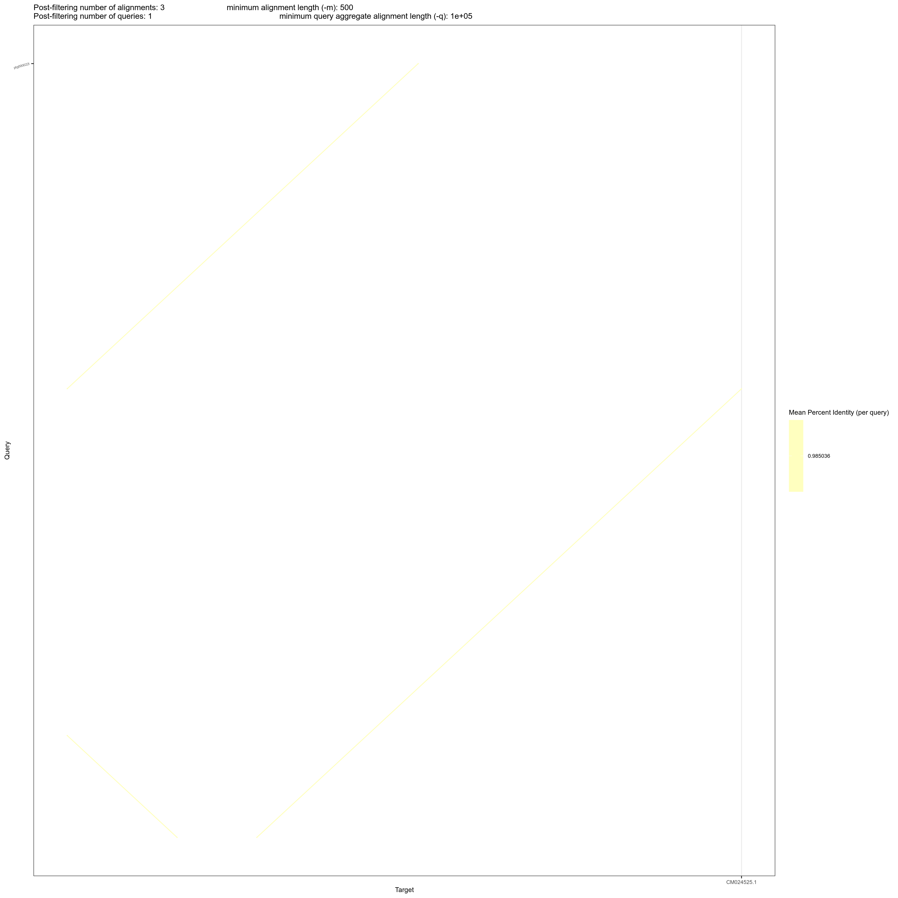 | 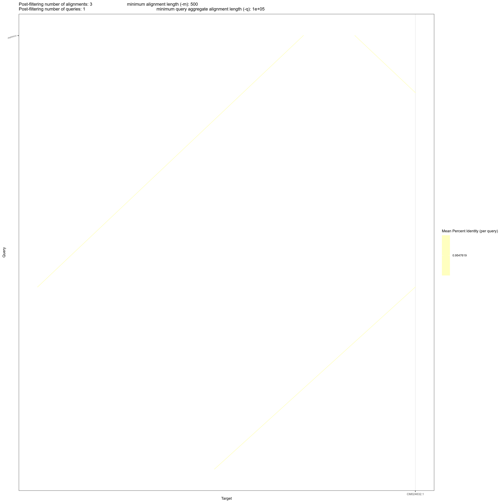 |


The dotplots reveal nothing amiss. 

The mother is clearly E virginea.

# 05 Organellar genome assembly

## Read filtering

```bash
# Setup Directories
source_file="02_filtering/E_phylacis_filtered.fastq.gz"
temp_fq="05_organelle_genomes/temp_unzipped.fastq"
organelle_reads_dir="05_organelle_genomes/organelle_subset"
mkdir -p ${organelle_reads_dir}

# 1. Decompress once to save CPU/IO
echo "Decompressing source file..."
pigz -dc -p 64 $source_file > $temp_fq

# 2. Run the sweep
for Q in 15 20; do
    echo "--- Filtering for Q${Q} ---"
    
    # Process from the temp unzipped file
    chopper -q $Q < $temp_fq | bgzip -@ 64 > ${organelle_reads_dir}/E_phylacis_Q${Q}.fastq.gz
    
    # Report results
    echo "Stats for Q${Q}:"
    seqkit stats ${organelle_reads_dir}/E_phylacis_Q${Q}.fastq.gz
done

# shows that I have a lot of Q20 or greater data (see below) so now let's try read lengths:

# Sweep for Length while keeping Quality constant at Q20
for L in 20000 30000 40000 50000; do
    # Convert length to 'k' format for filename
    L_kb=$(($L / 1000))
    echo "--- Filtering for Q20 and Length > ${L_kb}kb ---"
    
    # Process: filter for Q20 AND length L
    chopper -q 20 -l $L < $temp_fq | bgzip -@ 64 > ${organelle_reads_dir}/E_phylacis_Q20_L${L_kb}k.fastq.gz
    
    # Report results
    echo "Stats for Q20_L${L_kb}k:"
    seqkit stats ${organelle_reads_dir}/E_phylacis_Q20_L${L_kb}k.fastq.gz
done

# 3. Cleanup
rm $temp_fq
echo "All subsets created in ${organelle_reads_dir} and temp file removed."

```


This gives:

```
--- Filtering for Q15 ---
Kept 1165231 reads out of 1345923 reads
Stats for Q15:
file                                                           format  type   num_seqs         sum_len  min_len   avg_len  max_len
05_organelle_genomes/organelle_subset/E_phylacis_Q15.fastq.gz  FASTQ   DNA   1,165,231  29,326,043,409   15,000  25,167.6  147,172
--- Filtering for Q20 ---
Kept 696853 reads out of 1345923 reads
Stats for Q20:
file                                                           format  type  num_seqs         sum_len  min_len   avg_len  max_len
05_organelle_genomes/organelle_subset/E_phylacis_Q20.fastq.gz  FASTQ   DNA    696,853  17,203,549,475   15,000  24,687.5  134,734


--- Filtering for Q20 and Length > 20kb ---
Kept 463140 reads out of 1345923 reads
Stats for Q20_L20k:
file                                                                format  type  num_seqs         sum_len  min_len   avg_len  max_len
05_organelle_genomes/organelle_subset/E_phylacis_Q20_L20k.fastq.gz  FASTQ   DNA    463,140  13,056,995,216   20,000  28,192.3  134,734
--- Filtering for Q20 and Length > 30kb ---
Kept 144088 reads out of 1345923 reads
Stats for Q20_L30k:
file                                                                format  type  num_seqs        sum_len  min_len   avg_len  max_len
05_organelle_genomes/organelle_subset/E_phylacis_Q20_L30k.fastq.gz  FASTQ   DNA    144,088  5,333,865,113   30,000  37,018.1  134,734
--- Filtering for Q20 and Length > 40kb ---
Kept 34958 reads out of 1345923 reads
Stats for Q20_L40k:
file                                                                format  type  num_seqs        sum_len  min_len   avg_len  max_len
05_organelle_genomes/organelle_subset/E_phylacis_Q20_L40k.fastq.gz  FASTQ   DNA     34,958  1,627,555,827   40,000  46,557.5  134,734
--- Filtering for Q20 and Length > 50kb ---
Kept 7428 reads out of 1345923 reads
Stats for Q20_L50k:
file                                                                format  type  num_seqs      sum_len  min_len   avg_len  max_len
05_organelle_genomes/organelle_subset/E_phylacis_Q20_L50k.fastq.gz  FASTQ   DNA      7,428  421,042,149   50,000  56,683.1  134,734

```

I'll try starting with the Q20 40KB subset: `E_phylacis_Q20_L40k.fastq.gz`

## oatk fails with raw reads

Let's try oatk...

First we get the databases:

```bash
db_dir="05_organelle_genomes/db"
mkdir -p ${db_dir}

# Base URL for the raw files
base_url="https://raw.githubusercontent.com/c-zhou/OatkDB/main/v20230921"

# List of files to download
files=(
    "magnoliopsida_mito.fam"
    "magnoliopsida_mito.fam.h3f"
    "magnoliopsida_mito.fam.h3i"
    "magnoliopsida_mito.fam.h3m"
    "magnoliopsida_mito.fam.h3p"
    "magnoliopsida_pltd.fam"
    "magnoliopsida_pltd.fam.h3f"
    "magnoliopsida_pltd.fam.h3i"
    "magnoliopsida_pltd.fam.h3m"
    "magnoliopsida_pltd.fam.h3p"
)

echo "Downloading Magnoliopsida HMM profiles..."

for file in "${files[@]}"; do
    wget -q "${base_url}/${file}" -O "${db_dir}/${file}"
    echo "  Downloaded: ${file}"
done

echo "Done. Databases are in ${db_dir}"
```

Some trial and error with oatk shows that raw nanopore reads don't work. So I'll need to error correct them with hifiasm first.

Various iterations of this approach with different k and c all failed. Just to much noise (homopolymer errors) in the reads I suppose.

```bash
# Define paths
PT_FAM="05_organelle_genomes/db/magnoliopsida_pltd.fam"
MT_FAM="05_organelle_genomes/db/magnoliopsida_mito.fam"
out_dir="05_organelle_genomes/oatk_results"
mkdir -p $out_dir

# Run OatK
# We use the Q20_L40k subset which has 1.6GB of high-quality long reads
oatk -k 1001 \
     -c 3 \
     -t 64 \
     -p $PT_FAM \
     -m $MT_FAM \
     -o ${out_dir}/e_phylacis \
     05_organelle_genomes/organelle_subset/E_phylacis_Q20_L30k.fastq.gz
```

## oatk with hifiasm corrected reads

Let's retry the above with hifiasm corrected reads

First we get the corrected reads

```bash
cd 03_hifiasm_assembly/
hifiasm -o E_phylacis_asm -t 124 --write-ec /dev/null
seqkit stats -T E_phylacis_asm.ec.fa
```

```
file    format  type    num_seqs        sum_len min_len avg_len max_len
E_phylacis_asm.ec.fa    FASTA   DNA     1345923 33991131314     14202   25254.9 147315
```

That's about 28x coverage in these reads (of the haploid genome).

Let's try oatk with c set to ~10x the nuclear coverage to start with (280).

If this fails (too much noise...) then I might need to drop c and/or k

I'll try a few and name the output files differently...

* c280, k1001: run completed, plastid assembled well, mt didn't assemble
* c140, k1001: run has zero coverage arcs, mt genome has 1 contig of 10kb (linear)
* c70, k1001: run has zero coverage arcs, mt genome is in 3 contigs totalling 450kb (one circular, two linear)
* c50, k1001:  run has zero coverage arcs, mt genome is in 3 contigs totalling 450kb (one circular, two linear) basically idential to c70, with an extra 450bp
* c40, k1001:  run has zero coverage arcs, mt genome is in 3 contigs totalling 450kb (one circular, two linear) basically idential to c70, with an extra 450bp
* c30, k1001: as above, but main contig of mt genome increases by 2.7kb
* c25, k1001: this is getting into nuclear genome territory..., but the assembly is identical to c30

Conclusion: c30 k1001 is the best we can probably do. I also tried a few lower values of k, but it made no difference initially, then down at k=601 the mt genome assembly broke, there were two ~identical 70kb linear fragments, and the nv for the main contig went from 11 to 13. 

So we stick with c30 k1001 as the final organelle assemblies.

```bash
# Define paths
PT_FAM="05_organelle_genomes/db/magnoliopsida_pltd.fam"
MT_FAM="05_organelle_genomes/db/magnoliopsida_mito.fam"
out_dir="05_organelle_genomes/oatk_results_c30k1001"
mkdir -p $out_dir

# Run OatK
oatk -k 1001 \
     -c 30 \
     -t 64 \
     -p $PT_FAM \
     -m $MT_FAM \
     -o ${out_dir}/e_phylacis \
     03_hifiasm_assembly/E_phylacis_asm.ec.fa

```

## Final Organelle assemblies

The mitochondrial genome assembles into 3 pieces. One is circular, the other two are linear, but the gfa shows that it's probably a complex mixture of major and minor circles, with potentially some linear pieces in there.

>ctg000001l     length=355146 wlength=41066840.0 nv=11 circular=false path=u151-,u152+,u150-,u148-,u146-,u147+,u141-,u12277+,u139+,u146-,u138-
>ctg000002l     length=23355 wlength=2312145.0 nv=1 circular=false path=u149+
>ctg000003c     length=79427 wlength=7942700.0 nv=1 circular=true path=u12148-

The cp genome assembles into a single circle, and is basically perfect as expected. The gfa shows the typical dumbell structure with LSC, SSC, and IR regions.

>ctg000001c     length=160190 wlength=150009126.0 nv=12 circular=true path=u140+,u12277+,u137-,u7+,u12278-,u143-,u142+,u143+,u12278+,u7-,u137+,u12277-

NB, with a higher c value of 140 or 280 which are the recommended values in the oatk docs of ~5-10x the nuclear coverage, the contig is identical but the graph structure is much simpler with an nv of 4 vs. 12 when c=30; this suggests that with more coverage or fresher samples we could probably do a better job of resolving the mt genome.

# 06 Final Haplotype Assembly

All of the above confirms that the genome is of high quality, that coverage from genome alignment and mapping parental species probes provide useful ways to sort contigs into parental groups, and that the organelle genomes assemble very well. We also know that the maternal haplotype is closer to virginea than decipiens.

Now we need to put this all together, to get the best assembly. A key limitation of most of the above is that I just looked at the biggest 11 contigs, but of course there were plenty of additional big contigs in the haplotype files. The main challenges are to address that, and then do the parental assignment. 

## 1. Re-run hifiasm

Ash Jones helpfully pointed out that hifiasm got a bit confused about the data because it's so heterozygous. Specifically  ```[M::ha_pt_gen] peak_hom: 29; peak_het: -1``` shows it didn't find the het peak, because it thought the hom peak was 29. Actually the homozygous peak is ~60x, and the heterozygous peak is 29x. The kmer distribution just looks odd because the heterozygosity is SO high. 

To see if I can improve the assembly, I'll run three new assemblies, all with `--hom-cov 60` and at all value of `-l [0, 1, 2, 3]`. I can then compare the assemblies, and look at the BUSCO completeness of the two haplotypes in each, as well as the cumulative distribution of contig sizes, and the BUSCO completeness of the major contigs (crossing my fingers that there are only 11 big contigs this time). 


```bash
mkdir -p 06_1_hifiasm_assemblies

# 1. Create a mount point
sudo mkdir -p /mnt/ramdisk

# 2. Mount 1500GB of the 2.2TB RAM as a disk
sudo mount -t tmpfs -o size=1500G tmpfs /mnt/ramdisk
sudo chown $USER /mnt/ramdisk

# 3. Copy your filtered data THERE
cp 02_filtering/E_phylacis_filtered.fastq.gz /mnt/ramdisk/

# 4. Run hifiasm inside the ramdisk
cd /mnt/ramdisk


mkdir l0
mkdir l1
mkdir l2
mkdir l3
mkdir h0 # what happens if we pretend it's haploid...

hifiasm -o l0/E_phylacis -t 160 --ont --hom-cov 60 --hg-size 520m -l 0 --telo-m AAACCCT --dual-scaf E_phylacis_filtered.fastq.gz 2>&1 | tee l0/hifiasm.log
hifiasm -o l1/E_phylacis -t 160 --ont --hom-cov 60 --hg-size 520m -l 1 --telo-m AAACCCT --dual-scaf E_phylacis_filtered.fastq.gz 2>&1 | tee l1/hifiasm.log
hifiasm -o l2/E_phylacis -t 160 --ont --hom-cov 60 --hg-size 520m -l 2 --telo-m AAACCCT --dual-scaf E_phylacis_filtered.fastq.gz 2>&1 | tee l2/hifiasm.log
hifiasm -o l3/E_phylacis -t 160 --ont --hom-cov 60 --hg-size 520m -l 3 --telo-m AAACCCT --dual-scaf E_phylacis_filtered.fastq.gz 2>&1 | tee l3/hifiasm.log
hifiasm -o h0/E_phylacis -t 160 --ont --hom-cov 30 --hg-size 1040m --telo-m AAACCCT E_phylacis_filtered.fastq.gz 2>&1 | tee h0/hifiasm.log


```

Now to pick a winner we can run compleasm and merqury on all of those assemblies. Note that I'll do this either for the primary assembly (for l0 and h0, which don't have haplotype files), or on the h1 and h2 files separately AND together (i.e. cat of the hap1 and hap2 files). This is because there's no guarantee that h1 and h2 will be balanced and sorted correctly. However, their union should have a genome size of ~1040MB, perfect kmer coverage, and 100% BUSCO duplication rate. If I can find a primary assembly or cat'ted h1 and h2 assembly with these characteristics, it's a good one. 

First we convert the gfa files to fasta, and build the meryl database, then run the QC.


```bash
# Build the read k-mer database once
meryl count k=21 threads=160 memory=100G \
    E_phylacis_filtered.fastq.gz output reads.meryl

THREADS=160
LINEAGE="eudicotyledons"
READS_MERYL="/mnt/ramdisk/reads.meryl"

## l0
# Make FASTA; compleasm; merqury
DIR="l0" # for this one, there's only the p_ctg.fa
mkdir -p ${DIR}/qc_results
gfatools gfa2fa ${DIR}/E_phylacis.bp.p_ctg.gfa > ${DIR}/qc_results/p_ctg.fasta
compleasm run -t $THREADS -l $LINEAGE -a ${DIR}/qc_results/p_ctg.fasta -o ${DIR}/qc_results/compleasm_p_ctg
mkdir -p ${DIR}/qc_results/merq_p_ctg && cd ${DIR}/qc_results/merq_p_ctg
merqury.sh $READS_MERYL ../p_ctg.fasta p_ctg_merq
cd ../../..

## l1, 2, and 3, and h0 change dir sequentially and re-run it
DIR="l3" # now we have two haplotypes, which we analyse separately and together

# 1. Prepare FASTAs
mkdir -p ${DIR}/qc_results
gfatools gfa2fa ${DIR}/E_phylacis.bp.hap1.p_ctg.gfa > ${DIR}/qc_results/hap1.fasta
gfatools gfa2fa ${DIR}/E_phylacis.bp.hap2.p_ctg.gfa > ${DIR}/qc_results/hap2.fasta
cat ${DIR}/qc_results/hap1.fasta ${DIR}/qc_results/hap2.fasta > ${DIR}/qc_results/union.fasta

# 2. Compleasm (Hap1, Hap2, then Union)
compleasm run -t $THREADS -l $LINEAGE -a ${DIR}/qc_results/hap1.fasta -o ${DIR}/qc_results/compleasm_hap1
compleasm run -t $THREADS -l $LINEAGE -a ${DIR}/qc_results/hap2.fasta -o ${DIR}/qc_results/compleasm_hap2
compleasm run -t $THREADS -l $LINEAGE -a ${DIR}/qc_results/union.fasta -o ${DIR}/qc_results/compleasm_union

# 3. Merqury (Hap1, Hap2, then Union)
mkdir -p ${DIR}/qc_results/merq_hap1 && cd ${DIR}/qc_results/merq_hap1
merqury.sh $READS_MERYL ../hap1.fasta hap1_merq
cd ../../../

mkdir -p ${DIR}/qc_results/merq_hap2 && cd ${DIR}/qc_results/merq_hap2
merqury.sh $READS_MERYL ../hap2.fasta hap2_merq
cd ../../../

mkdir -p ${DIR}/qc_results/merq_union && cd ${DIR}/qc_results/merq_union
merqury.sh $READS_MERYL ../union.fasta union_merq
cd ../../../

# Then repeat the above for h0, l2, and l3


#########
### Copy things you want back to the hard drive
### Ignore all the big files, but of course keep the assemblies.

# 5. VERY IMPORTANT: Move results back to /home before rebooting!
rsync -avh --progress --exclude='*.fastq.gz' /mnt/ramdisk/ ~/MM_genome/06_1_hifiasm_assemblies/

cd ~/MM_genome

# 6. Unmount (only after you've verified the files are safe!)
# cd ~
# sudo umount /mnt/ramdisk

# ignore this stuff for git, mostly
echo "06_1_hifiasm_assemblies/" >> .gitignore

```

Get assembly basic stats and organise them:

```bash
# get all the .fasta except those in the compleasm folders, and get lots of stats
find . -name "*.fasta" | grep -E "hap1|hap2|union|p_ctg" | grep -vE "compleasm|merq" | xargs seqkit stats -a -j 160 -N 50,90,95,99 | column -t
```

```
file                         format  type  num_seqs  sum_len        min_len  avg_len       max_len     Q1        Q2       Q3            sum_gap  N50         N50_num  Q20(%)  Q30(%)  AvgQual  GC(%)  sum_n   N50         N90         N95         N99
./l3/qc_results/union.fasta  FASTA   DNA   131       1,097,940,037  30,917   8,381,221.7   65,688,633  66,540.5  92,347   258,145       0        45,062,906  10       0       0       0        39.63  43,947  45,062,906  33,511,041  20,522,527  504,488
./l3/qc_results/hap2.fasta   FASTA   DNA   45        573,953,311    42,116   12,754,518    65,688,633  66,777    151,689  26,036,980    0        43,652,620  6        0       0       0        39.63  43,747  43,652,620  26,036,980  20,522,527  14,252,391
./l3/qc_results/hap1.fasta   FASTA   DNA   86        523,986,726    30,917   6,092,868.9   61,716,932  65,110    85,704   191,335       0        45,216,074  5        0       0       0        39.64  200     45,216,074  33,914,441  33,914,441  191,335
./l2/qc_results/union.fasta  FASTA   DNA   132       1,213,886,437  24,825   9,196,109.4   65,674,939  67,058    94,767   338,826.5     0        45,708,075  11       0       0       0        39.61  300     45,708,075  33,387,322  20,442,905  13,773,696
./l2/qc_results/hap2.fasta   FASTA   DNA   58        610,625,537    42,116   10,528,026.5  61,716,932  76,003    118,755  380,136       0        45,708,075  6        0       0       0        39.61  200     45,708,075  33,387,322  26,036,980  20,442,905
./l2/qc_results/hap1.fasta   FASTA   DNA   74        603,260,900    24,825   8,152,174.3   65,674,939  56,568    88,451   293,829       0        45,081,242  6        0       0       0        39.62  100     45,081,242  33,719,123  16,961,878  407,150
./l1/qc_results/union.fasta  FASTA   DNA   119       1,069,391,022  30,917   8,986,479.2   65,674,939  64,743    87,899   303,443.5     0        45,081,242  10       0       0       0        39.62  74,339  45,081,242  33,719,123  20,310,318  13,773,696
./l1/qc_results/hap2.fasta   FASTA   DNA   45        466,004,620    35,842   10,355,658.2  61,716,932  68,000    94,551   550,701       0        41,950,308  5        0       0       0        39.64  100     41,950,308  33,465,692  20,310,318  20,310,318
./l1/qc_results/hap1.fasta   FASTA   DNA   74        603,386,402    30,917   8,153,870.3   65,674,939  56,855    86,360   232,920       0        45,081,242  6        0       0       0        39.61  74,239  45,081,242  33,719,123  16,961,878  518,253
./l0/qc_results/p_ctg.fasta  FASTA   DNA   79        1,014,773,291  30,917   12,845,231.5  65,674,939  69,098.5  142,767  33,781,247.5  0        43,652,620  10       0       0       0        39.61  0       43,652,620  33,930,661  20,458,351  13,773,696
```


## L1 compleasm and kmers

For all of the following, run this code from within the relevant in the qc_results folder for each assembly
```
echo "| Metric | Hap1 | Hap2 | Union |"
echo "| :--- | :--- | :--- | :--- |"

# Create temporary files for each column to handle the side-by-side join
for mode in hap1 hap2 union; do
    grep -P "S:|D:|F:|M:|N:" compleasm_${mode}/summary.txt | awk -F':|,' '{print $2}' > ${mode}_col.tmp
done

# Add labels and join the columns
paste -d '|' <(echo -e "S\nD\nF\nM\nN") hap1_col.tmp hap2_col.tmp union_col.tmp | sed 's/^/| /' | sed 's/$/ |/'

# Clean up
rm *.tmp

echo "| Metric | Hap1 | Hap2 | Union |"
echo "| :--- | :--- | :--- | :--- |"

# Extract QV (Column 4 of the .qv file)
qv_h1=$(awk '{print $4}' merq_hap1/hap1_merq.qv)
qv_h2=$(awk '{print $4}' merq_hap2/hap2_merq.qv)
qv_un=$(awk '{print $4}' merq_union/union_merq.qv)

# Extract Completeness (Column 5 of the generic completeness.stats file)
comp_h1=$(awk '{print $5}' merq_hap1/completeness.stats)
comp_h2=$(awk '{print $5}' merq_hap2/completeness.stats)
comp_un=$(awk '{print $5}' merq_union/completeness.stats)

echo "| **QV** | $qv_h1 | $qv_h2 | $qv_un |"
echo "| **K-mer Completeness %** | $comp_h1 | $comp_h2 | $comp_un |"

```

The h0 and l0 assemblies don't separate haplotypes, so I'll only look at L1, L2 and L3. 

### L1

| Metric | Hap1 | Hap2 | Union |
| :--- | :--- | :--- | :--- |
| S|78.36%|78.89%|2.92% |
| D|17.15%|6.35%|96.86% |
| F|0.71%|1.00%|0.18% |
| M|3.78%|13.76%|0.04% |
| N|2805|2805|2805 |
| **QV** | 64.9563 | 66.1094 | 65.4217 |
| **K-mer Completeness %** | 66.5101 | 54.6202 | 99.3052 |


### L2
| Metric | Hap1 | Hap2 | Union |
| :--- | :--- | :--- | :--- |
| S|78.36%|73.51%|2.71% |
| D|17.15%|19.00%|97.08% |
| F|0.71%|0.46%|0.18% |
| M|3.78%|7.02%|0.04% |
| N|2805|2805|2805 |
| **QV** | 65.0701 | 65.76 | 65.4034 |
| **K-mer Completeness %** | 66.5072 | 67.0275 | 99.3053 |

### L3
| Metric | Hap1 | Hap2 | Union |
| :--- | :--- | :--- | :--- |
| S|96.83%|91.69%|2.85% |
| D|2.00%|7.95%|96.93% |
| F|0.29%|0.32%|0.18% |
| M|0.89%|0.04%|0.04% |
| N|2805|2805|2805 |
| **QV** | 65.1172 | 65.6202 | 65.3729 |
| **K-mer Completeness %** | 62.3954 | 66.0179 | 99.3053 |

### Quast

```
quast.py l1/qc_results/hap1.fasta l1/qc_results/hap2.fasta \
    l2/qc_results/hap1.fasta l2/qc_results/hap2.fasta \
    l3/qc_results/hap1.fasta l2/qc_results/hap2.fasta \
    -o quast_comparison \
    --labels L1-hap1,L1-hap2,L2-hap1,L2-hap2,L3-hap1,L3-hap2
```


Most of the length of the L3 haplotypes is contained in the first 12 (hap1) or 14 (hap2) contigs. There are essentially no N's. The union of hap1 and hap2 is 1.135Gb which is ~568Mb haploid genome size. This is a little big, so it seems likely that there's some duplication, especially in hap2 whose total size is 611Mb. This is confirmed by the ~8% BUSCO duplication rate in hap2, and is something to look for when cleaning the assembly.

### Conclusion: use L3

L3 is *clearly* the best assembly. The two haplotypes have incredibly high compleasm scores, little duplication, almost nothing missing. I suspect hap2 has a a few contigs that actually belong in hap1, (it's longer than hap1, and it has more duplicates), but parental binning will solve that in the next step. The stats on the union are also excellent - 97% of BUSCOs are duplicated, as expected. The QV scores are uniformly high. The kmer completeness is very very high for the Union graph (bearing in mind these are nanopore reads) and is just about right for the haplotypes (we expect a lot of missing kmers if it's an F1 hybrid of divergent species). The N50 is about 45MB for all three assemblies (union, H1, H2). 

Now I'll tidy up and get what I need off the ramdisk. No point keeping big files here, especially since the assemblies take only an hour to re-do.

```bash
cd /mnt/ramdisk

#get rid of big duplicate files I don't need
find . -name "E_phylacis_filtered.fastq.gz" -delete
find . -name "*ec.bin" -delete
rm -rf mb_downloads/

# move to hard drive
rsync -avP . ~/MM_genome/06_1_hifiasm_assemblies/

# check sizes to ~verify
du -sh .
du -sh ~/MM_genome/06_1_hifiasm_assemblies/

# unmount and delete mount point
cd ~/MM_genome/
sudo umount /mnt/ramdisk
sudo rmdir /mnt/ramdisk
```

## L3 additional QC

## Unresolved bubbles
One question I had is whether there were unresolved bubbles in the unitig graph, but there aren't any at all. (`gfatools bubble E_phylacis.bp.p_utg.gfa > bubbles_l3_utg.bed` produces nothing). This suggests that all the bubbles were big and obvious, as expected for accurate long reads with very divergent haplotypes.

## Kmer spectra
Next are kmer spectra for the union, h1, and h2 from the merqury runs above. These are also incredibly good. The union plot has very clear 1x and 2x peaks, as expected. The h1 and h2 plots show just over half of the 1x kmers in each sample (as expected - many unique kmers), and a smaller number of 2x kmers (as expected - some homozygous regions). 

<table>
  <tr>
    <td align="center"><b>Union (Total)</b></td>
    <td align="center"><b>Haplotype 1</b></td>
    <td align="center"><b>Haplotype 2</b></td>
  </tr>
  <tr>
    <td></td>
    <td></td>
    <td></td>
  </tr>
</table>

## 2 Parental kmer checks

Similar to what I did on the initial assembly, now I want to see how the unique kmers from the putative parental genomes map to the contigs. I already have hapmers from the parents, with k=31. this is described above, but I get the kmers, look for the noise | signal trough, filter out the noise, and then use subtraction to get the kmers unique to each parent (hapmers). Now I need to do the same for the phylacis reads, and then I can run merqury.


```bash
mkdir 06_2_parental_kmer_checks
cd 06_2_parental_kmer_checks

# make phylacis meryl db (not sure how this will go with nanopore, but let's see)
meryl count k=31 threads=128 memory=1200G \
    output E_phylacis.meryl \
    ../02_filtering/E_phylacis_filtered.fastq.gz

meryl histogram E_phylacis.meryl > E_phylacis.hist

# look for the trough
E_phylacis.hist | more

# Filter based on trough - the number is the trough I observed
meryl greater-than 10 E_phylacis.meryl output E_phylacis.filtered.meryl

# Run merqury twice - once with filtered and once with unfilitered read kmers
cd ~/MM_genome/06_1_hifiasm_assemblies/l3/
gfatools gfa2fa E_phylacis.bp.hap1.p_ctg.gfa > E_phylacis.hap1.fasta
gfatools gfa2fa E_phylacis.bp.hap2.p_ctg.gfa > E_phylacis.hap2.fasta

# 3. The two commands above lead merqury to fail. So next I'll try running it as I ran it initially on the top 11 contigs
mkdir trio
cd trio

# merqury is very finicky about having the actual files available, and fails a lot when it tries to make symlinks if they're not right there, so we copy them over for this analysis
cp -r  ../E_phylacis.meryl/ . # phylacis kmers from nanopore reads, no filtering for noise
cp -r ~/MM_genome/parental_spp_genomes/E_decipiens.final_probes.meryl/ .  # decipiens hapmers, noise filtered
cp -r ~/MM_genome/parental_spp_genomes/E_virginea.final_probes.meryl/ .   # virginea hapmers, noise filtered
cp ../../06_1_hifiasm_assemblies/l3/E_phylacis.hap1.fasta . # phylacis assembly hap1
cp ../../06_1_hifiasm_assemblies/l3/E_phylacis.hap2.fasta . # phylacis assembly hap2

merqury.sh \
    E_phylacis.meryl \
    E_virginea.final_probes.meryl \
    E_decipiens.final_probes.meryl \
    E_phylacis.hap1.fasta \
    E_phylacis.hap2.fasta \
    E_phylacis_trio

```

## 3 ROADIES

Get the genomes

```bash

mkdir 06_3_roadies
cd 06_3_roadies

# 1a. Download the packages
datasets download genome taxon "Eucalyptus" --reference --assembly-level chromosome --filename eucs.zip
datasets download genome taxon "Corymbia" --assembly-level chromosome,scaffold --filename corymbia.zip
datasets download genome taxon "Angophora" --assembly-level chromosome,scaffold --filename angophora.zip

# 1b. Create the reference directory
mkdir -p roadies_refs

# 1c. Unzip only the genomic fasta files (.fna) directly into the folder
# The -j (junk paths) flag is key here to avoid deep folder structures
unzip -j eucs.zip "ncbi_dataset/data/*/*.fna" -d roadies_refs/
unzip -j corymbia.zip "ncbi_dataset/data/*/*.fna" -d roadies_refs/
unzip -j angophora.zip "ncbi_dataset/data/*/*.fna" -d roadies_refs/

```


Here's the plan from here


0. Dot plots
L3 dot plots to check for duplicate regions in h1 and h2 - h1 vs h2 ,h1 against itself ,h2 against itself. remove potentially duplicated contigs.

2. Parental binning
1.1. Remove organelles
We're doing organelles separately, and we already have them perfect thanks to oatk. So the first job is to align the haplotypes to the two organelle genomes I now have, and remove all contigs that are ~perfectly covered by the organelle genomes. Then we're dealing with the nuclear genome only. (We might lose some small nuclear contigs that are copies of the cp and mt genomes, but that's OK). Remove any contig that is >=95% covered by organellar genomes is probably a good start, but the best thing is to look at the coverage and see.

this gives hap1_nuclear.fa and hap2_nuclear.fa

1.2. Alignment:
* align hap1 to hap2
* dotplot of all contigs from hap1 vs all from hap2
* get coverage table of all pairs, with H2 AND H1 coverage

This tells us which contigs are ~interchangeable and align to each other. Important for helping with parental assignment because we can expect homologues to be reciprocally assigned.

1.3. Kmer assignment
* Use the unique kmers we got for decipiens and virginea to get the dominant parent and dominant ratio for every contig in hap1 and hap2. 
* Decide on a cutoff ratio. With the top 11 contigs, the LOWEST dominant ratio was 1.85x, but the cutoff should be determined empirically by looking at the table.
* Contigs get one of three determinants: decipiens, virginea, unknown

* NB: Also use ROADIES with each contig as a 'species'. If we can see where they map vs. the ~35 existing euc genomes, we could assign haplotypes easily! Also each contig might just pop out cleanly on the species tree of other euc genomes. In an ideal world, homologous contigs would land on different parts of the tree, near their parent species.


Then combine kmer dominance with coverage table to see how far we can get in sorting the contigs into groups. For example, if two contigs are clearly homologues, and the hap1 contig is BELOW the ratio, but the hap2 homologue is ABOVE it (but the assignment is reciprocal) we can still sort it into parents. Each contig now ends up assigned to one of three groups: decipiens-parent, virginea-parent, unknown-parent

This can be done with a table like this:


contig1_ID
contig2_ID
contig1_length
contig2_length
length_ratio (1 / 2)
1v2_coverage
2v1_coverage
recip_best_hit (TRUE/FALSE)
kmer_ratio (highest / lowest coverage, noting which parent is highest, e.g. "2.5x decipiens")
parental_complementarity (TRUE if contig1 assigns to one parent, and contig2 assigns to the other)
contig1_final_assignment


1.4. Parental haplotypes
Create paternal (decipiens parent) and maternal (virginea parent; we know this from the organelles) haplotype assemblies.
Add organelle genome to maternal parent genome.

This gives us e_phylacis_paternal_contigs.fa and e_phylacis_maternal_contigs.fa

2. Scaffolding
Use ragtag to scaffold paternal against decipiens and maternal against virginea. This gives e_phylacis_paternal_scaffolds.fa and e_phylacis_maternal_scaffolds.fa

3. QC

For all four assemblies (paternal contigs, maternal contigs, paternal scaffolds, maternal scaffolds) QC including:
* compleasm
* Basic stats (N50 etc)
* map the reads back and check coverage
* ?

4. Annotation
The organelles are already assembled, but a basic annotation will be useful. 

