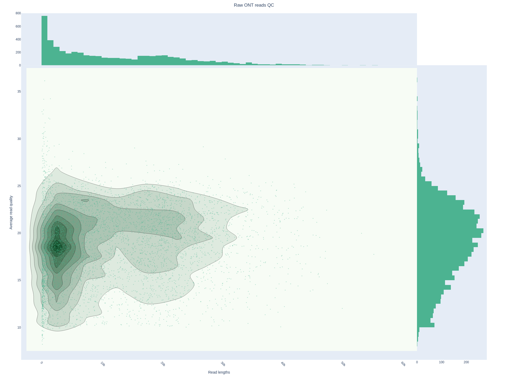

# Project: Assembly of the Meelup Mallee genome.

[give a brief intro to what this is, why, and the raw data]

# Environment

This repo uses Conda/Micromamba to help with reproducibility. Everything here is run on a Linux machine.

To set up and activate the environment:
```bash
micromamba create -f eucalypt_asm.yml
micromamba activate eucalypt_asm
```

# 01_QC: Quality control of raw data

First we establish the quality of the raw data. This can be done primarily with the GenomeQC tool, which generates graphics and descriptive summaries for genome assembly. The metrics computed in this section can be re-ran after all measures have been implemented, making for useful comparison and reflection on the quality control process.

## NanoPlot
First we use NanoPlot. This visualises and summarises long-read sequencing data. The main plot shows read-length and quality scores which you will see below:
Running NanoPlot:

```
bash /01_qc/scripts/run_nanoplot.sh
```
If this is your first time running NanoPlot, you will need to have the `pillow` installed in the environment. Add it here:
```
micromamba install pillow
```
Visualising the read length vs read quality results after running NanoPlot:



The displayed plot is for the tiny test dataset I've made. This is code to replicate my test data:

```
bash /01_qc/scripts/make_test_data.sh
```
*I will eventually replace this with the real outputs from the real raw_data once I'm done testing*

*I want to make a table of the important summary stats here*

NanoPlot will used again after the rest of the QC and filtering is complete to compare to these baseline results.


Then more GenomeQC tools...   I will talk to Rob and/or do my own research to decide what to include - ideas are to look at k-mers with KMC and I think I definitely want to include GenomeScope. This will be a matter of returning to this section and adding them in when I want to buff out my QC/read filtering more.

## Contamination check
The next step is to inspect the raw reads, determining the extent of contamination. One can check GC contamination easily, but a more thorough examination can be done with the Kraken2 tool.

** Roadblock ** Need to see if there is a rona server path for kraken2 already, otherwise need to download 8GB mini database.


