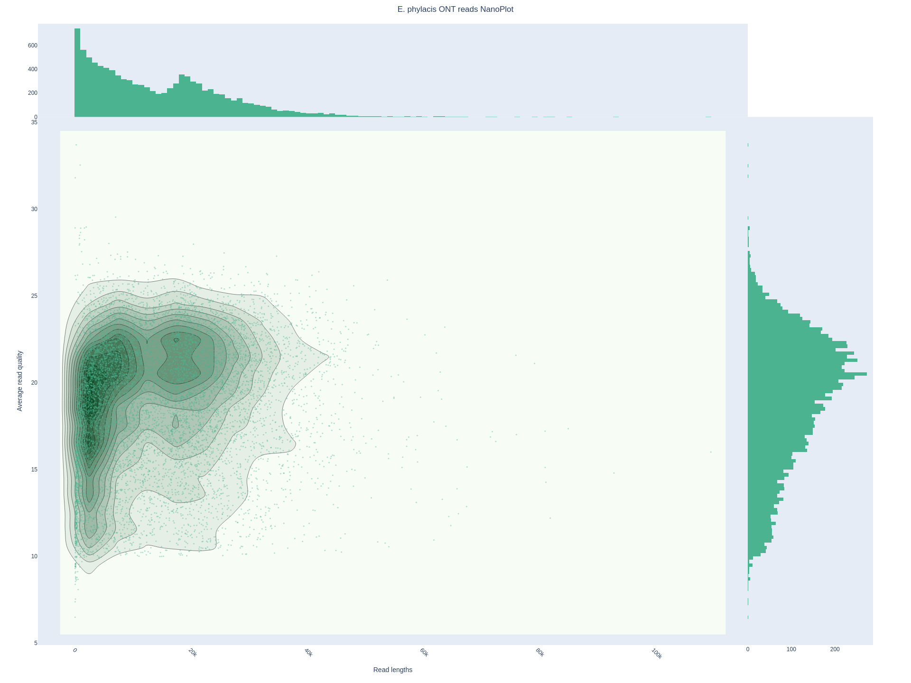
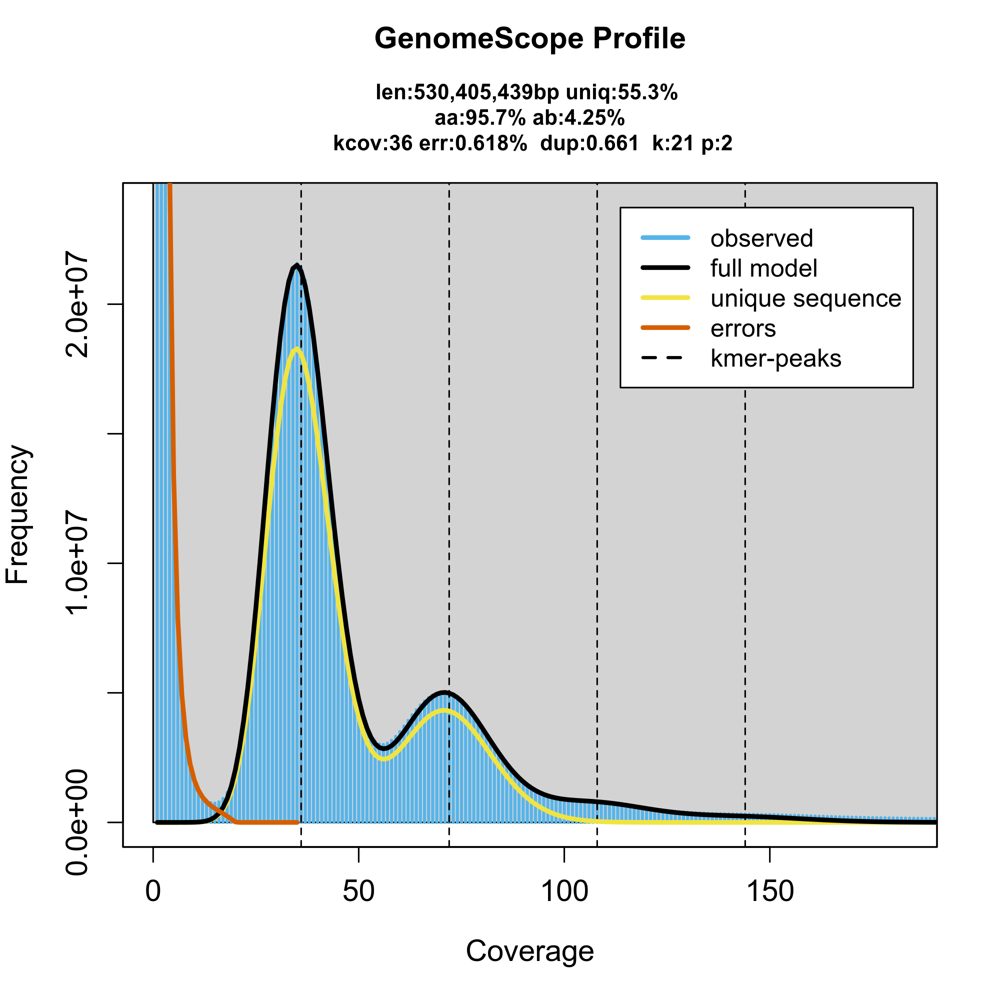
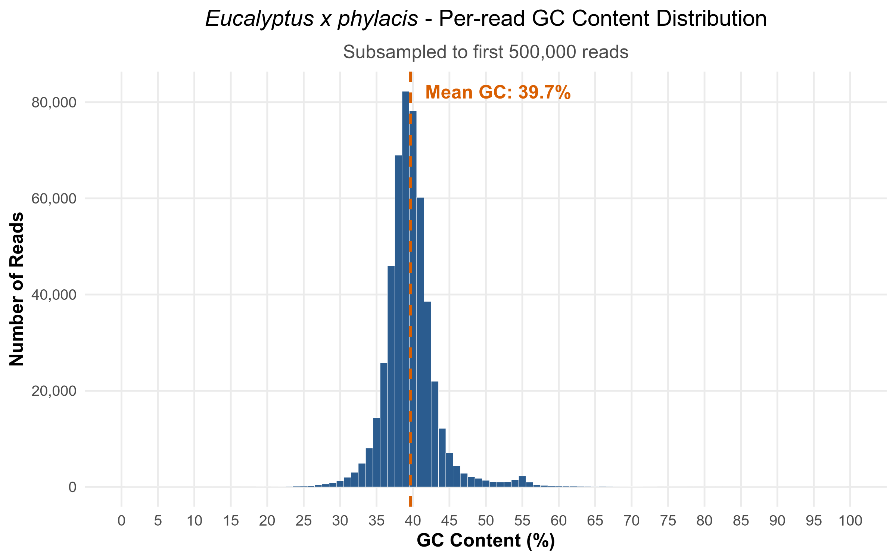
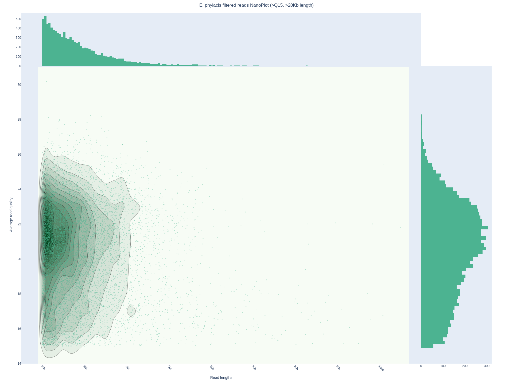

# Project: Assembly of the Meelup Mallee genome.

[give a brief intro to what this is, why, and the raw data]

# Environment

This repo uses Conda/Micromamba to help with reproducibility. Everything here is run on a Linux machine.

To set up and activate the environment:
```bash
micromamba create -f eucalypt_asm.yml
micromamba activate eucalypt_asm
```

Before running code on the full raw data (all of the reads), I made a tiny test dataset to practice with. If you would like to do the same for your own code e.g. if you tweak some of the code here, use this test data!
```
bash /make_test_data.sh
```
This makes the data, matches the file type of the raw reads and makes a directory called test_data for it. In the rest of the scripts, you can set raw_data = "test_data" for testing, then replace it i.e. raw_data = "your directory with the raw reads" to run the scripts on your real data. I've set up the following script for you to do this - Follow the instruction in the script to swap between testing and running on raw reads at your leisure before running scripts for the assembly
```
bash /config.sh
```

# 01_QC: Quality control of raw data

First we establish the quality of the raw data. This can be done primarily with the GenomeQC tool, which generates graphics and descriptive summaries for genome assembly. The metrics computed in this section can be re-ran after all measures have been implemented, making for useful comparison and reflection on the quality control process.

## NanoPlot
First we use NanoPlot. This visualises and summarises long-read sequencing data. The main plot shows read-length and quality scores which you will see below:
Running NanoPlot:

```
bash /01_qc/scripts/run_nanoplot.sh
```

Visualising the read length vs read quality results after running NanoPlot:

### Read length vs Read quality




### Raw ONT Read quality summary

| Metric | Value |
|---|---|
| **Total Reads** | 3,064,194 |
| **Total Yield** | 44.33 Gb |
| **Coverage (~522 Mb Genome)** | ~84.9× |
| **Median Read Length** | 12,334 bp |
| **Mean Read Length** | 14,466.1 bp |
| **Read N50** | 22,177 bp |
| **Median Quality Score** | Q19.6 |
| **Reads $\ge$ Q10** | 3,051,048 (99.6%) |
| **Reads $\ge$ Q15** | 2,547,395 (83.1%) |
| **Reads $\ge$ Q20** | 1,396,296 (45.6%) |

NanoPlot will used again after the rest of the QC and filtering is complete to compare to these baseline results.


## K-mer counting and GenomeScope

GenomeQC allows for stats about the long reads' k-mers to be computed e.g. how many total k-mers and how many are unique. It is a good way to examine the size and complexity of the genome prior to assembly, and to measure the error rates in sequencing of the data we have.

The following code is used to compute basic KMC statistics and create a GenomeScope profile histogram useful for gleaning information about the Meelup Mallee genome:

```
bash /01_qc/scripts/run_kmc.sh
```

### KMC basics output:
| Metric | Value |
| :--- | :--- |
| **K-mer Length ($k$)** | 21 |
| **Total Reads Processed** | 3,064,194 |
| **Total $k$-mers** | 44,265,691,027 (~44.27 Gb) |
| **Unique $k$-mers** | 5,216,090,955 (~5.22 Gb) |


### Genome Profile Estimation (`GenomeScope 2.0`)
A diploid model ($p=2$) was fitted to the $k=21$ frequency histogram generated by KMC to establish reference genome parameters prior to assembly:

### GenomeScope 2.0 Genome Profile Summary

| Parameter | Estimate (Min – Max) |
| :--- | :--- |
| **Genome Haploid Length** | **529.6 Mb – 531.2 Mb** |
| **Genome Unique Length** | **293.1 Mb – 294.0 Mb** |
| **Genome Repeat Length** | **236.5 Mb – 237.2 Mb** |
| **Heterozygosity ($ab$)** | **4.22% – 4.29%** |
| **Homozygosity ($aa$)** | **95.71% – 95.78%** |
| **Read Error Rate** | **0.62%** |
| **Model Fit (Full Model)** | **94.33%** |

### GenomeScope histogram:



The major peak at the very left (low coverage) represents sequencing errors that are unique (only covered once). GenomeScope recognises this and excludes them when calculating genome size. The main peak lambda typically corresponds to k-mers identical in both chromosomes (homozygous), however in the case of this hybrid species the heterozygous peak (with half the coverage) is the main peak due to a large portion of k-mers being unique to one parent species and not present in both parents' genomes.

## Contamination check
The next step is to inspect the raw reads, determining the extent of contamination. One can check GC contamination easily, but a more thorough examination can be done with the Kraken2 tool.

** Roadblock ** Need to see if there is a rona server path for kraken2 already, otherwise need to download 8GB mini database.

Running a quicker contamination check on GC content for now:
```
bash /01_qc/scripts/run_gc_check.sh
```
### SeqKit Additional Metrics including GC content:

| Metric | Value | Significance |
|---|---|---|
| **GC Content** | **39.58%** | Matches *Eucalyptus* nuclear baseline (~39%); no contamination |
| **Read Length Interquartile Range** | 4,646 – 21,519 bp | Q1 (25th percentile) to Q3 (75th percentile) |
| **N50 Read Count** | 44,211 reads | Number of top long reads constructing the N50 yield |
| **Base Accuracy $\ge$ Q20** | **88.36%** | Bases meeting $\ge$99% call accuracy |
| **Base Accuracy $\ge$ Q30** | **79.99%** | Bases meeting $\ge$99.9% call accuracy |
| **Ambiguous Bases (N)** | 0 (0.00%) | Zero uncalled bases across all 44.33 Gb |

Here is a histogram to visualise the spread of GC content across reads and notice any unusual peaks that could suggest contamination:



# 02_filtering: Preparing reads for genome assembly by trimming and filtering

We have established the quality of the raw data. Next, the reads must be filtered. They have already had the adapters trimmed by default, so no adapter trimming tools such as Porechop_ABI are required. The reads will be filtered by thresholding quality score and read length using Chopper (trims out those which don't pass the filters). Once this process has been conducted with parameters/thresholds determined suitable for the MM genome, the reads will be much better quality and well-prepared for genome assembly.

## Filtering reads with Chopper

Chopper is a versatile tool which can filter based on average read quality, min/max read lengths and GC content. It then trims by a chosen method (see more info here https://github.com/wdecoster/chopper), in this case I used a Q15 (95% accuracy) quality score threshold and a >20Kb read length cutoff.

Performing filtering and quality-based trimming using Chopper:

```
bash /02_filtering/scripts/run_chopper.sh
```

Filtering Summary:  *To be added once I've set filters that I'm happy with*


## Re-running NanoPlot post-filtering for comparison of coverage and other read metrics
The same type of plot is displayed here, but this time on the filtered reads which have over Q15 quality score and are at least 20Kb long.




The reads file has now been effectively examined, cleaned and filtered. The next step is to conduct the genome assembly.

# 03_assembly: Assembling filtered reads with Hifiasm, model selection to choose an assembly

The set up is all done and now it is time to actually run some assemblies. Hifiasm is a haplotype-resolved de novo genome assembler, which is very appropriate for our hybrid species *Eucalyptus x phylacis* (Meelup Mallee) genome because the goal is to assemble the contigs into chromosome sets of each parent.

I will use a RAM disk for fast read/write speeds when assembling. Hifiasm claims it can assemble a human genome in half a day! (for more info on Hifiasm, go here: https://github.com/chhylp123/hifiasm)
Assembling the filtered reads using Hifiasm:

```
bash /03_assembly/scripts/run_hifiasm.sh
```
