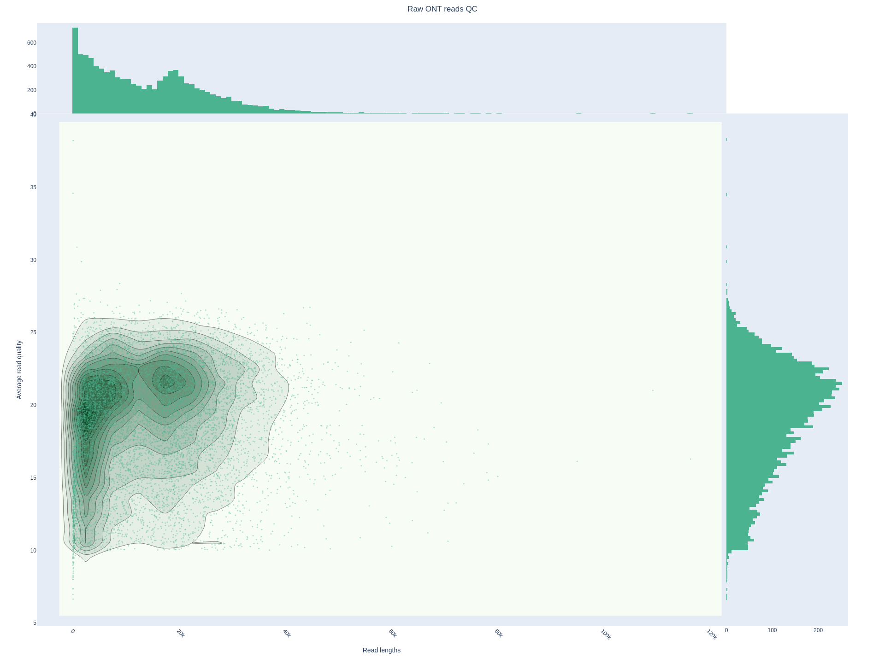
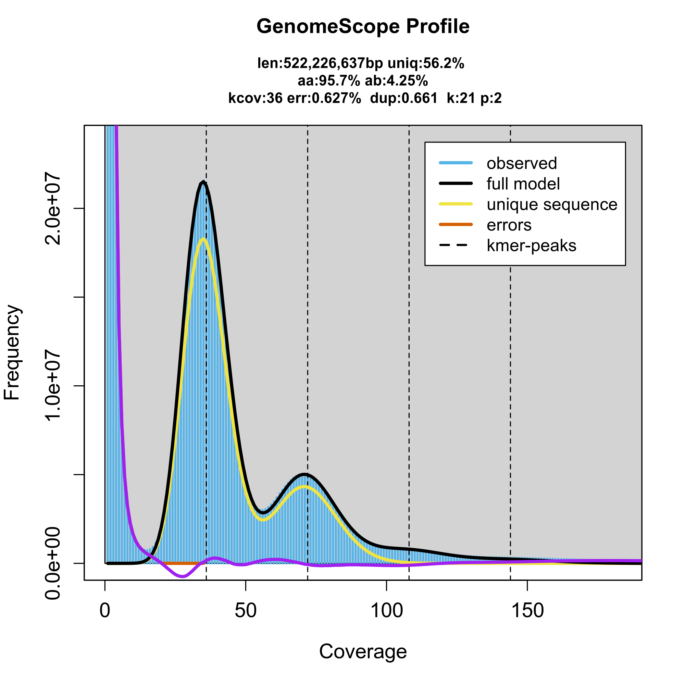

# Project: Assembly of the Meelup Mallee genome.

[give a brief intro to what this is, why, and the raw data]

# Environment

This repo uses Conda/Micromamba to help with reproducibility. Everything here is run on a Linux machine.

To set up and activate the environment:
```bash
micromamba create -f eucalypt_asm.yml
micromamba activate eucalypt_asm
```

Before running code on the full raw data (all of the reads), I made a tiny test dataset to practice with. If you would like to do the same for your own code e.g. if you tweak some of the code here, use this test data!
```
bash /01_qc/scripts/make_test_data.sh
```

# 01_QC: Quality control of raw data

First we establish the quality of the raw data. This can be done primarily with the GenomeQC tool, which generates graphics and descriptive summaries for genome assembly. The metrics computed in this section can be re-ran after all measures have been implemented, making for useful comparison and reflection on the quality control process.

## NanoPlot
First we use NanoPlot. This visualises and summarises long-read sequencing data. The main plot shows read-length and quality scores which you will see below:
Running NanoPlot:

```
bash /01_qc/scripts/run_nanoplot.sh
```
If this is your first time running NanoPlot, you will need to have the `pillow` installed in the environment. Add it here:
```
micromamba install pillow
```
Visualising the read length vs read quality results after running NanoPlot:

### Read length vs Read quality




### Raw ONT Read quality summary

| Metric | Value |
|---|---|
| **Total Reads** | 3,064,194 |
| **Total Yield** | 44.33 Gb |
| **Coverage (~522 Mb Genome)** | ~84.9× |
| **Median Read Length** | 12,334 bp |
| **Mean Read Length** | 14,466.1 bp |
| **Read N50** | 22,177 bp |
| **Median Quality Score** | Q19.6 |
| **Reads $\ge$ Q10** | 3,051,048 (99.6%) |
| **Reads $\ge$ Q15** | 2,547,395 (83.1%) |
| **Reads $\ge$ Q20** | 1,396,296 (45.6%) |

NanoPlot will used again after the rest of the QC and filtering is complete to compare to these baseline results.


## K-mer counting and GenomeScope

GenomeQC allows for stats about the long reads' k-mers to be computed e.g. how many total k-mers and how many are unique. It is a good way to examine the size and complexity of the genome prior to assembly, and to measure the error rates in sequencing of the data we have.

The following code is used to compute basic KMC statistics and create a GenomeScope profile histogram useful for gleaning information about the Meelup Mallee genome:

```
bash /01_qc/scripts/run_kmc.sh
```
(output is currently for test data, placeholder to be replaced by full genome data soon)

### KMC basics output:
Stats:
- **No. of k-mers below min. threshold:**            0
- **No. of k-mers above max. threshold:**            0
- **No. of unique k-mers:**                 5216090955
- **No. of unique counted k-mers:**         5216090955
- **Total no. of k-mers:**                 44265691027
- **Total no. of reads:**                      3064194
- **Total no. of super-k-mers:**            6430181221

### Genome Profile Estimation (`GenomeScope 2.0`)
A diploid model ($p=2$) was fitted to the $k=21$ frequency histogram generated by KMC to establish reference genome parameters prior to assembly:

| Parameter | Min Estimate | Max Estimate | Notes / Interpretation |
| :--- | :--- | :--- | :--- |
| **Haploid Genome Size** | **521.4 Mb** | **523.0 Mb** | Target assembly reference (~0.52 Gb) |
| **Heterozygosity** | **4.22%** | **4.29%** | High diploid divergence (favors graph-based assemblers) |
| **Repeat Content** | **228.3 Mb** | **229.0 Mb** | ~43.7% of genome comprised of repeat elements |
| **Unique Sequence** | **293.1 Mb** | **294.0 Mb** | ~56.3% single-copy genomic regions |
| **Estimated Error Rate** | **0.63%** | **0.63%** | Baseline raw k-mer error profile |

### GenomeScope histogram:




## Contamination check
The next step is to inspect the raw reads, determining the extent of contamination. One can check GC contamination easily, but a more thorough examination can be done with the Kraken2 tool.

** Roadblock ** Need to see if there is a rona server path for kraken2 already, otherwise need to download 8GB mini database.

Running a quicker contamination check on GC content for now:
```
bash /01_qc/scripts/run_gc_check.sh
```
(these are placeholder results from the test dataset)
9%      1
23%     2
24%     2
25%     3
26%     8
27%     4
28%     10
29%     14
30%     27
31%     24
32%     33
33%     77
34%     91
35%     178
36%     292
37%     429
38%     686
39%     790
40%     712
41%     536
42%     386
43%     215
44%     137
45%     101
46%     59
47%     25
48%     43
49%     42
50%     30
51%     27
52%     21
53%     20
54%     22
55%     28
56%     18
57%     5
58%     5
59%     11
60%     2
61%     2
62%     2
65%     1
66%     1
67%     1
68%     2
69%     1
71%     1
72%     2
73%     1
77%     1

There doesn't seem to be major evidence for contamination, as there is a unimodal distribution of GC content in the reads tested of around 38-40%. Spike at 59% could be an issue or just coincidence. The contigs can be better decontaminated once I implement the more complex Kraken2 tool.


# 02_filtering: Preparing reads for genome assembly by trimming and filtering

We have established the quality of the raw data. Next, the reads must be filtered and trimmed. This will involve the removal of adapters done by Porechop (trimming reads), and filtering reads based on thresholding quality score and other key metrics using Chopper (trims out those which don't pass the filters). Once this process has been conducted with parameters/thresholds determined suitable for the MM genome, the reads will be much better quality and well-prepared for genome assembly.

## Trimming adapters with Porechop
Porechop discovers unknown adapters in ONT reads such as those we have for the MM raw data and then trims them off. This is done using a k-mer based algorithm. It is a more specialised tool than Chopper, which will be used afterwards to more holistically filter out reads which are low in quality score or not suitable for genome assembly use based on a range of filters/metrics.

Running Porechop on the data:

If this is your first time running Porechop, you will need to install it to your environment like so:
```
micromamba install -c bioconda porechop -y 
```

```
bash /02_filtering/scripts/run_porechop.sh
```

Results:
Adapter trimming and chimeric read checking were run on `raw_data/tiny_test.fastq` (5,131 total reads).  (to be replaced by full dataset)
* **Start Adapters:** 3,347 / 5,131 reads trimmed (65.2%) — 130,752 bp removed
* **End Adapters:** 1,882 / 5,131 reads trimmed (36.7%) — 16,102 bp removed
* **Chimeric Reads Split:** 1 read (0.02%)
* **Total Adapters Removed:** 146,854 bp

There was a high adapter rate (~65% start, ~37% end in adapter sequences), so trimming out this noise in the reads is a highly effective and important measure prior to genome assembly.
Only one out of 5,131 reads had an adapter in the middle of the read, meaning this one had two distinct fragments joined together during library prep by mistake. The low rate suggests reads are in tact and lengths are genuine for almost all cases.

## Further trimming by filtering reads with Chopper

Chopper is a versatile tool which can filter based on average read quality, min/max read lengths and GC content. It then trims by a chosen method (see more info here https://github.com/wdecoster/chopper), in this case I used a Q10 (90% accuracy) quality score threshold.

Performing filtering and quality-based trimming using Chopper:
No installations required if you've already run porechop :)

```
bash /02_filtering/scripts/run_chopper.sh
```

Filtering Summary:  (for test_data, to be replaced by full data soon)
| Stage | File | Read Count | Total Bases (bp) | Min Length | Avg Length | Max Length |
|---|---|---|---|---|---|---|
| **Raw** | `tiny_test.fastq` | 5,131 | 61.90 M | 47 | 12,064.4 | 55,317 |
| **Porechop** | `tiny_test_porechop.fastq.gz` | 5,132 | 61.76 M | 14 | 12,042.8 | 55,276 |
| **Chopper (Q10, >1kb)** | `tiny_test_filtered.fastq.gz` | 4,820 | 61.40 M | 1,001 | 14,090 | 55,276 |

Most of the reads here were long enough and had a high enough Phred quality score (better than  Q10, >90% accuracy) to be kept for genome assembly while the others were filtered out (approx 300 out of 5132 reads filtered out).

*Need to run NanoPlot one more time to compare before/after filtering*

The reads file has now been effectively examined, cleaned and filtered. The next step is to conduct the genome assembly

# 03_assembly: Assembling filtered reads with Hifiasm, model selection to choose an assembly

The set up is all done and now it is time to actually run some assemblies. Hifiasm is a haplotype-resolved de novo genome assembler, which is very appropriate for our hybrid species *Eucalyptus x phylacis* (Meelup Mallee) genome because the goal is to assemble the contigs into chromosome sets of each parent.

I will use a RAM disk for fast read/write speeds when assembling. Hifiasm claims it can assemble a human genome in half a day! (for more info on Hifiasm, go here: https://github.com/chhylp123/hifiasm)
Assembling the filtered reads using Hifiasm:

```
bash /03_assembly/scripts/run_hifiasm.sh
```
