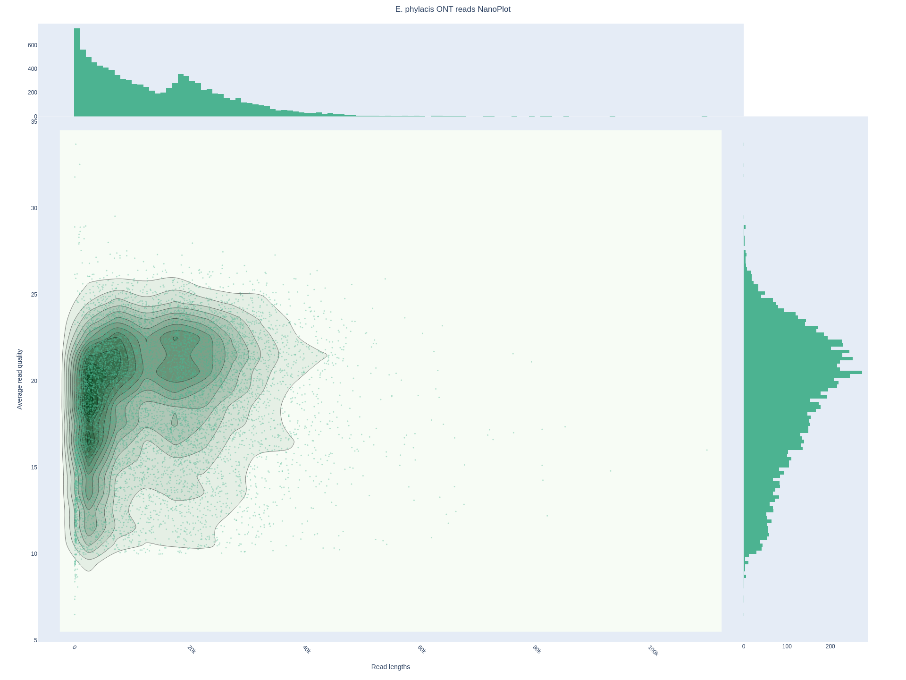
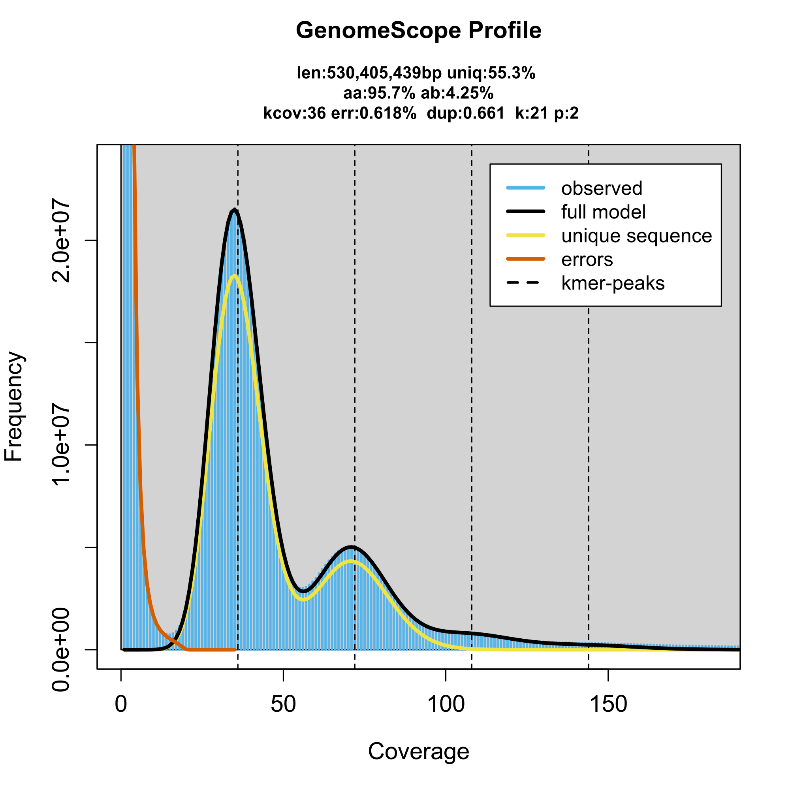
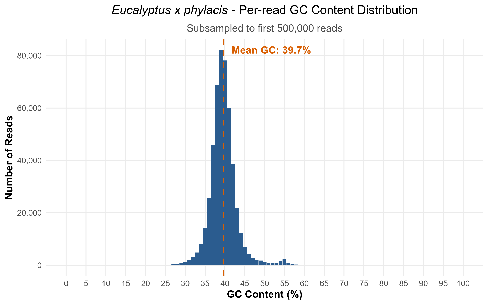
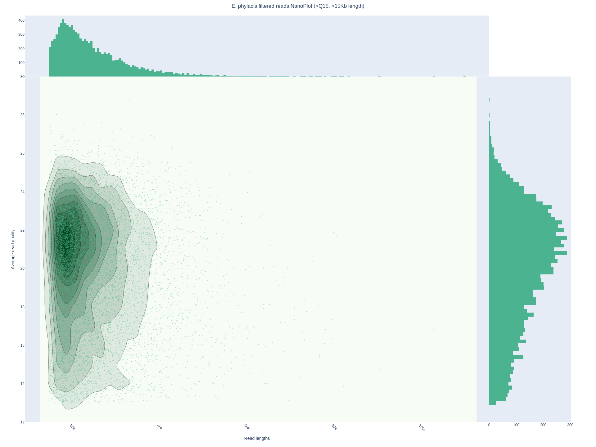
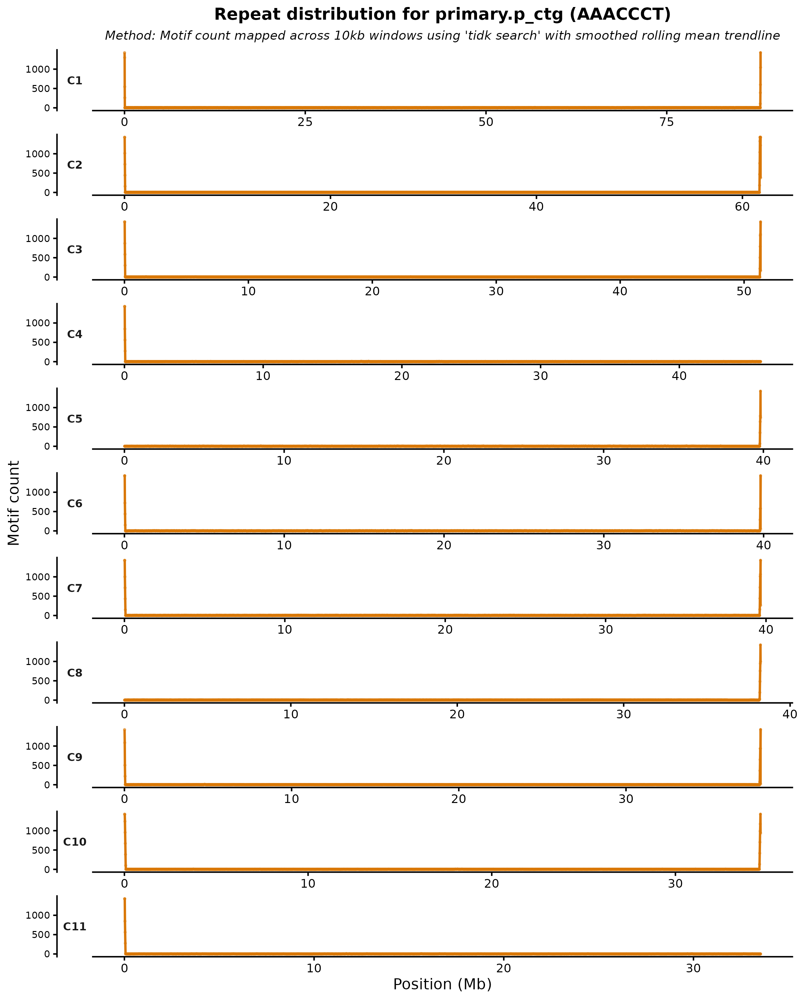
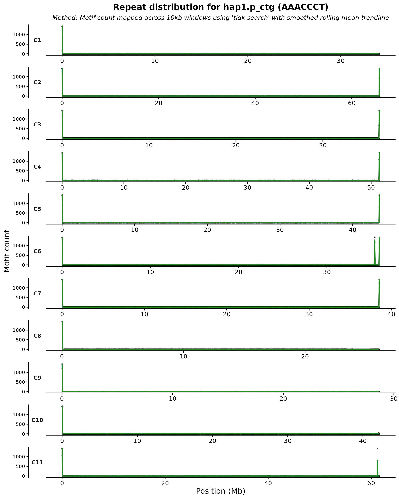
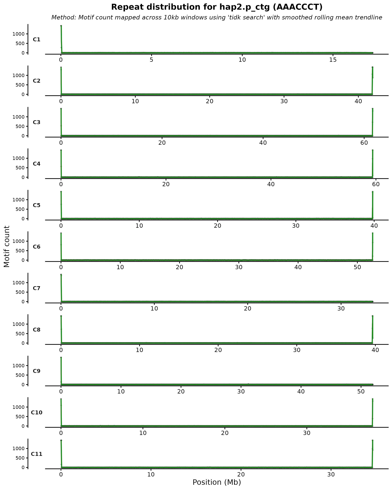
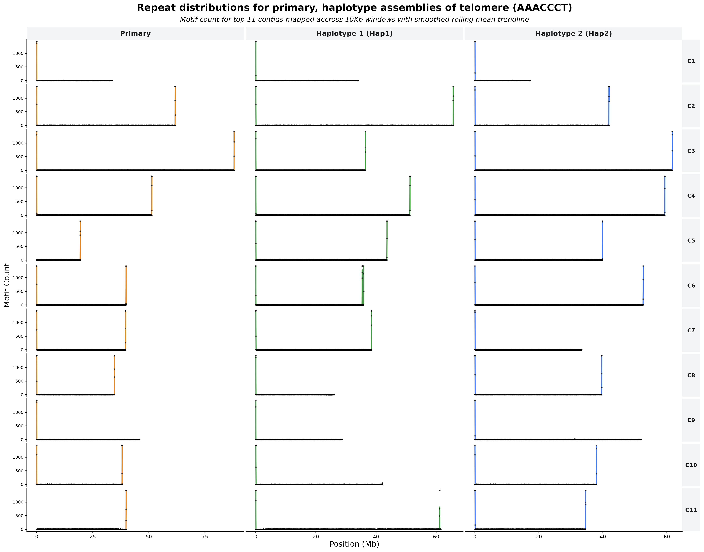
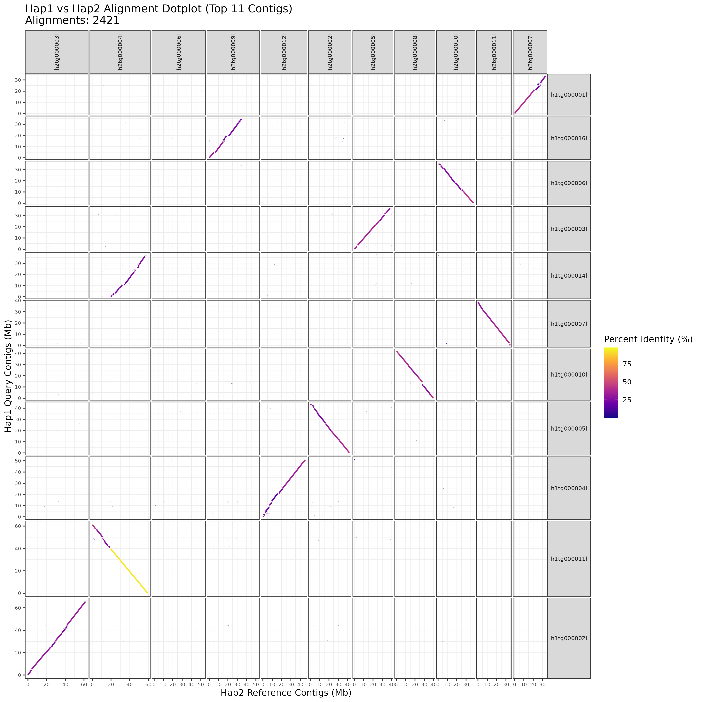

# Project: Assembly of the Meelup Mallee genome.

[give a brief intro to what this is, why, and the raw data]

# Environment

This repo uses Conda/Micromamba to help with reproducibility. Everything here is run on a Linux machine.

To set up and activate the environment:
```bash
micromamba create -f eucalypt_asm.yml
micromamba activate eucalypt_asm
```

Before running code on the full raw data (all of the reads), I made a tiny test dataset to practice with. If you would like to do the same for your own code e.g. if you tweak some of the code here, use this test data!
```
bash /make_test_data.sh
```
This makes the data, matches the file type of the raw reads and makes a directory called test_data for it. In the rest of the scripts, you can set raw_data = "test_data" for testing, then replace it i.e. raw_data = "your directory with the raw reads" to run the scripts on your real data. I've set up the following script for you to do this - Follow the instruction in the script to swap between testing and running on raw reads at your leisure before running scripts for the assembly
```
bash /config.sh
```

# 01_QC: Quality control of raw data

First we establish the quality of the raw data. This can be done primarily with the GenomeQC tool, which generates graphics and descriptive summaries for genome assembly. The metrics computed in this section can be re-ran after all measures have been implemented, making for useful comparison and reflection on the quality control process.

## NanoPlot
First we use NanoPlot. This visualises and summarises long-read sequencing data. The main plot shows read-length and quality scores which you will see below:
Running NanoPlot:

```
bash /01_qc/scripts/run_nanoplot.sh
```

Visualising the read length vs read quality results after running NanoPlot:

### Read length vs Read quality




### Raw ONT Read quality summary

| Metric | Value |
|---|---|
| **Total Reads** | 3,064,194 |
| **Total Yield** | 44.327 Gb |
| **Coverage (~522 Mb Genome)** | ~84.9× |
| **Median Read Length** | 12,334 bp |
| **Mean Read Length** | 14,466.1 bp |
| **Read N50** | 22,177 bp |
| **Median Quality Score** | Q19.6 |
| **Reads $\ge$ Q10** | 3,051,048 (99.6%) |
| **Reads $\ge$ Q15** | 2,547,395 (83.1%) |
| **Reads $\ge$ Q20** | 1,396,296 (45.6%) |

NanoPlot will used again after the rest of the QC and filtering is complete to compare to these baseline results.


## K-mer counting and GenomeScope

GenomeQC allows for stats about the long reads' k-mers to be computed e.g. how many total k-mers and how many are unique. It is a good way to examine the size and complexity of the genome prior to assembly, and to measure the error rates in sequencing of the data we have.

The following code is used to compute basic KMC statistics and create a GenomeScope profile histogram useful for gleaning information about the Meelup Mallee genome:

```
bash /01_qc/scripts/run_kmc.sh
```

### KMC basics output:
| Metric | Value |
| :--- | :--- |
| **K-mer Length ($k$)** | 21 |
| **Total Reads Processed** | 3,064,194 |
| **Total $k$-mers** | 44,265,691,027 (~44.27 Gb) |
| **Unique $k$-mers** | 5,216,090,955 (~5.22 Gb) |


### Genome Profile Estimation (`GenomeScope 2.0`)
A diploid model ($p=2$) was fitted to the $k=21$ frequency histogram generated by KMC to establish reference genome parameters prior to assembly:

### GenomeScope 2.0 Genome Profile Summary

| Parameter | Estimate (Min – Max) |
| :--- | :--- |
| **Genome Haploid Length** | **529.6 Mb – 531.2 Mb** |
| **Genome Unique Length** | **293.1 Mb – 294.0 Mb** |
| **Genome Repeat Length** | **236.5 Mb – 237.2 Mb** |
| **Heterozygosity ($ab$)** | **4.22% – 4.29%** |
| **Homozygosity ($aa$)** | **95.71% – 95.78%** |
| **Read Error Rate** | **0.62%** |
| **Model Fit (Full Model)** | **94.33%** |

### GenomeScope histogram:



The major peak at the very left (low coverage) represents sequencing errors that are unique (only covered once). GenomeScope recognises this and excludes them when calculating genome size. The main peak lambda typically corresponds to k-mers identical in both chromosomes (homozygous), however in the case of this hybrid species the heterozygous peak (with half the coverage) is the main peak due to a large portion of k-mers being unique to one parent species and not present in both parents' genomes.

## Contamination check
The next step is to inspect the raw reads, determining the extent of contamination. One can check GC contamination easily, but a more thorough examination can be done with the Kraken2 tool.

** Roadblock ** Need to see if there is a rona server path for kraken2 already, otherwise need to download 8GB mini database.

Running a quicker contamination check on GC content for now:
```
bash /01_qc/scripts/run_gc_check.sh
```
### SeqKit Additional Metrics including GC content:

| Metric | Value | Significance |
|---|---|---|
| **GC Content** | **39.58%** | Matches *Eucalyptus* nuclear baseline (~39%); no contamination |
| **Read Length Interquartile Range** | 4,646 – 21,519 bp | Q1 (25th percentile) to Q3 (75th percentile) |
| **N50 Read Count** | 44,211 reads | Number of top long reads constructing the N50 yield |
| **Base Accuracy $\ge$ Q20** | **88.36%** | Bases meeting $\ge$99% call accuracy |
| **Base Accuracy $\ge$ Q30** | **79.99%** | Bases meeting $\ge$99.9% call accuracy |
| **Ambiguous Bases (N)** | 0 (0.00%) | Zero uncalled bases across all 44.33 Gb |

Here is a histogram to visualise the spread of GC content across reads and notice any unusual peaks that could suggest contamination:


There is a relatively symmetric distribution of GC content across all of the reads, however a small bump is noticeable around 55% GC content. After some preliminary research, this is likely to be a microbial/fungal contaminant that has made its way into the *Eucalyptus x phylacis* tissue sample rather than a GC-rich area of the genome. GC-rich regions in typical eucalyptus genomes such as rRNA clusters are not proportionally large enough in the genome to cause a spike that pronounced, and many fungi and microbes can interact with leaves and roots of eucalyptus species, meaning it is very plausible for there to be some contamination. Post assembly, BlobTools can be used to pinpoint contaminant contig IDs if there are any. If there is a match with a taxon whose GC content is around 55%, this would explain the bump observed. 

# 02_filtering: Preparing reads for genome assembly by trimming and filtering

We have established the quality of the raw data. Next, the reads must be filtered. They have already had the adapters trimmed by default, so no adapter trimming tools such as Porechop_ABI are required. The reads will be filtered by thresholding quality score and read length using Chopper (trims out those which don't pass the filters). Once this process has been conducted with parameters/thresholds determined suitable for the MM genome, the reads will be much better quality and well-prepared for genome assembly.

## Filtering reads with Chopper

Chopper is a versatile tool which can filter based on average read quality, min/max read lengths and GC content. It then trims by a chosen method (see more info here https://github.com/wdecoster/chopper), in this case I used a Q15 (95% accuracy) quality score threshold and a >20Kb read length cutoff.

Performing filtering and quality-based trimming using Chopper:

```
bash /02_filtering/scripts/run_chopper.sh
```

After trial and error, I found that the best tradeoff between coverage (aiming for at least 30x coverage per haplotype) and quality/length was using thresholds for Q13 (~95% accuracy) and 15Kb read lengths. The coverage can be seen in the 'Filtered ONT read quality summary' further down.


## Re-running NanoPlot post-filtering for comparison of coverage and other read metrics
The same type of plot is displayed here, but this time on the filtered reads which have over Q13 quality score and are at least 15Kb long.



### Filtered ONT read quality summary

| Metric | Value |
|---|---|
| **Total Reads** | 1,258,992 |
| **Total Yield** | 31.762 Gb |
| **Coverage (~522 Mb Genome)** | ~60.85× |
| **Median Read Length** | 22,761 bp |
| **Mean Read Length** | 25,228 bp |
| **Read N50** | 25,591 bp |
| **Median Quality Score** | Q20.4 |
| **Reads $\ge$ Q15** | 1,165,231 (92.6%) |
| **Reads $\ge$ Q20** | 696,853 (55.4%) |
| **Reads $\ge$ Q25** | 32,580 (2.6%) |

This output has over just over 60x total coverage, meaning over 30x coverage per haplotype. The filtering has refined read quality and lengths as effectively as possible whilst maintaining the amount of coverage desired.

The raw reads for the Meelup Mallee genome have now been examined, cleaned and filtered. The next step is to conduct the genome assembly.

# 03_assembly: Assembling filtered reads with Hifiasm, model selection to choose an assembly

The set up is all done and now it is time to actually run some assemblies. Hifiasm is a haplotype-resolved de novo genome assembler, which is very appropriate for our hybrid species *Eucalyptus x phylacis* (Meelup Mallee) genome because the goal is to assemble the contigs into chromosome sets of each parent.

Assembling the filtered reads using Hifiasm:

```
bash /03_assembly/scripts/run_hifiasm.sh
```
Important note: On the first run, Hifiasm was confused by the heterozygous peak being larger (see genomescope discussion) and tried to set that as the homozygous peak, failing to set a heterozygous peak at all. The peak number Hifiasm uses will not be the same as the visible coverage peak on the GenomeScope profile (36x).
To fix the issue, I identified the "peak_hom" value of the first assembly (28), then doubled it (56) so Hifiasm recognises the second peak as the homozygous peak and can identify the large peak as the heterozygous one as intended. This has been updated and fixed in the script above.


The reads have now been assembled, and a range of analysis with tools can be conducted to evaluate the assembly before coding for parental assignment.

## Getting Metrics for Assembly

Using gfastats to get basic metrics for the assembly after hifiasm is complete:
```
bash /03_assembly/scripts/gfastats.sh
```
And looking specifically at the top 11 scaffolds, because *Eucalyptus x phylacis* has 2n = 22 chromosomes so a haploid chromosome number of 11. The idea of this approach is that if the top 11 scaffolds coverage is very high, then the assembly is near-chromosome-scale already. The approach is followed later with scaffolding, where many previous assemblers of eucalyptus genomes scaffolded haplotype contigs into 11 pseudo-chromosomes.

```
bash /03_assembly/scripts/get_top11.sh
```

### Top 11 Contigs by Length

#### Primary Assembly
| Rank | Contig ID | Length (bp) |
| :---: | :--- | :---: |
| **1** | `ptg000003l` | 87,977,299 |
| **2** | `ptg000002l` | 61,762,678 |
| **3** | `ptg000004l` | 51,331,157 |
| **4** | `ptg000009l` | 45,857,674 |
| **5** | `ptg000011l` | 39,825,173 |
| **6** | `ptg000006l` | 39,810,340 |
| **7** | `ptg000007l` | 39,661,829 |
| **8** | `ptg000014l` | 38,226,956 |
| **9** | `ptg000010l` | 38,050,136 |
| **10** | `ptg000008l` | 34,636,555 |
| **11** | `ptg000001l` | 33,538,365 |

#### Haplotype 1 Assembly
| Rank | Contig ID | Length (bp) |
| :---: | :--- | :---: |
| **1** | `h1tg000002l` | 65,707,553 |
| **2** | `h1tg000011l` | 61,580,219 |
| **3** | `h1tg000004l` | 51,331,157 |
| **4** | `h1tg000005l` | 43,675,544 |
| **5** | `h1tg000010l` | 42,182,117 |
| **6** | `h1tg000007l` | 38,526,317 |
| **7** | `h1tg000014l` | 38,226,956 |
| **8** | `h1tg000003l` | 36,495,849 |
| **9** | `h1tg000006l` | 35,933,447 |
| **10** | `h1tg000016l` | 35,100,670 |
| **11** | `h1tg000001l` | 28,154,233 |

#### Haplotype 2 Assembly
| Rank | Contig ID | Length (bp) |
| :---: | :--- | :---: |
| **1** | `h2tg000003l` | 61,689,153 |
| **2** | `h2tg000004l` | 59,380,630 |
| **3** | `h2tg000006l` | 52,586,484 |
| **4** | `h2tg000009l` | 51,940,222 |
| **5** | `h2tg000012l` | 45,258,771 |
| **6** | `h2tg000002l` | 41,926,117 |
| **7** | `h2tg000005l` | 39,810,330 |
| **8** | `h2tg000008l` | 39,661,829 |
| **9** | `h2tg000010l` | 38,039,194 |
| **10** | `h2tg000011l` | 34,626,403 |
| **11** | `h2tg000007l` | 33,387,340 |

### Assembly Metrics summary:

Before fixing homozygous peak:
| Assembly | Total Length (bp) | Total Contigs | Contig N50 (bp) | Top 11 Contigs (bp) | Top 11 Coverage (%) |
| :--- | :---: | :---: | :---: | :---: | :---: |
| **Primary** | 579,220,214 | 76 | 39,810,302 | 510,677,781 | 88.16% |
| **Haplotype 1** | 612,315,716 | 465 | 41,926,025 | 501,716,605 | 81.93% |
| **Haplotype 2** | 604,287,328 | 466 | 38,526.299 | 482,434,239 | 79.83% |

After fixing homozygous peak with `--hom-cov 56`:
| Assembly | Total Length (bp) | Total Contigs | Contig N50 (bp) | Top 11 Contigs (bp) | Top 11 Coverage (%) |
| :--- | :---: | :---: | :---: | :---: | :---: |
| **Primary** | 578,955,535 | 70 | 39,810,340 | 510,678,162 | 88.2% |
| **Haplotype 1** | 591,870,853 | 287 | 38,526,317 | 482,913,485 | 81.59% |
| **Haplotype 2** | 572,264,015 | 317 | 41,926,117 | 498,306,473 | 87.08% |

By running a Hifiasm assembly that correctly identifies the second peak as the homozygous one, there are noticeable improvements. The reduced number of contigs (particularly for haplotypes) is an indication of reduced fragmentation, which has occurred because coverage is no longer underestimated and more duplicate haplotigs have been successfully purged. Additionally, the total lengths of assemblies have decreased for similar reasons of purging overlapping/duplicate haplotigs. This means the assembly is less noisy and inflated from fragmentation, and has shortened towards a likelier estimated genome size under 600Mbp.

Notice that there is a primary, haplotype 1 and haplotype 2 assembly conducted by Hifiasm. 
The primary assembly represents a haploid genome while the *Eucalyptus x phylacis* genome is diploid. This collapsed assembly approach arbitrarily patches together a haploid genome by choosing one representative sequence for heterozygous regions, which is not ideal for the purposes of this project. The primary assembly is also the shortest in length because Hifiasm seeks to maximise N50 and contiguity by stitching homozygous regions together.

## Genome Completeness - BUSCO

Benchmarking Universal Single-Copy Orthologs (BUSCO) is a crucial step in genome assembly used for measuring assembly quality. It measures genome completeness as a percentage by searching the genome for a predetermined set of single-copy genes. In this project I downloaded the recent OrthoDB v12 catalog which has been used for Ash's *Spinifex sericeus* assembly, but using the eudicots `odb_eudicotyledons12` (*S. sericius* is a monocot).

Compleasm is an efficient tool to measure genome completeness, which I have used in the following script. This provides BUSCO genome completeness metrics for the primary and haplotype assemblies from the improved Hifiasm runthrough.

```
bash 03_assembly/scripts/compleasm_busco.sh
```

### Assembly Metrics including genome completeness:
| Metric | **Primary** | **Haplotype 1** | **Haplotype 2** |
| :--- | :---: | :---: | :---: |
| **Total Length (bp)** | 578,955,535 | 591,870,853 | 572,264,015 |
| **Total Contigs** | 70 | 287 | 317 |
| **Contig N50 (bp)** | 39,810,340 | 38,526,317 | 41,926,117 |
| **Top 11 Contigs (bp)** | 510,678,162 | 482,913,485 | 498,306,473 |
| **Top 11 Coverage** | 88.2% | 81.59% | 87.08% |
| **BUSCO Genome Completeness**| 95.69% | 98.47% | 99.61% |
| Single-copy (S)| 85.59% | 91.30% | 92.48% |
| Duplicated (D)| 6.10% | 7.17% | 7.13% |
| Fragmented (F)| 0.71% | 0.39% | 0.36% |
| Missing (M)| 3.60% | 1.14% | 0.04% |

Note that BUSCO completedness is the addition of single-copy (S) and duplicated (D). The genes located should be single-copy but in the cases they are duplicated they are still present - and this is what is being checked to evaluate completeness of the genome.

The results are promising, as results above 95% are typical of published eucalyptus and hybrid species genomes and above 99% is excellent. The same metrics will be computed after parental assignment, when the current haplotype assemblies which are a patchwork of contigs from both parents will be arranged into two parental haplotypes. If the metrics remain at a similar level or improve, this genome is likely worthy of publication.


## Post Assembly Tools and Checks

Performing parental binning to achieve post-assembly phasing and a haplotype-resolved genome assembly is the main goal of the project. However, before doing this there are more checks and tools that can be used to improve and clean up remaining issues in the current assembly I have.
These include filtering out small contigs, organelle removal to work on nuclear genome, investigating contamination with BlobTools and a telomere-to-telomere check.

### Telomere Checks

Looking for motifs in the assemblies with `tidk explore`, the following output was observed. Note that a run is recorded as 100 or more sequential repeats of the motif.

#### Motifs Output

| Motif | Runs in Primary Assembly | Runs in Haplotype 1 | Runs in Haplotype 2 |
| :--- | :---: | :---: | :---: |
| **`AAACCCT`** | **1,572** | **5,822** | **6,164** |
| **`AAAAAAT`** | 4,245 | — | 4,302 |
| **`ACCCGTC`** | — | 1,274 | 1,675 |
| **`AAAAAAG`** | — | 318 | — |

AAACCCT is the reverse complement of the canonical plant telomere DNA motif TTTAGGG. The fact that it is very prominent here especially in the better-suited haplotype assemblies reinforces that AAACCCT is the telomere motif for *Eucalyptus x phylacis*. Using `tidk search` the motifs' locations can be visualised, which will be useful for observing how many contigs in the assemblies are telomere-to-telomere (T2T). This is because telomere arrays of the known motif will be visible at both ends of the contig if it is T2T.

The following script combines the `tidk explore` and `tidk search` steps to look at motifs and assess T2T:
```
bash 03_assembly/scripts/telomere_check.sh
```

Then the following scripts make plot outputs that record the number of occurrences of the AAACCCT telomere in the top 11 contigs for each of the primary, haplotype 1 and haplotype 2 assemblies. This gives a good picture of whether the contigs are T2T or not.

```
Rscript 03_assembly/scripts/t2t_plots.R
```
Gives individual plots for each assembly:

| Primary Assembly | Haplotype 1 | Haplotype 2 |
| :---: | :---: | :---: |
| [](03_assembly/results/tidk/plots/primary.p_ctg_AAACCCT_fingerprint.png) | [](03_assembly/results/tidk/plots/hap1.p_ctg_AAACCCT_fingerprint.png) | [](03_assembly/results/tidk/plots/hap2.p_ctg_AAACCCT_fingerprint.png) |
| *Click to enlarge* | *Click to enlarge* | *Click to enlarge* |

```
Rscript 03_assembly/scripts/plot_t2t_telomeres_combined.R
```
Gives side-by-side plot for comparison between assemblies:



Most of the contigs have peaks on both ends in the amount of telomere motifs recorded, which is a positive sign that the longest contigs in the assemblies are T2T! This means we already have a near chromosome-level assembly on our hands in terms of scale of contigs. Some contigs are missing one end but this is typical and can be seen to occur in many other published genomes as well at this stage.

### Haplotype Alignment

By aligning the haplotype 1 and haplotype 2 assemblies, information about synteny can be attained. This lets us visualise which contigs in haplotype 1 map to which contigs in haplotype 2. The alignment plot is also useful for visually detecting inversions, translocations, duplications and more.

Aligning haplotypes with minimap2:
```
bash 03_assembly/scripts/h1h2_alignment.sh
```

Using these alignments, I made a dotplot for the top 11 longest contigs in each haplotype in order to look at how it mapped, synteny and other noticeable features.
```
Rscript 03_assembly/scripts/h1h2_dotplot.R
```
#### Synteny dotplot for pairwise alignment of 11 longest contigs in haplotype 1 and 2:


The strong main diagonal here is evidence of good syntenic conservation by the assembly, as every haplotype 1 contig mapped uniquely to a corresponding haplotype 2 contig. This is a good indication that the top 11 contigs from the haplotype assemblies indeed represent the 11 haplotype chromosomes quite closely.
As for percent identity, in most cases it is lower (around 30%) meaning not that many of the bases match in the alignments. This is justifiable as there is high divergence between the parent species (as seen in GenomeScope heterozygosity), and minimap2 also makes indels that drag down the score in the alignment process. However, one of the alignments has a large section of high percent identity (~75%, yellow) which could represent a highly conserved block in the chromosome with very similar structure in both parents - interesting.

### Contamination screening


### Organelle removal


### Filter for contig size


# 04_parental_assignment: Obtaining parental haplotype assemblies via mapping, k-mer profiling


